# Plether Protocol

[](https://github.com/Plether-Fi/plether-core/actions/workflows/ci.yml)
[](https://codecov.io/gh/Plether-Fi/plether-core)
[](https://www.gnu.org/licenses/agpl-3.0)
[](https://docs.soliditylang.org/)

Plether is a DeFi protocol for synthetic dollar-denominated tokens with inverse and direct exposure to the US Dollar Index (USDX). Users deposit USDC to mint paired tokens that track USD strength, enabling speculation and hedging on dollar movements.

## How It Works

The protocol creates two synthetic tokens from USDC collateral:

- **plDXY-BEAR** - Appreciates when USD weakens (USDX falls)
- **plDXY-BULL** - Appreciates when USD strengthens (USDX rises)

These tokens are always minted and burned in pairs, maintaining a zero-sum relationship. When you deposit 100 USDC, you receive equal amounts of both tokens. The combined value of a BEAR + BULL pair always equals the original USDC deposit.



## Architecture

### Core Contracts

| Contract | Description |
|----------|-------------|
| [`SyntheticSplitter`](src/SyntheticSplitter.sol) | Central protocol contract. Accepts USDC, mints/burns token pairs, manages yield deployment |
| [`SyntheticToken`](src/SyntheticToken.sol) | ERC20 + ERC20FlashMint implementation for plDXY-BEAR and plDXY-BULL |

### Staking Layer

| Contract | Description |
|----------|-------------|
| [`StakedToken`](src/StakedToken.sol) | ERC-4626 vault wrapper (splDXY-BEAR, splDXY-BULL) with streaming rewards to prevent reward sniping |
| [`RewardDistributor`](src/RewardDistributor.sol) | Distributes USDC yield to StakedToken vaults, favoring the underperforming token |

### Oracle Layer

| Contract | Description |
|----------|-------------|
| [`BasketOracle`](src/oracles/BasketOracle.sol) | Computes plDXY as weighted basket of 6 price feeds, with bound validation against Curve EMA price |
| [`PythAdapter`](src/oracles/PythAdapter.sol) | Adapts Pyth Network feeds to Chainlink's AggregatorV3Interface (used for SEK/USD) |
| [`MorphoOracle`](src/oracles/MorphoOracle.sol) | Adapts BasketOracle to Morpho Blue's 36-decimal scale format |
| [`StakedOracle`](src/oracles/StakedOracle.sol) | Wraps underlying oracle to price ERC-4626 staked token shares |

#### BasketOracle Design

The BasketOracle computes a USDX-like index using **normalized arithmetic weighting** rather than the geometric weighting of the official ICE USDX index:

```
Price = Σ(Weight_i × Price_i / BasePrice_i)
```

Each currency's contribution is normalized by its base price, ensuring the intended USDX weights are preserved regardless of absolute FX rate scales. Without normalization, low-priced currencies like JPY (\~$0.007) would be nearly ignored compared to EUR (\~$1.08), causing severe weight distortion.

This design enables gas-efficient on-chain computation and eliminates rebalancing requirements, which guarantees protocol solvency.

**Inverse Relationship:** Because the oracle measures the USD value of a foreign currency basket, it moves **inversely** to the real USDX index. When the dollar strengthens, USDX rises but our basket value falls (foreign currencies are worth less in USD terms). This is why plDXY-BEAR appreciates when the basket value rises (dollar weakens).

**Fixed Base Prices and Weights** (immutable, set at deployment based on January 1, 2026 prices):

| Currency | Weight | Base Price (USD) |
|----------|--------|------------------|
| EUR | 57.6% | 1.1750 |
| JPY | 13.6% | 0.00638 |
| GBP | 11.9% | 1.3448 |
| CAD | 9.1% | 0.7288 |
| SEK | 4.2% | 0.1086 |
| CHF | 3.6% | 1.2610 |

Both weights and base prices are permanently fixed and cannot be changed after deployment.

### Routing Layer

| Contract | Description |
|----------|-------------|
| [`ZapRouter`](src/ZapRouter.sol) | Single-sided plDXY-BULL minting and burning using flash mints |
| [`LeverageRouter`](src/LeverageRouter.sol) | Leveraged plDXY-BEAR positions via Morpho Blue flash loans (fee-free) |
| [`BullLeverageRouter`](src/BullLeverageRouter.sol) | Leveraged plDXY-BULL positions via Morpho + plDXY-BEAR flash mints |

### Yield Adapters (ERC-4626)

| Contract | Description |
|----------|-------------|
| [`MorphoAdapter`](src/MorphoAdapter.sol) | ERC-4626 wrapper for Morpho Blue yield generation |


## Ecosystem Integrations

### Token Flow



- **Chainlink** - Price feeds for EUR/USD, JPY/USD, GBP/USD, CAD/USD, CHF/USD
- **Pyth Network** - Price feed for SEK/USD (via PythAdapter)
- **Curve Finance** - AMM pools for USDC/plDXY-BEAR swaps
- **Morpho Blue** - Yield generation on idle USDC reserves via MorphoAdapter

### Bear Leverage



Flash loan USDC from Morpho → swap to plDXY-BEAR on Curve → stake → deposit splDXY-BEAR as Morpho collateral.

### Bull Leverage



Flash loan USDC from Morpho → mint BEAR+BULL pairs → sell BEAR on Curve → stake BULL → deposit splDXY-BULL as Morpho collateral.

Both routers use fee-free Morpho flash loans and a fixed debt model: `debt = principal × (leverage - 1)`.

### Staking & Rewards



- **StakedToken** - ERC-4626 vaults (splDXY-BEAR, splDXY-BULL) that receive streaming USDC rewards
- **RewardDistributor** - Allocates yield from SyntheticSplitter, favoring the underperforming token's stakers to incentivize price convergence

## Protocol Mechanics

### Liquidity Management

The SyntheticSplitter maintains a 10% local buffer of USDC for redemptions, with 90% deployed to yield adapters. This generates yield while ensuring liquidity for normal operations.

If adapter liquidity is constrained (e.g., high Morpho utilization), the owner can pause the protocol and use `withdrawFromAdapter()` for gradual extraction as liquidity becomes available.

### Leverage

Users can open leveraged positions through the routers:

1. **LeverageRouter** (Bear): Morpho flash loan USDC → Swap to plDXY-BEAR → Stake → Deposit to Morpho as collateral → Borrow USDC to repay flash loan
2. **BullLeverageRouter** (Bull): Morpho flash loan USDC → Mint pairs → Sell plDXY-BEAR → Stake plDXY-BULL → Deposit to Morpho → Borrow to repay

Both routers use a fixed debt model: `debt = principal × (leverage - 1)`. For 2x leverage with $100 principal, Morpho debt is always $100.

Morpho Blue provides fee-free flash loans, making leveraged positions more capital-efficient.

Both routers include MEV protection via user-defined slippage caps (max 1%).

### Reward Distribution

The RewardDistributor receives yield from SyntheticSplitter and allocates it to StakedToken vaults based on the price discrepancy between the oracle and Curve EMA:

- **≥2% discrepancy**: 100% to underperforming token stakers
- **<2% discrepancy**: Quadratic interpolation from 50/50 toward 100/0
- **0% discrepancy**: 50/50 split

This mechanism incentivizes arbitrageurs to correct price deviations by rewarding stakers of the underpriced token. A 0.1% caller reward incentivizes permissionless distribution.

### Lifecycle States

The protocol operates in three states:

1. **ACTIVE** - Normal operations (mint, burn, swap). If Chainlink and Curve EMA prices diverge >2%, BasketOracle reverts, blocking minting, leverage, and reward distribution until prices converge. Burns and swaps remain available—the 10% liquid buffer ensures users can always exit.
2. **PAUSED** - Emergency pause (minting and reward distribution blocked, burning allowed so users can exit, gradual adapter withdrawal enabled)
3. **SETTLED** - End-of-life when plDXY hits CAP price (only redemptions allowed)

## Development

### Prerequisites

- [Foundry](https://book.getfoundry.sh/getting-started/installation)

### Build

```bash
forge build
```

### Test

```bash
forge test              # Run all tests
forge test -vvv         # Verbose output
forge coverage          # Generate coverage report
```

### Fork Tests

Fork tests run against mainnet state using real Chainlink oracles, Curve pools, and Morpho Blue. They require an RPC URL:

```bash
# Set RPC URL (or add to .env file)
export MAINNET_RPC_URL=https://eth-mainnet.g.alchemy.com/v2/YOUR_KEY

# Run all fork tests
forge test --match-path "test/fork/*.sol" --fork-url $MAINNET_RPC_URL -vvv

# Or source from .env
source .env && forge test --match-path "test/fork/*.sol" --fork-url $MAINNET_RPC_URL -vvv
```

**Fork test files:**

| File | Description |
|------|-------------|
| `BaseForkTest.sol` | Shared base contract, constants, and test helpers |
| `ZapRouterFork.t.sol` | ZapRouter integration with real Curve swaps |
| `FullCycleFork.t.sol` | Complete mint → yield → burn lifecycle |
| `LeverageRouterFork.t.sol` | Bear and Bull leverage via real Morpho |
| `SlippageProtectionFork.t.sol` | MEV protection and slippage scenarios |
| `LiquidationFork.t.sol` | Interest accrual and liquidation mechanics |
| `BasketOracleFork.t.sol` | Full 6-feed plDXY basket oracle validation |
| `RewardDistributorFork.t.sol` | Reward distribution with real oracle prices |
| `PermitFork.t.sol` | EIP-2612 permit-based deposits |
| `SlippageReport.t.sol` | Slippage analysis across trade sizes |

Run a specific fork test file:
```bash
source .env && forge test --match-path test/fork/LeverageRouterFork.t.sol --fork-url $MAINNET_RPC_URL -vvv
```

### Testnet Deployment

#### Sepolia

Deploy to Sepolia testnet with a custom Morpho Blue instance (the public Morpho on Sepolia has no enabled IRMs/LLTVs):

```bash
# Required environment variables in .env:
# TEST_PRIVATE_KEY=0x...  (your deployer private key)
# SEPOLIA_RPC_URL=https://sepolia.infura.io/v3/YOUR_KEY

# Deploy (43 transactions - may take a few minutes)
source .env && forge script script/DeployToSepolia.s.sol --tc DeployToSepolia \
  --rpc-url $SEPOLIA_RPC_URL \
  --broadcast

# Verify contracts on Etherscan (optional)
# ETHERSCAN_API_KEY=... in .env
source .env && forge verify-contract <ADDRESS> <CONTRACT> \
  --chain sepolia --etherscan-api-key $ETHERSCAN_API_KEY
```

The Sepolia deployment script:
- Deploys its own Morpho Blue instance with a ZeroRateIrm (0% interest for testnet)
- Creates all protocol contracts, oracles, and routers
- Seeds Curve pool and Morpho markets with liquidity
- Mints 100k MockUSDC to the deployer

#### Anvil (Local)

For frontend development and testing without spending real ETH:

```bash
# 1. Start local Anvil node forking Ethereum mainnet
anvil --fork-url $MAINNET_RPC_URL --chain-id 31337

# 2. Deploy all contracts with real Chainlink/Pyth oracles (mints 100k USDC to deployer)
TEST_PRIVATE_KEY=0x59c6995e998f97a5a0044966f0945389dc9e86dae88c7a8412f4603b6b78690d \
forge script script/DeployToAnvilFork.s.sol --tc DeployToAnvilFork \
  --rpc-url http://127.0.0.1:8545 \
  --broadcast

# 3. (Optional) Simulate yield accrual (1% of adapter assets)
cast send <MOCK_YIELD_ADAPTER> "generateYield()" \
  --rpc-url http://127.0.0.1:8545 \
  --private-key 0x59c6995e998f97a5a0044966f0945389dc9e86dae88c7a8412f4603b6b78690d

# 4. (Optional) Seed Morpho markets for leverage testing
#    Morpho seeding is built into DeployToTest.s.sol for testnet deploys.
#    For Anvil fork, create markets manually using cast commands.
```

The Anvil fork deployment uses real mainnet oracles (Chainlink for EUR/JPY/GBP/CAD/CHF, Pyth for SEK) with prices frozen at the fork block. MockUSDC and MockYieldAdapter are still used for flexible testing.

**Anvil Test Accounts** (pre-funded with 10,000 ETH each):

| Account | Address | Private Key |
|---------|---------|-------------|
| #0 | `0xf39Fd6e51aad88F6F4ce6aB8827279cffFb92266` | `0xac0974bec39a17e36ba4a6b4d238ff944bacb478cbed5efcae784d7bf4f2ff80` |
| #1 | `0x70997970C51812dc3A010C7d01b50e0d17dc79C8` | `0x59c6995e998f97a5a0044966f0945389dc9e86dae88c7a8412f4603b6b78690d` |

**MetaMask Setup:**
1. Import a test private key (Settings → Import Account)
2. Add network: RPC `http://127.0.0.1:8545`, Chain ID `31337`

### Format

```bash
forge fmt               # Format code
forge fmt --check       # Check formatting
```

### Documentation

**[View Reference Documentation](https://plether-fi.github.io/plether-core/)**

Generate HTML documentation locally from NatSpec comments:

```bash
forge doc               # Generate docs to ./docs
forge doc --serve       # Serve docs locally at http://localhost:3000
forge doc --build       # Build static site to ./docs/book
```

## Security

- All contracts use OpenZeppelin's battle-tested implementations
- Reentrancy protection on state-changing functions
- 7-day timelock for critical governance changes
- Oracle staleness checks (8–24 hour timeouts depending on context)
- Oracle bound validation against Curve EMA to prevent price manipulation
- Flash loan callback validation (initiator + lender checks)
- Yield adapter uses Morpho's internal accounting (immune to donation attacks)

For detailed security assumptions, trust model, and emergency procedures, see [SECURITY.md](SECURITY.md).

## License

[AGPL-3.0](LICENSE)

## Disclaimer

This software is provided "as is" without warranty of any kind. Use at your own risk. This protocol has not been audited. Do not use in production without a professional security audit.
