# Perps Accounting Spec

This document defines the accounting model for the Plether perps system.

It is the source of truth for:

- solvency,
- LP redemption-funding limits,
- close and liquidation settlement,
- trader claim liabilities,
- clearinghouse reservation treatment,
- LP-capital carry,
- LP request admission timing and its separation from settlement maturity and oracle boundaries.

Use it together with:

- [`README.md`](README.md) for the system overview,
- [`SECURITY.md`](SECURITY.md) for invariants and trust assumptions,
- [`INTERNAL_ARCHITECTURE_MAP.md`](INTERNAL_ARCHITECTURE_MAP.md) for the custody map,
- [`PRE_AUDIT_GUIDE.md`](PRE_AUDIT_GUIDE.md) for the consolidated policy tables, quantity ownership table, and transaction narratives.

## Accounting Model In One Page

The protocol keeps cash availability, risk solvency, and terminal LP equity as separate questions. LP entry and exit
pricing, however, deliberately share one exact terminal-NAV view.

The key rules are:

1. Physical USDC and mathematical claims are different objects.
2. Marked LP equity includes only the portion of an unrealized trader loss collectible from that account's dedicated
   PnL pledge or nettable same-account trader claim. It is not spendable withdrawal cash before collection.
3. LP redemption funding is stricter than protocol solvency.
4. Pending-order reservations are not free trader collateral.
5. A trader price loss is collectible only up to the account's PnL pledge plus explicitly nettable claim. Any excess
   is a diagnostic write-off, not an LP asset, trader claim, or terminal deficit. An unpaid protocol-side payout
   becomes a trader claim; independently negative terminal equity remains explicit as terminal deficit. A waived
   frozen-close spread is an uncollected charge. V2 has no accumulated-debt ledger or repayment selector.
6. A valid risk-reducing transition must not revert just to preserve pre-close solvency; the protocol contains the outcome with `degradedMode` instead.
7. Frozen-close spread value belongs to LPs and must never be credited to protocol treasury.

## Canonical Quantities

All quantities are in 6-decimal USDC unless stated otherwise.

### Physical asset terms

Use these terms consistently:

- `rawAssets`: literal USDC token balance held by `HousePool`
- `accountedAssets`: canonical protocol-owned USDC recognized by pool accounting
- `excessAssets = max(rawAssets - accountedAssets, 0)`: unsolicited or otherwise unaccounted positive balance
- `physicalAssets = totalAssets() = min(rawAssets, accountedAssets)`: conservative economic pool backing
- `protocolTreasuryBalance = clearinghouse.balanceUsdc(protocolTreasury)`: cash-realized protocol-owned inventory held as treasury margin in `MarginClearinghouse`, not LP equity
- `netPhysicalAssets = max(physicalAssets - protocolTreasuryBalance, 0)`: protocol/lens diagnostic quantity exposed by accounting snapshots when treasury margin should be excluded from protocol-owned pool depth

Operational rules:

- unsolicited positive transfers do not become economic depth until explicitly admitted,
- raw-balance shortfalls reduce effective backing immediately,
- all core accounting paths should read canonical physical assets rather than raw token balance,
- live HousePool redemption-funding and reconcile kernels start from `physicalAssets` and subtract explicit reserve
  buckets; they do not implicitly reserve `protocolTreasuryBalance`.

### Liability terms

- `bullMaxProfit`: worst-case payout to all live BULL positions at one price extreme
- `bearMaxProfit`: worst-case payout to all live BEAR positions at the opposite price extreme
- `maxLiability = max(bullMaxProfit, bearMaxProfit)`
- `badDebt`: a realized protocol-side shortfall that remains after its authorized settlement paths; it excludes
  uncollateralized trader price loss above the account's collectible cap

### Exact terminal price-PnL terms

Every live position is stored as whole 100-token lots:

```text
SIZE_QUANTUM = 1e20
lots = size / SIZE_QUANTUM
```

At an 8-decimal price, `lots * price` is already denominated in 6-decimal USDC atoms. The Engine stores
`entryCostUsdcAtoms` exactly rather than reconstructing it from the display-only average `entryPrice`. On an increase,
the added basis is `addedLots * executionPrice`. On a partial close:

```text
closedEntryCost = floor(oldEntryCost * closedLots / oldLots)
remainingEntryCost = oldEntryCost - closedEntryCost
```

This assigns every entry-cost atom exactly once and preserves all basis dust for the residual position.

For one account at mark `p`, let `E` be exact entry cost and let
`K = pnlPledgeUsdc + sameAccountTraderClaimUsdc`. Its LP-side terminal price delta is:

```text
BULL: min(lots * p - E, K)
BEAR: min(E - lots * p, K)
```

A negative result is an amount owed by LPs to the trader. A positive result is capped at value reachable from that
same account. Carry, VPI, execution/frozen spreads, protocol fees, liquidation reserve, order margin, and action
reserves are deliberately excluded: they are separate realized-settlement quantities, not marked price PnL.

`TerminalNavBookV2` aggregates these account curves exactly over `[0, CAP_PRICE]`. It is immutable-bound to one
Engine, writable only by that Engine, and queried at the Engine's authenticated cached mark. The Engine authenticates
mark availability and book consistency; `HousePool` separately enforces its configured mark-age and oracle-frozen
policy before LP actions. The Engine updates the position, pledge/claim state, and curve as one atomic transition;
the book's monotonic version makes the captured snapshot auditable.

### Frozen-close spread terms

- `frozenSpreadUsdc`: fixed spread assessed on the reduced position notional for a voluntary close/reduce while `oracleFrozen`
- `frozenSpreadPaidUsdc`: assessed spread actually retained or collected as LP trading revenue
- `frozenSpreadWaivedUsdc`: uncollectible assessed spread waived to let a terminal full close complete

For a valid close plan, `frozenSpreadUsdc == frozenSpreadPaidUsdc + frozenSpreadWaivedUsdc`. All three values are zero for live and FAD-only closes. Liquidations never assess this spread.

### Symmetric exact marked NAV

The aggregate signed book output is the sole mark-to-close adjustment used to price both LP deposits and LP
redemptions:

```text
signedTerminalEquity = physicalAssets
                     - totalTraderClaimBalanceUsdc
                     + terminalLpPriceDeltaUsdc

distributable = max(signedTerminalEquity, 0)
terminalDeficit = max(-signedTerminalEquity, 0)
```

This is symmetric: an entrant receives the same discount for inherited marked liabilities that an exiting LP bears,
and receives credit only for collectible marked receivables. It does not make those receivables cash. Redemption
funding still uses the stricter physical withdrawal reserve described below.

### LP request admission, maturity, and oracle boundaries

LP request admission uses one fixed cutoff for both tranches and both request directions. Let:

```text
D = 3,600 seconds
C = 300 seconds
t = block.timestamp
e = floor(t / D)
b = (e + 1) * D
```

The request id is:

```text
requestEpoch(t) = e + 1, when t < b - C
requestEpoch(t) = e + 2, when t >= b - C
```

Exact equality belongs to the later epoch. The cutoff does not add a rejection condition: a request that passes the
ordinary authorization, cooldown, pause, lifecycle, size, balance, and capacity checks is accepted and routed to the
calculated epoch. The returned request id and request event reflect the inclusion timestamp and are authoritative.
For every successful request:

```text
targetEpochStart - block.timestamp > 300 seconds
targetEpochStart - block.timestamp <= 3,900 seconds
```

These are three distinct boundaries:

- **Request admission cutoff:** during `[b - C, b)`, new requests cannot increase epoch `e + 1`; they route to
  `e + 2`. Cancellations may still reduce `e + 1`, and no later request can add to that epoch after it matures. During
  `[b, b + D - C)`, requests may legitimately join numeric epoch `e + 2`, which is then the new imminent epoch.
- **Settlement maturity:** a queued epoch is eligible when `currentEpoch >= requestId`. The cutoff does not alter this
  test or the settlement phase order.
- **Live-position oracle boundary:** the reconciliation basket's earliest publish time must be at or after the current
  round-hour boundary. The request cutoff neither fixes the settlement price nor substitutes for that post-boundary
  refresh.

The cutoff freezes only additions to the imminent epoch. Trading, closes, liquidations, claims, carry, pool
accounting, governance finalization, oracle state, and cancellations can still change the state used at settlement.

## The Four Core Accounting Views

The engine needs separate views because different actions answer different questions.

### 1. Risk-increasing solvency view

Question answered:

- may the protocol accept more risk right now?

Definition:

- start from `physicalAssets`,
- subtract existing trader claim liabilities when deriving effective solvency assets,
- compare post-op assets to post-op `maxLiability`.

Rule:

- a risk-increasing action is allowed only if post-op effective solvency assets remain at least as large as post-op bounded liability.

Notes:

- it must not count unrealized trader losses as spendable assets,
- it is less conservative than LP withdrawal accounting, but still bounded and physical-first.

### 2. LP redemption-settlement view

Question answered:

- how much USDC may the next synchronized settlement commit to matured LP redemptions?

Definition:

```text
freeUsdc = physicalAssets - withdrawalReservedUsdc
```

Where `withdrawalReservedUsdc` is built from the canonical reserve model, including at least:

- bounded trader liability,
- trader claim balance,
- supplemental withdrawal reserves,
- pool-level pending claimant and unassigned-asset reservations where applicable.

Rule:

- matured LP redemptions may be funded only from conservative free cash. Senior demand is funded first. Junior demand
  uses only the remainder and must also preserve the active Senior-share covenant.

Notes:

- this view is intentionally stricter than solvency,
- it ignores uncollected trader debts as a cash source for withdrawal.
- dormant Senior NAV is not reserved merely because it exists; only eligible matured Senior demand has priority over
  Junior demand,
- deposit assets finalized later in the same synchronized transaction are not a funding source for withdrawals,
- funded assets leave `HousePool` for vault claim escrow and cannot be counted as free cash again,
- during `oracleFrozen`, the settlement-time output is reduced by the tranche's frozen-window surcharge rather than
  hard-blocking automatically.

### 3. Canonical LP reconciliation and share-pricing view

Question answered:

- what is tranche equity for share pricing and revenue distribution?

Definition:

- start from the same physical assets, trader-claim liabilities, claimant buckets, recapitalizations, and revenue state,
- apply the exact signed `terminalLpPriceDeltaUsdc` once,
- route the resulting distributable equity through the same Senior/Junior waterfall for both redemption and deposit
  pricing,
- ordinary LP entry always starts with an asynchronous deposit request: assets are funded up front, a complete
  pending request is cancellable before maturity, and post-maturity cancellation remains available only under the
  epoch rejection, projected terminal-wipe, Senior-impairment, or Senior-reservation escape conditions,
- `OrderRouter.settleLpEpoch(bytes[])` validates a `PoolReconcile` Pyth basket, installs its neutral Engine mark, and
  invokes the Router-only HousePool settlement callback in one rollback frame; with live open positions, the basket's
  earliest publish time must be at or after the current round-hour epoch boundary,
- the Router retains the canonical external entrypoint while delegating the large stateless epoch orchestration to
  its separately predeployed, immutable, exactly Router-bound `OrderRouterLiquidationBatchSidecar`; in that frame the
  Router remains `address(this)` and the direct-event address, HousePool sees the Router as caller, and the
  implementation reads Router integrations through external getters rather than depending on Router storage layout,
- HousePool fixes one shared epoch price after both redemption phases and activates Junior deposits before Senior
  deposits; ERC-4626 `deposit` and `mint` only claim already-activated requests,
- a settlement pass that advances no queue item reverts, so its reconcile and carry checkpoints cannot be retained by
  a permissionless no-op caller; on the Router path the Pyth and Engine updates roll back as well,
- the current terminal snapshot must be fresh and internally stable; the Engine rejects snapshots while a
  multi-contract account mutation is in progress,
- a nonzero current `terminalDeficit` blocks deposit activation, as do degraded mode, stale/frozen entry policy,
  Senior impairment, ownerless assets, or zero tranche NAV with nonzero supply,
- realized pool losses continue to lower the same NAV.

Rules:

- uncollateralized trader losses beyond an account's collectible cap are not booked as LP receivables,
- marked receivables cannot fund same-transaction LP withdrawals,
- value with no valid claimant path must sit in explicit `unassignedAssets`.
- during `oracleFrozen`, synchronized redemption funding may apply the fixed tranche-local exit surcharge, while
  deposit activation is deferred until the live symmetric-NAV entry gate passes,
- direct cached-mark settlement is restricted to zero-open-position state or `oracleFrozen`; a separately refreshed
  live cached mark cannot bypass the atomic Router path,
- during `oracleFrozen`, bootstrap admin flows (`initializeSeedPosition`, `assignUnassignedAssets`) are blocked rather than inheriting LP frozen-fee pricing.

Required consequences:

- `unassignedAssets > 0` blocks new tranche-deposit requests and activation,
- a wiped tranche cannot be silently revived by an ordinary asynchronous deposit,
- seeded ownership continuity is preferred over governance re-assignment.

### 3.1 Senior exposure admission limits

Let:

- `S` be projected senior principal after the conservative reconcile used by senior admission,
- `H` be the projected senior high-water mark,
- `J` be projected junior principal,
- `R` be gross USDC reserved by all unfinalized senior deposit requests,
- `E = max(S, H)` be active protected senior exposure,
- `C = E + R` be counted senior admission exposure,
- `A = maxSeniorExposureUsdc`, and
- `B = maxSeniorShareBps`, where finalized governance requires `A` to be finite and `B < 10_000`.

New senior exposure is admissible only while both conditions hold after the action:

```text
C <= A
C * 10_000 <= B * (C + J)
```

Equivalently, before a new deposit and for nonzero `B`, ratio headroom is bounded by
`floor(J * B / (10_000 - B)) - C`, saturated at zero. The active senior capacity is the smaller absolute and ratio
headroom. A zero `B` permits no positive senior exposure. Raw cash, unassigned assets, trader balances, and pending
junior deposits do not count as junior subordination.

Rules:

- a pending senior request adds its gross assets to `R`, preventing parallel epochs from overbooking the same capacity,
- finalization revalidates the complete reservation book against current accounting and the active limits before it
  atomically releases the reservation and adds the same gross amount to active senior principal,
- reservations are provisional rather than grandfathered: if a governance reduction, coupon, loss, or junior-capital
  change makes the book invalid, post-maturity cancellation is enabled so owners can recover escrowed assets,
- funded junior redemptions of net assets `w` must additionally preserve
  `E * 10_000 <= B * (E + J - w)` using active protected exposure only; reservations do not lock junior liquidity, so
  permitted Junior funding may instead invalidate provisional reservations and make them refundable,
- funded Senior redemptions and Junior deposits improve capacity and may cure an overage,
- governance reductions are prospective for active claims: existing senior shares are not burned, repriced, or forced
  out, while new senior capacity remains zero until the state returns within both limits.

The limits are admission controls, not alternate waterfall arithmetic. Junior-funded coupon, junior-first loss,
revenue restoration, and privileged recapitalization continue under their ordinary priority rules even if they create
or deepen a passive overage. In particular, claimant recapitalization recorded through
`recordClaimantInflow(amount, Recapitalization, cashMode)` may restore an existing protected senior entitlement above
a reduced limit; it mints no new senior LP shares. Assigning ownerless `unassignedAssets` to senior or creating a
senior seed does create new senior shares and goes through the same admission checks. Constructor-neutral limits make
those checks permissive during bootstrap, but trading activation requires finite active limits and a compliant seeded
capital structure; once those finite limits are active, later senior assignment and seeding are directly bounded.

### 4. Trader reachability / terminal settlement view

Question answered:

- what value backs this account's exact price-risk health across open/increase, trader withdrawal, close, and
  liquidation, and which of that value is physically spendable?

Rules:

- generic account views distinguish free settlement, PnL pledge, liquidation reserve, order margin, and action reserve,
- exact price-risk health uses `pnlPledgeUsdc + traderClaimBalanceUsdc`, including for open/increase, trader-withdraw,
  close, and liquidation checks; the claim is nettable exactly once against that same account's price loss,
- the separately funded VPI reserve backs only that account's typed VPI obligation: excess reserve never increases
  price-risk equity or the terminal price-PnL cap, while backing below `max(-vpiAccrued, 0)` is an independent
  delinquency that blocks withdrawal and makes the account liquidatable,
- same-account trader claim balance is not withdrawable cash and cannot fund carry, VPI, execution fees, frozen
  spread, liquidation charges, order margin, or other action obligations,
- liquidation and close settlement must cap physical seizure and payout logic by actually spendable typed value while
  applying the explicit same-account price-loss netting once,
- pending-order reservations and execution bounty reserves must be handled explicitly rather than assumed to be free cash.

## Snapshot Boundaries

Snapshot structs are boundary objects between engine accounting and downstream consumers.

### `HousePoolInputSnapshot`

Purpose:

- canonical accounting payload for LP redemption funding and tranche reconciliation. Live LP kernels consume
  `physicalAssetsUsdc` plus explicit reserve fields; `netPhysicalAssetsUsdc` is exposed for protocol and read-layer
  parity where treasury margin should be excluded.

Key fields:

- `physicalAssetsUsdc`
- `netPhysicalAssetsUsdc`
- `maxLiabilityUsdc`
- `supplementalReservedUsdc`: reserved extension slot for LP-withdrawal accounting; currently zero in the carry model
- `terminalLpPriceDeltaUsdc`: exact signed collectible price-PnL adjustment used by both entry and exit pricing
- `terminalNavBookVersion`: monotonic version captured with the exact delta
- `traderClaimBalanceUsdc`
- `hasOpenPositions`
- `markFreshnessRequired`
- `maxMarkStaleness`

Rule:

- downstream LP accounting must not re-derive the terminal delta from rounded position tuples or side aggregates,
- the Engine snapshot authenticates mark, claims, position status, maximum directional liability, and book version in
  one call,
- the request delay and synchronized activation replace the old instant-deposit gate; no ordinary request mints active
  shares in the submission transaction.

### `HousePoolStatusSnapshot`

Purpose:

- non-accounting liveness flags for LP actions.

Key fields:

- `lastMarkTime`
- `oracleFrozen`
- `degradedMode`

Rule:

- keep status gating distinct from accounting insufficiency.

## Frozen-Window LP Fees

The protocol keeps eligible queued-redemption settlement live during `oracleFrozen` by charging fixed stale-price
surcharges. It defers deposit activation because symmetric entry pricing requires the live terminal-NAV gate.

Default configured fees:

- senior tranche: `25 bps`
- junior tranche: `75 bps`

Governance model:

- `HousePool` governance may update these fees through the same 48-hour timelock pattern used for other LP-facing config,
- the active fee is zero whenever `oracleFrozen == false`, even during the FAD-only shoulder windows.

Accounting rules:

- synchronized deposit activation does not run during `oracleFrozen`; `deposit` and `mint` can still release shares
  activated by an earlier live settlement,
- a redemption request escrows shares without fixing its exchange rate or fee; pending shares remain outstanding and
  participate in tranche profit and loss,
- synchronized settlement prices funded shares from the post-reconcile, pre-burn tranche snapshot using the existing
  ERC-4626 virtual offsets, applies the then-active frozen fee, burns only shares with nonzero net output, and escrows
  exactly the resulting net assets,
- `withdraw` and `redeem` only release already-funded escrow and do not reprice or reassess a fee,
- the fee does not become protocol revenue,
- the fee does not increase `protocolTreasuryBalanceUsdc`,
- the fee remains inside the same tranche and therefore benefits incumbent LPs of that tranche only.

Async allocation dust is resolved only after every controller's entitlement is accounted for:

- each controller receives a floor-rounded pro-rata allocation from the fixed epoch totals; splitting one request
  across controllers cannot increase aggregate entitlement because the sum of individual floors cannot exceed the
  floor of the combined allocation,
- terminal deposit-share dust is removed from claim escrow, booked into `epoch.claimedShares`, and burned,
- terminal funded-redemption share dust was already burned during funding and is booked into `epoch.claimedShares`;
  corresponding asset dust is removed from withdrawal escrow and returned raw to `HousePool` without increasing
  `accountedAssets`, so it becomes pool excess,
- terminal refundable-redemption share dust is booked into `epoch.refundedShares` and transferred to the permanent
  seed account without resetting that account's cooldown.

Consequences:

- senior frozen-window actions must not reprice junior shares,
- junior frozen-window actions must not reprice senior shares,
- pending-request estimate views must reproduce the settlement conversion and fee rounding without promising a fixed
  future rate,
- asynchronous `previewWithdraw` and `previewRedeem` revert; `maxWithdraw` and `maxRedeem` expose only funded claim
  capacity.

### Preview and simulation solvency outputs

Purpose:

- tell integrators whether an action is legal, whether it newly degrades the protocol, and what the raw post-op solvency looks like.

Required fields:

- `effectiveAssetsAfterUsdc`
- `maxLiabilityAfterUsdc`
- `postOpDegradedMode`
- `triggersDegradedMode`

Rule:

- canonical preview reads live protocol depth,
- hypothetical simulation reads caller-supplied what-if depth,
- both must preserve the same economic stage ordering.

## Ownership Routing For Pool Inflows

Not every inflow into `HousePool` is LP equity.

Keep these categories separate:

- `recordClaimantInflow(amount, Recapitalization, CashArrived)`: recapitalization intended to restore waterfall claimants
- `recordClaimantInflow(amount, Revenue, CashArrived)`: claimant-owned value where fresh cash entered the pool in this flow
- `recordClaimantInflow(amount, Revenue, AlreadyRetained)`: claimant-owned value already retained physically by the pool and only needing ownership routing
- `accountExcess()`: owner-governed admission of unsolicited raw pool cash into canonical assets

Rules:

- source semantics decide the owner of the inflow,
- explicit cash inflow vs implicit retained value decides whether `accountedAssets` should increase,
- claimant continuity should prefer seeded ownership paths when available,
- only value with no safe claimant path belongs in `unassignedAssets`.

`unassignedAssets` should be exceptional telemetry, not a normal operating bucket.

## LP-Capital Carry

The protocol uses LP-capital carry instead of a side-to-side rate mechanism.

Definitions:

- `borrowBaseUsdc = max(positionMaxProfitUsdc - activePositionMarginUsdc, 0)`
- `sideBorrowBaseUsdc`: sum of open-position borrow bases for one side
- `sideUtilizationBps = min(sideBorrowBaseUsdc / poolAssetsUsdc, 100%)`
- `pendingCarryUsdc = borrowBaseUsdc * (currentSideCarryIndex - positionLastCarryIndex)`
- `unsettledCarryUsdc[account]`: carry that has been checkpointed at a basis change but not yet physically collected

Rules:

- carry accrues continuously by wall-clock time,
- carry does not pause when the oracle is stale or frozen,
- both sides pay when they have nonzero borrow base,
- guard, open/modify, withdrawal, and liquidation checks first project pending carry against eligible free settlement,
- carry fully covered by eligible free settlement does not reduce the separate exact price-risk health basis,
- any uncovered carry remainder blocks withdrawal and independently makes the account liquidatable; PnL pledge plus
  same-account claim cannot offset that remainder,
- basis-changing settlement credits must checkpoint carry even when physical collection remains pending,
- carry is realized before margin, pool-asset, or risk-parameter mutations change the carry base/rate denominator,
- on deposit, realized carry may be collected from post-deposit settlement in the same transaction,
- on withdraw, carry is realized before settlement balance is reduced,
- liquidation does not have its own separate carry-realization path,
- realized carry is booked as LP trading revenue.

## Trader Claim Liabilities

The protocol supports fail-soft terminal settlement.

### Trader claim balance

- profitable closes and some liquidation residuals may create `traderClaimBalanceUsdc[account]`,
- only the beneficiary account owner may call `settleTraderClaim(account)`,
- settlement is all-or-nothing for the account claim once aggregate trader claim liabilities are fully cash-covered,
- settlement is credited into `MarginClearinghouse`,
- if the beneficiary still has a live position, paid claim value is credited directly to `pnlPledgeUsdc` and the
  account's terminal curve is resynchronized; it must not become withdrawable free settlement while its value was
  already included in the marked collectible cap.

Rules:

- trader claim liabilities are beneficiary-balance based, not FIFO queue based,
- trader claim liabilities are senior claims on pool cash,
- trader claim servicing is frozen entirely while physical pool cash is below aggregate trader claim liabilities,
- fresh payout funding, protocol fee top-ups, and claim servicing must all agree on what pool cash is actually free,
- protocol fee top-ups are subordinate to trader claims and immediate trader payouts; any fee amount that cannot be cash-credited under this priority is not recorded as a protocol fee receivable.

## Pending-Order Reservation Model

Question answered:

- what value is reserved for queued actions and therefore not free to withdraw or reuse?

The canonical clearinghouse split includes:

- `pnlPledgeUsdc`: the only live-position custody reachable by marked price losses,
- `liquidationReserveUsdc`: keeper/protocol liquidation-charge backing, isolated from price PnL,
- `orderMarginUsdc`: committed open/increase margin,
- `actionReserveUsdc`: execution bounties and other action charges, including the dedicated negative lifetime-VPI
  reserve and dormant position-protection trigger and linked-close bounties.

For a live position, the gross VPI reserve target is:

```text
vpiRebateReserveUsdc = max(-vpiAccrued, 0)
actionReserveUsdc >= protectedExecutionBountyUsdc + vpiRebateReserveUsdc
```

The second relation is a protected floor: generic action-charge collection may consume only action reserve above it.
An open/increase that raises the VPI target must fully fund the increase from eligible settlement or newly supplied
pledge, otherwise planning fails before exposure grows.

After an open/increase, the target liquidation reserve is:

```text
max(minBountyUsdc, floor(resultingNotionalUsdc * bountyBps / 10_000))
```

Approved position collateral beyond that target is PnL pledge. A reduction recomputes the target and releases excess
reserve; price movement alone never permits a liquidation charge to consume PnL pledge.

Rules:

- reserved value is not withdrawable,
- reserved value is not free buying power,
- liquidation, order, and action reserves do not increase the TerminalNavBook collectible cap,
- reserved execution bounty value is not reachable collateral for unrelated price losses,
- VPI reserve is nonwithdrawable, cannot fund generic action charges, and cannot be extracted by LPs before its
  account obligation settles,
- releasing or consuming reservation must happen exactly once,
- clearinghouse reservation records are the source of truth for committed trader margin,
- execution bounty reserves are not LP cash and should not become a pool liability bucket.

### Close-order bounty policy

- close intents source their flat bounty from free settlement and lock it as action reserve; the bounty never consumes
  or reclassifies PnL pledge,
- this is an explicit bounded liveness tradeoff,
- partial close intents below the engine's minimum meaningful notional are rejected at commit time unless they fully close the queued residual position,
- `closeOrderExecutionBountyUsdc` is governance-configured but hard-capped at `1 USDC`,
- the amount parked in reservation is bounded by `MAX_PENDING_ORDERS * 1 USDC` per account,
- collateral reachability should treat that reservation as temporarily unavailable until the order resolves,
- terminal-invalid close execution pays the keeper from the clearinghouse-reserved bounty; liquidatable full closes may reserve that bounty only from free settlement, not active position margin.

### Position-protection bounty policy

Component authority is deliberately split:

- `PositionProtectionBook`, discovered through `OrderRouter.positionProtectionBook()`, owns retained protection state,
  canonical protection actions/views, bounty attribution before trigger, and all protection lifecycle events,
- `OrderRouter` owns the timelocked protection feature/bounty configuration, the ordinary global FIFO, and the narrow
  host operations used by the Book to commit the parent open, refresh a trigger mark, and append the linked close,
- `MarginClearinghouse` remains the custody and reserved-settlement source of truth. The Book holds no tokens, and it
  cannot mutate the Router queue directly.

- one protection snapshots a fixed trigger bounty and the current fixed close-order bounty at creation,
- both protection bounties are reserved from free settlement only; dormant protection never uses the active-position-
  margin close fallback,
- the protection reserve is locked before post-reservation safety is evaluated. Existing-position creation uses the
  Engine-configured canonical planner's V2 exact-price predicate rather than a local copy of risk math. Inputs are exact
  entry cost and price-risk equity composed only of PnL pledge (`position.margin`) plus the same-account trader claim
  plus exact capped unrealized PnL; generic free settlement and action, order, liquidation, VPI, and protection reserves
  are excluded,
- any uncovered carry or dedicated VPI reserve below `max(-vpiAccrued, 0)` fails closed independently. The exact-price
  equity test rejects equality and requires the account to remain strictly above the larger of initial margin and the
  active normal-maintenance/FAD requirement,
- an attached-open flow locks protection bounties before committing the parent, so the ordinary canonical open planner
  admits and executes that parent against the balances that remain after the protection reservation,
- `PendingOpen` keeps protection separate from the parent's committed opening margin and opening execution bounty,
- parent-open success arms protection atomically against the actual resulting side and full size without moving its
  protection reserve,
- parent-open failure or expiry releases both protection bounty amounts; the parent execution bounty follows the
  ordinary terminal-order policy,
- cancelling `PendingOpen` or `Armed` protection releases both unpaid amounts exactly once; cancelling `PendingOpen`
  detaches protection but does not cancel the binding parent open,
- triggering credits the trigger bounty and reattributes the remaining execution bounty to exactly one generated FIFO
  close without a second clearinghouse reservation,
- linked-close execution or terminal failure consumes the remaining bounty under ordinary order policy,
- liquidation forfeits unpaid protection value to treasury. `Triggered` protection does not add the linked order's
  bounty a second time,
- a terminal protection has no reserved value, and Book-attributed dormant-protection reserve plus Router-attributed
  ordinary-order reserve must equal the clearinghouse's reserved settlement source of truth.

### Open-order failure policy

- deterministic live-state open failures may be rejected at commit time,
- ordinary execution-time terminal failures pay the keeper from clearinghouse-reserved bounty value,
- the persistent administrative risk-off cutoff is the sole terminal-failure exception: it refunds the full remaining
  margin, ordinary execution bounty, and any attached `PendingOpen` protection bounties internally to the trader in
  one no-checkpoint clearinghouse release, and pays no cleanup reward,
- engine revert selectors classify the public failure reason and preserve mark-price-out-of-order as nonterminal, but
  do not split ordinary terminal-failure bounty routing.

## Settlement Rules

Close and liquidation should share the same economic assumptions wherever the question is identical, and differ only where the product deliberately differs.

### Close settlement

Every voluntary close uses the normal signed VPI curve and the lifetime rebate clamp. While `oracleFrozen`, the same VPI result is combined with a fixed spread on reduced notional. `frozenCloseSpreadBps` defaults to `50` bps (0.50%), is part of the 48-hour timelocked engine risk config, must be nonzero, and is hard-capped at `1,000` bps (10%). For an oracle-frozen voluntary close, the spread replaces the Pyth adverse-confidence price adjustment and is allocated exclusively to LPs; live/FAD-only closes and liquidations retain adverse-confidence pricing.

When a close realizes a loss:

1. allocate exact entry cost to the closed lots and compute their price PnL from that basis,
2. seize price loss from the dedicated PnL pledge and explicitly net same-account claim value up to the book's cap,
3. treat price loss above that cap as a diagnostic write-off; it does not create LP equity, LP deficit, trader claim,
   or protocol debt and does not by itself block a partial close,
4. handle carry, VPI, fees, spreads, and liquidation charges through their separate settlement paths; those distinct
   charges retain their explicit partial-close collection policy,
5. if this is a full close, waive any still-uncollectible frozen-close spread without creating a protocol liability,
6. atomically replace or remove the account's terminal curve, including the residual position's updated collectible
   cap, before the transition completes.

Required properties:

- a partial close remains live when its price loss exceeds the collectible cap; LP accounting never recognized the
  excess as a receivable,
- a price gain on a partial close is either paid from unreserved pool cash directly into the surviving position's PnL
  pledge or recorded as a same-account trader claim; both outcomes remain in that account's next terminal collectible
  cap,
- a price gain on a full close is either paid from unreserved pool cash into free settlement or recorded as a trader
  claim,
- the full gross negative lifetime-VPI clawback target `max(-vpiAccrued, 0)` remains protected in the dedicated VPI
  sub-reserve while a position survives. A partial close must leave the exact target for the residual accrual; value
  above that target is consumed when the clawback is collected or released only when equivalent trader value was
  withheld,
- a new close-time action rebate is funded only from pool cash left free after protecting existing trader claims. Any
  unfunded portion is explicitly waived and never becomes a trader claim or PnL pledge,
- anticipated carry, VPI, fees, spreads, and other action economics stay outside terminal `K`; the book is synchronized
  only to actually installed PnL pledge and same-account claim state after settlement. The VPI reserve therefore does
  not inflate marked LP receivables or symmetric LP NAV,
- a user must not shield otherwise reachable settlement by parking it in queued committed margin right before terminal settlement,
- carry-adjusted close loss must be planned once and consumed live from that same canonical loss amount,
- price-gain-withheld or cash-collected frozen spread becomes LP revenue and never treasury margin; same-account claim
  netting remains exclusive to exact price loss,
- assessed spread must equal paid spread plus waived spread,
- preview and live close paths should share one close-accounting kernel and expose the same assessed/paid/waived result; successful nonzero assessments emit `FrozenCloseSpreadSettled`.

### Open projection

- skew-reducing rebates must count as reachable collateral for projected IMR checks,
- post-trade skew above the configured cap is allowed only while the open strictly reduces the existing imbalance
  without making the order side heavier; unchanged or worsening skew and above-cap sign flips remain invalid,
- open preview and execution should not reject a trade solely because the planner omitted a rebate that the live settlement would credit.

### Treasury fee withdrawals

- protocol fee withdrawal is a standard `MarginClearinghouse` withdrawal from the configured treasury account,
- `MarginClearinghouse.balanceUsdc(CfdEngine.protocolTreasury())` reports the configured treasury account balance,
- only cash-collected execution or liquidation fees and free-cash-funded top-ups become treasury margin,
- uncredited fee amounts are not withdrawable protocol inventory in the simplified treasury-margin model,
- frozen-close spread is LP-owned trading revenue and never becomes treasury margin,
- withdrawing treasury margin must not consume `HousePool` cash, trader claims, or LP withdrawal reserves.

### Liquidation settlement

Liquidation must:

1. collect position price loss from the PnL pledge and explicitly nettable claim, matching the pre-liquidation book cap,
2. allocate the capped liquidation charge using the configured `keeperShareBps` and `protocolShareBps`, crediting the
   keeper and protocol-treasury shares through clearinghouse settlement and transferring the exact LP remainder to
   `HousePool` claimant revenue,
3. preserve residual trader value when positive,
4. report uncollateralized price loss above the cap as a diagnostic write-off rather than protocol debt or terminal deficit,
5. delete the position,
6. re-evaluate degraded-mode containment.

Liquidation-charge rule:

- assess the configured `bountyBps` rate and `minBountyUsdc` floor as one total charge,
- cap the total charge by physically reachable liquidation collateral,
- require `keeperShareBps + protocolShareBps <= 10_000`,
- set `keeperAllocation = floor(totalCharge * keeperShareBps / 10_000)` and credit it to the keeper,
- set `protocolAllocation = floor(totalCharge * protocolShareBps / 10_000)` and credit it to the protocol treasury,
- allocate `totalCharge - keeperAllocation - protocolAllocation` to LPs so all rounding remainder belongs to LPs and
  the three destinations conserve the collected charge exactly,
- allow the total charge to exceed positive equity as an explicit liquidation subsidy,
- never cap by stale notions of notional or margin alone.

Required property:

- liquidation eligibility first projects carry from eligible free settlement, then uses exact price-risk equity; any
  uncovered carry independently makes the account liquidatable and cannot be offset by PnL pledge or claim,
- liquidation charge caps and residual planning use their typed physically eligible sources rather than folding carry
  into the price channel,
- negative accrued VPI does not reduce P+C price-risk equity. Its gross target must instead remain fully backed by the
  dedicated VPI reserve; underfunding is an independent liquidation condition, and the clawback is consumed from that
  reserve or replaced by an equivalent withheld trader gain before excess reserve is released,
- the keeper/protocol charge is capped by its dedicated reserve and other explicitly eligible charge funds; it must
  never raid PnL pledge needed by price settlement,
- an uncollectible terminal action charge is waived rather than reclassified as protocol debt or price loss,
- liquidation does not assess `frozenCloseSpreadBps`, including while `oracleFrozen`,
- preview and live liquidation should share the same liquidation-accounting kernel.

Mark refresh (including protection-trigger oracle resolution), single liquidation, liquidation batching, and LP-epoch
settlement remain canonical `OrderRouter` entrypoints. To preserve EIP-170 headroom, their large stateless orchestration,
together with active-oracle policy forwarding inside authenticated Router configuration, is carried in the separately
deployed `OrderRouterLiquidationBatchSidecar` runtime and reached only by Router `delegatecall`. Direct and
foreign-context calls to those sidecar selectors revert. The delegated code discovers
integrations through external Router getters rather than assumed storage slots, never writes Router storage by layout,
and changes Router-owned state only through authorized external self/item calls. The Router remains `address(this)` and
the direct-event address, downstream Engine/HousePool calls see the Router as caller, exact revert data propagates, and
the Router entrypoint's `msg.sender` is preserved; the protection-trigger route carries authenticated keeper/refund
identity in its trailing payload. The stateful `PositionProtectionBook` remains a separate Router-created lifecycle
store and direct protection action/view surface.

### Three-bucket liquidation residual accounting

Liquidation residuals must be modeled explicitly as:

- settlement retained on-ledger in the clearinghouse,
- existing trader claim balance consumed / remaining,
- fresh trader payout created by the liquidation itself.

This prevents overloading one residual bucket with multiple meanings.

## Degraded Mode

`degradedMode` is a containment latch, not a retroactive revert mechanism.

It must trigger whenever a realized transition leaves:

```text
effectiveSolvencyAssets < maxLiability
```

Allowed while degraded:

- closes,
- liquidations,
- mark updates,
- recapitalization,
- owner action to clear the mode after solvency is genuinely restored.

Blocked while degraded:

- new opens,
- other risk-increasing modifications,
- withdrawals that rely on position-backed equity.

Required properties:

- both close and liquidation re-check containment,
- preview and simulation should expose both `triggersDegradedMode` and `postOpDegradedMode`.

## Oracle And Freshness Policy

Freshness policy is action-specific.

### Opens and increases

- require fresh post-commit oracle data,
- stale data reverts and leaves the order pending.

### Closes

- in live markets, require fresh oracle data under the close execution rule,
- stale data is a keeper/oracle failure rather than a user failure,
- frozen-oracle windows use the dedicated frozen-market policy, including relaxed cross-feed publish-time divergence up to the frozen staleness window,
- normal signed VPI and the lifetime rebate clamp apply to voluntary close/reduce execution in every regime,
- during `oracleFrozen` only, voluntary closes assess the fixed LP-owned `frozenCloseSpreadBps` against reduced notional instead of applying the Pyth adverse-confidence price shift,
- live and FAD-only closes retain Pyth adverse-confidence pricing and assess no frozen-close spread,
- a terminal full close may waive uncollectible spread without creating a protocol liability; a partial close must satisfy its
  separate charge policy, while uncollateralized price loss above the account cap is simply written off.

### Liquidations

- use a stricter live-market freshness rule,
- may use relaxed FAD/frozen policy only where explicitly intended,
- do not assess the voluntary frozen-close spread.

### LP accounting actions

- reconciliation and redemption funding use LP-accounting freshness and cash-reserve policy,
- during `oracleFrozen`, matured redemption funding may remain live under the fixed exit-fee policy, but deposit
  activation is deferred until the exact marked snapshot can satisfy the live entry gate,
- already-funded pending buckets may still settle through the same settlement entrypoint,
- preview and live LP paths must agree on entry deferral and the active redemption fee.

## Order State Model

Conceptually, an order can be thought of as:

- `Committed`
- `Executable`
- `Executed`
- `Expired`

In storage, the live router persists:

- `None`
- `Pending`
- `Executed`
- `Failed`

Interpretation rules:

- `Executable` is derived, not stored,
- `Expired` is represented by the failure path rather than its own enum member,
- position protection uses a separate retained enum and is not an ordinary order until it triggers.

Required transition rules:

- execution consumes reservation exactly once,
- user cancellation is disallowed once pending; the only binding-order exception is a protocol risk-off cutoff that
  terminally invalidates pre-cutoff opens and refunds their remaining committed margin, execution bounty, and any
  attached `PendingOpen` protection bounties to the trader's free internal settlement,
- expiry resolves through the configured bounty and reservation policy,
- risk-off invalidation precedes expiry, requires no oracle and performs no Engine mutation, carry checkpoint, or
  Terminal NAV synchronization, pays no cleanup bounty, and remains effective after governance unpauses,
- stale or missing oracle data does not destroy a valid pending order,
- slippage-invalid orders fail terminally and must not pin the FIFO head,
- live-market execution requires `order.commitTime < oraclePublishTime <= block.timestamp`; only genuine frozen-oracle close-only windows may relax commit-time ordering.

Position-protection storage persists `None`, `PendingOpen`, `Armed`, `Triggered`, `Executed`, `Failed`, `Cancelled`, and
`Liquidated`.

- The state machine and its canonical reads live in `PositionProtectionBook`; protection lifecycle events originate
  there. The linked close is an ordinary Router order and its order events originate from the Router.
- `PendingOpen` is attached to one binding open but remains unable to trigger.
- Successful parent execution transitions to `Armed` atomically and snapshots the actual resulting position.
- Trader creation, replacement, and attached-open calls are nonpayable and use the engine's cached fresh neutral mark.
- Triggering is permissionless and payable for current Pyth data. It requires a later block and a publish time strictly
  after arming, and is unavailable during `oracleFrozen`.
- `Armed` is off queue. `Triggered` links one full-size `targetPrice = 0` close appended at the global FIFO tail.
- The linked close follows ordinary historical settlement, expiry, and terminal failure. Failure does not re-arm.
- An already-triggered linked close may use ordinary frozen-close execution policy even though a new trigger may not be
  evaluated while frozen.



## Required Global Invariants

The accounting system should preserve the following:

1. funded redemption assets never exceed physical assets after explicit withdrawal reserves
2. LP-withdrawable cash is at least as conservative as solvency assets
3. no realized shortfall goes unrecorded
4. no pending-order reservation is treated as free trader equity
5. no liquidation assumes access to nonexistent or already-reserved funds
6. solvency and withdrawal accounting do not silently share assumptions
7. a successful close may reduce solvency but must not revert solely to preserve it
8. terminal full closes and liquidations must not perform work proportional to total queue length
9. full closes do not eagerly cancel unrelated queued orders
10. liquidation may perform bounded account-local cleanup under the per-account pending-order cap
11. emergency risk-off cleanup preserves custody and total settlement while releasing exactly the invalidated open's
    remaining committed margin, execution bounty, and attached `PendingOpen` protection bounties, with no carry or
    Terminal NAV mutation
12. every position-deletion path re-checks degraded-mode containment
13. Junior redemption funding is zero while any eligible matured Senior demand remains unaccounted for
14. every claimable LP asset is backed one-for-one by vault-held escrow and can be claimed at most once
15. every live position and order size is a whole 100-token lot
16. exact position entry cost is conserved across increases and partial closes without reconstructing basis from a
    rounded average price
17. the terminal book curve for every account equals its live lots, exact entry cost, side, and current
    `pnlPledge + same-account claim` collectible cap
18. LP deposits and redemptions use the same signed terminal price delta and waterfall snapshot
19. positive marked receivables do not increase physical cash available to fund redemptions
20. a current nonzero terminal deficit blocks LP deposit activation
21. every live negative lifetime-VPI balance has an equal dedicated reserve, and generic action collection preserves
    the combined VPI-plus-execution-bounty floor
22. LP request ids are monotonically nondecreasing with `block.timestamp` and follow the shared five-minute formula
    for both tranches and both request directions
23. no request included at or after `b - 300` can increase the locked `e + 1` epoch
24. each account has at most one active (`PendingOpen`, `Armed`, or `Triggered`) protection
25. an armed protection is never linked into FIFO, and a triggered protection links exactly one full reduce-only order
26. the take-profit and stop-loss legs collectively trigger at most once
27. every protection bounty unit is exactly reserved, paid, refunded, or forfeited once
28. terminal protection owns zero reserve, and liquidation leaves no protection or linked-order residue
29. existing-position protection cannot arm after its reserve lock unless canonical exact-basis price equity, using
    only PnL pledge plus same-account claim, remains strictly above the stricter initial/active requirement
30. uncovered carry and an underfunded negative-VPI reserve independently block existing-position protection creation

## Architecture Goal

The system uses separate kernels when actions answer different questions: solvency, physical withdrawal availability,
close settlement, liquidation planning, trader claims, and clearinghouse reservations each need their own boundary. LP
entry and exit pricing answer the same ownership question and therefore use one exact signed terminal-NAV kernel.

Design rules:

- keep each kernel explicit and local to its purpose,
- share logic only when the economic question is truly the same,
- make cross-domain reuse deliberate rather than accidental,
- prefer duplication over silently mixing assumptions from the wrong domain.
