# Perps Internal Architecture Map

This page is a compressed operational map of where value lives, who owns it, which contract may mutate it, which accounting view may read it, and which flows move it across protocol domains.

For normative semantics, use [`ACCOUNTING_SPEC.md`](ACCOUNTING_SPEC.md). For system overview, use [`README.md`](README.md). For compact audit policy tables and transaction narratives, use [`PRE_AUDIT_GUIDE.md`](PRE_AUDIT_GUIDE.md).

## Asset Buckets

| Bucket | Economic owner | Custody / source of truth | May mutate | Read by accounting views |
|--------|----------------|---------------------------|------------|--------------------------|
| Free settlement USDC | Trader account | `MarginClearinghouse.balanceUsdc(accountId)` | `MarginClearinghouse` via user deposit/withdraw, `CfdEngine` settlement paths, `OrderRouter` narrow reservation calls | Close, liquidation, pending-order reservation, withdrawal eligibility |
| PnL pledge / active position margin | Trader until exact price settlement | `MarginClearinghouse.pnlPledgeUsdc(account)` plus the Engine position mirror | Engine/settlement-sidecar open, close, liquidation, and claim-service paths; the router cannot source execution bounty from it | Account-capped terminal curve, close/liquidation price-loss collection, account health |
| Liquidation-charge reserve | Trader, dedicated to the active position's capped liquidation charge | `MarginClearinghouse.liquidationReserveUsdc(account)` | Engine/settlement-sidecar open, increase, decrease, and liquidation paths | Liquidation charge only; excluded from terminal NAV collectible cap |
| VPI rebate reserve | Trader, dedicated to `max(-vpiAccrued, 0)` | `MarginClearinghouse.vpiRebateReserveUsdc(account)` as a protected action-reserve sub-balance | Engine/settlement-sidecar open, close, and liquidation paths | Matching VPI clawback only; nonwithdrawable and excluded from price-risk equity and terminal NAV; underfunding is independent delinquency and excess never adds price collateral |
| Committed order margin | Trader, but reserved for one queued order | `MarginClearinghouse` reservation record keyed by `orderId` | `OrderRouter` reserves at commit and releases on execution or terminal cleanup; users cannot cancel a pending intent | Pending-order escrow, liquidation reachability, withdrawable trader balance |
| Execution bounty reserve | Trader-funded keeper reserve until paid or forfeited | `MarginClearinghouse` reserved settlement bucket plus `OrderRecord.executionBountyUsdc` | `OrderRouter` reserves at commit and routes payout/refund/forfeiture through engine/clearinghouse calls | Pending-order reservation, liquidation reachability, queue liveness review |
| Canonical pool assets (`accountedAssets`, `totalAssets()`) | Protocol-recognized `HousePool` assets | `HousePool` raw/accounted asset ledger | `HousePool` deposit/synchronized-epoch/accountExcess/sweepExcess plus engine-authorized inflow hooks (`recordProtocolInflow`, `recordClaimantInflow(...)`) | Redemption funding, reconciliation, solvency base cash |
| Excess assets | No economic owner until explicitly assigned | `HousePool.excessAssets()` via `max(rawAssets - accountedAssets, 0)` | `HousePool.accountExcess()` / `sweepExcess()` | Operator review only; excluded from canonical withdrawal, solvency, and NAV until admitted |
| Protocol fees | Protocol / treasury, never LP equity | Treasury account in `MarginClearinghouse`; `MarginClearinghouse.balanceUsdc(CfdEngine.protocolTreasury())` reports that account balance | Trader settlement routes cash-collected fee value directly to treasury margin; settlement top-ups move only the free-cash-funded remainder after senior claims and trader payouts; treasury withdraws through the standard clearinghouse path | Protocol accounting snapshot; not a `HousePool` reserve or protocol fee receivable |
| Trader claim balance | Traders owed realized close proceeds | `CfdEngine.traderClaimBalanceUsdc[accountId]`; cash remains in `HousePool` until paid | `CfdEngine` records on illiquid profitable close and services claims as cash becomes available | Same-account price-risk health and terminal cap, withdrawal reserves, reconciliation, solvency; never cash/action collateral |
| Realized carry revenue | LP-owned trading revenue sourced from trader capital rent | `HousePool` claimant inflow routing plus `CfdEngine` side carry indexes | `CfdEngine` realizes on open/close/add-margin and clearinghouse deposit/withdraw; `HousePool` checkpoints side indexes before pool-asset mutations; realized carry routes ownership via `recordClaimantInflow(...)` | LP revenue, reconciliation, solvency |
| Frozen-close spread revenue | LP-owned stale-price protection collected from voluntary frozen closes | `CfdEngine` close plan plus `HousePool` claimant inflow routing; assessed/paid/waived values are exposed by close preview and `FrozenCloseSpreadSettled` | `CfdEngine` assesses only while `oracleFrozen`; the sidecar routes gain-withheld or cash-collected value to LPs and waives a terminal remainder | LP revenue and close audit logs; never protocol treasury, trader claim, terminal NAV, or protocol debt |
| Unsettled carry | Protocol-recorded carry debt awaiting later physical collection | `CfdEngine.unsettledCarryUsdc[accountId]` | engine carry-checkpoint paths on basis-changing settlement credits | Account risk/equity, planner previews, audit/operator reads |
| Tranche principal / seeded claim path | Senior then Junior LPs by waterfall | `HousePool` principal state, seed positions, and `TrancheVault` share supply | `HousePool` reconcile, synchronized deposit activation/redemption funding, recap/trading-revenue application, unassigned-asset assignment | Reconciliation and LP epoch views; not trader settlement views |
| Pending LP deposit assets | Request controller until cancellation or activation | Per-controller/per-epoch `TrancheVault` accounting plus vault-held USDC escrow | LP request/cancellation and pool-authorized activation | Excluded from pool assets, tranche NAV, and settlement cash until activated |
| Activated LP deposit shares | Request controller | Vault-held share escrow plus claimable per-controller/per-epoch accounting and the epoch activation timestamp | atomic Router epoch settlement activates; controller/operator either claims through `deposit` / `mint` or routes an eligible source lot directly into redemption | Already included in outstanding share supply and tranche ownership; claim is administrative, direct routing consumes the same entitlement, and neither path can consume it twice |
| Pending LP redemption shares | Request controller until funded | Per-controller/per-epoch `TrancheVault` queue accounting; shares are escrowed by the vault but remain outstanding | wallet request or controller-authorized reclassification from deposit-claim escrow, followed by bounded Router-to-HousePool settlement | Settlement priority and estimated claim value; not free pool cash |
| Funded LP redemption assets | Request controller | USDC claim escrow in the corresponding `TrancheVault` plus claimable epoch accounting | atomic Router epoch settlement funds; controller or operator claims through `withdraw` / `redeem` | Excluded from `HousePool` assets and liabilities after funding; must remain one-for-one claim backed |
| Unassigned assets | No owner yet; explicit governance assignment required | `HousePool.unassignedAssets` | `HousePool` only, through exceptional fallback assignment flows | Reconciliation, deposit gating, and operator review |

## Mutation Boundaries

| Domain | What it may do | What it must not do |
|-------|----------------|---------------------|
| `MarginClearinghouse` | Custody trader settlement USDC, lock/release reserved buckets, settle or seize balances under trusted engine/router calls | Reprice the HousePool, classify LP ownership, or pay arbitrary third parties |
| `OrderRouter` | Convert trader balance into queued committed margin and clearinghouse execution-bounty reservations; advance or unwind order lifecycle | Mutate `HousePool` accounting directly or invent trader/pool economics outside engine-validated outcomes |
| `PositionProtectionBook` | Own retained protection state, direct protection actions/views, latest-attempt linkage, and recycled retry-bounty attribution; expose Router-only activation and terminal lifecycle hooks | Custody tokens, directly mutate FIFO, execute keeper/liquidation orchestration, accept a trigger activation from any caller other than its immutable Router, or allow more than one live attempt per protection |
| `CfdEngine` | Own core state, planner orchestration, carry realization, and narrow settlement host hooks | Hold funds directly or bypass clearinghouse / `HousePool` custody boundaries |
| `TerminalNavBookV2` | Aggregate account curves derived from canonical Engine and clearinghouse state for exact signed LP NAV at a mark | Accept mutations other than the bound Engine's state-derived `syncFromEngine(...)`, accept caller-supplied curve economics, infer cash availability, or act as the endpoint risk-admission reserve |
| `CfdEngineSettlementSidecar` | Execute externalized close/liquidation settlement orchestration through engine-owned host hooks | Own storage or bypass engine authorization boundaries |
| `HousePool` | Maintain canonical pool assets, the shared round-hour epoch clock, the LP principal waterfall, independent entry/settlement restrictions, and synchronized LP epoch clearing; maintain exceptional excess/unassigned buckets | Select deposit/redemption request epochs, inspect raw trader balances, execute order logic, bypass Senior-before-Junior matured-demand priority, block closes or already-funded claims, or custody protocol fees that moved to treasury margin |
| `HousePoolRedemptionMathSidecar` | Provide stateless pure redemption-budget calculations to the immutable-bound HousePool and advertise its fixed implementation id | Own state, mutate Pool/vault accounting, authorize settlement, accept configuration, delegatecall, or serve as an upgrade target |
| `TrancheVault` | Custody active shares, pending-deposit assets, activated deposit-claim shares, pending redemption shares, and funded redemption assets; record successful deposit activation time; select both request ids through one five-minute-cutoff helper; authorize same-controller deposit-entitlement routing; execute only pool-authorized epoch mutations | Define a competing epoch clock, independently finalize a pending deposit epoch, independently fund a redemption, redirect a source lot to another controller, or reprice an already-funded claim |
| `SettlementMonitorLens` | Validate required one-time core wiring and read bounded epoch, oracle, wiring, NAV, pool, and vault-custody diagnostics for one explicitly observed epoch | Select FIFO settlement heads, mutate protocol state, authorize settlement, promise transaction success, traverse an unbounded queue, or replace exact route-specific `eth_call` simulation |
| `SettlementMonitorLensSidecar` | Execute the facade's code-size-split accounting, oracle, health, and config reads when called by its constructor-bound monitor; expose the public `MONITOR()` binding while keeping dependency bindings internal | Accept another caller on monitor-only diagnostic builders, act as a second canonical monitoring surface, mutate its constructor-set bindings, or mutate protocol state |
| `EmergencyPauseCoordinator` | Let one configured guardian choose among three fixed immutable-bound actions: Router risk-off plus LP entry, LP-settlement-only hold, or atomic full containment; record advisory reason/evidence hashes and restriction masks | Accept an arbitrary mask, read the Lens as authorization, unpause, block closes/funded claims, change child configuration, set prices, move funds, or call arbitrary targets |
| `OrderRouterLiquidationBatchSidecar` | Carry stateless active-oracle configuration forwarding, mark-refresh/protection-trigger, LP-epoch settlement, and single/batch liquidation orchestration in its exactly bound Router's delegatecall context; read Router state through public getters and invoke narrow Router self-only item callbacks | Accept a direct call, own mutable storage, execute for another Router, replace its immutable Router binding, depend on Router storage layout, bypass HousePool policy including the LP-settlement hold, or provide an upgrade target |

## LP Timing Ownership

| Responsibility | Canonical owner | Rule |
|----------------|-----------------|------|
| Epoch duration, current epoch, epoch start, and settlement maturity | `HousePool` | Round-hour clock; an epoch is mature when `currentEpoch >= requestId` |
| Request-epoch selection | `TrancheVault` | Both request directions target `e + 1` before `b - 300` and `e + 2` at or after `b - 300`, where `b` is the next HousePool epoch start |
| Integration timing view | `TrancheVault.getRequestEpochWindow()` | Returns the current target and the next future cutoff at which that target changes; no stored state or second clock |
| Compact timing read | `PerpsPublicLens.getTrancheQueues(bool)` | Relays the selected vault's canonical pair as `nextRequestEpoch` and `nextRequestCutoffTime` |
| Operational epoch monitoring | `SettlementMonitorLens` | Reads the caller-selected observed epoch rather than silently switching from the closed epoch to the new request target at cutoff; both cached-Pool and atomic-Router settlement remain FIFO. A readable settlement hold is an intentional blocker/deferral while route classification remains visible; a failed hold read is an unknown Pool dependency |
| Settlement and live oracle refresh | cached route: `HousePool`; atomic route: `OrderRouter` -> immutable exactly Router-bound keeper sidecar -> `HousePool` | The independent settlement hold blocks both routes before mutation. The atomic-refresh entrypoint remains the Router; inside the delegate frame `address(this)` and the direct-event address are the Router, and HousePool sees the Router as caller. Request cutoff does not change maturity, phase order, or the post-round-hour publication boundary |

## Critical Capability Boundaries

- `OrderRouter` is the main external execution boundary: it can drive engine order/liquidation paths and a narrow clearinghouse reservation surface, but it does not have broad clearinghouse settlement authority or `HousePool.payOut(...)` authority.
- To preserve Router runtime and creation-input headroom, mark refresh/protection-trigger resolution, single liquidation,
  liquidation-batch, and LP-epoch orchestration execute by `delegatecall` into the immutable
  `OrderRouterLiquidationBatchSidecar` runtime. The delegated code rejects direct and foreign-context calls, reads
  Router integration addresses through external getters, never
  reads or writes Router storage by layout, and changes Router-owned state only through authorized external self/item
  calls. In the delegate frame the Router remains `address(this)` and the direct-event address, downstream
  Engine/HousePool calls see the Router as caller, and the Router entrypoint's `msg.sender` is preserved; the
  protection-trigger route carries keeper/refund identity in authenticated trailing data.
- `CfdEngineSettlementSidecar` is engine-gated, but any external surface added there is security-critical because it inherits engine settlement authority.
- `OrderRouterLiquidationBatchSidecar` is separately predeployed with the predicted address of the immediately next
  Router `CREATE`, then that Router must be deployed by the same deployer with no intervening nonce-consuming
  transaction or `CREATE`. The Router
  constructor accepts the sidecar only when it has code and reports `ROUTER() == address(this)`. Sidecar entrypoints
  require `address(this) == ROUTER`, which is true only in that Router's delegatecall context; direct calls and
  delegatecalls from a foreign host revert. Review its storage-free layout and the Router's self-only item callbacks
  together.
- `TerminalNavBookV2` is immutable-bound to one Engine, and `syncFromEngine(...)` is its sole external mutation authority. Before a mutation, the Engine calls `authenticateEngineState(...)` to prove that canonical pre-transition state matches the stored curve. Afterward, `syncFromEngine(...)` checks that authenticated hash against the stored commitment, then reads canonical post-transition Engine and clearinghouse state to install, replace, or remove the curve; callers cannot supply curve economics. The book has no owner, repair, or migration path.
- `MarginClearinghouse` broad settlement paths trust only `engine` and `settlementSidecar`; `orderRouter` is limited to queued-order reservation lifecycle calls.
- `MarginClearinghouse` additionally exposes one narrow Router-only risk-off refund transition. It releases the exact
  remaining committed-order reservation, recorded order bounty, and any failed attached-protection bounties into the
  same trader's free internal settlement without
  transferring tokens or performing an Engine mutation, carry checkpoint, or Terminal NAV synchronization. Router
  authorization reads the Engine's canonical Router binding. Account liquidation invokes that transition once per
  invalidated open under the 32-order account cap, with every call enclosed by the same atomic liquidation frame; the
  one-call aggregate Router implementation was not deployable within the retained bytecode limits.
- `HousePool.payOut(...)` and `HousePool.recordProtocolInflow(...)` trust only `engine` and `settlementSidecar`; protocol fees remain outside `HousePool` in treasury clearinghouse margin.
- Any new helper/sidecar that can reach these caller sets should be treated as a core custody/settlement boundary and reviewed accordingly.

## Accounting Readers

| View | Canonical readers | Buckets intentionally visible |
|------|-------------------|------------------------------|
| Close accounting | `CloseAccountingLib`, close preview/live engine paths | Whole lots, exact entry cost, same-account claim and PnL-pledge price collection, diagnostic price-loss write-off, separate action charges/rebates, residual curve, trader payout/claim |
| Liquidation accounting | `LiquidationAccountingLib`, liquidation preview/live engine paths | Exact price channel, dedicated liquidation-charge reserve, keeper/protocol/LP allocation, separate action charge/waiver, trader payout/claim, curve removal |
| Solvency / redemption-funding cash state | `SolvencyAccountingLib`, degraded-mode checks, protocol accounting snapshot builders | `HousePool.totalAssets()` / net physical assets, bounded max liability, trader claim liabilities, withdrawal reserve, free cash available to synchronized LP settlement |
| Reconciliation / share NAV | `TerminalNavBookV2`, Engine snapshot, `HousePoolAccountingLib.buildReconcileSnapshot()` | Physical assets minus aggregate trader claims plus exact signed account-capped terminal price delta; one snapshot for LP entry and exit pricing |
| Pending-order reservation view | Router + clearinghouse reservation getters, liquidation reachability helpers | Committed order margin, clearinghouse-reserved bounty value, free settlement excluded by active reservations |
| Existing-position protection admission | `PositionProtectionBook`, Engine-configured `CfdEnginePlanner.isExactPriceRiskLiquidatable(...)` | Exact entry cost; PnL pledge plus same-account claim as the only price collateral; uncovered carry and negative-VPI reserve sufficiency as independent fail-closed gates; stricter initial versus active maintenance/FAD threshold |
| LP settlement monitor | `SettlementMonitorLens.getSettlementStatus(observedEpoch)` / `getSettlementHealth()` / `getPoolReconcileOracleStatus()` / `getSettlementObservation(observedEpoch)` | Poll the lighter status view; use the roughly 6 KB / 0.8–1.3m representative `eth_call`-gas composite for checkpoints and alerts. Exposes fail-soft dependencies, bounded queues, route-specific `executionPathDependencyMask`, activation/reservation-limit deferrals (not new Senior admission capacity), current oracle observation, custody, and NAV parity; not per-account/radix proof. Every Oracle dependency read is required for `observationComplete`, policy validity only on atomic refresh. Confidence is pre-cap and cannot always be ratio-checked against a capped mark. Both digests are advisory |

## Cross-Domain Value Flows

| Flow | From -> To | Initiator | Accounting effect |
|------|------------|-----------|-------------------|
| User funds account | External wallet -> `MarginClearinghouse` free settlement | Trader | Increases trader free cash only |
| Commit open order | Free settlement -> committed margin + reserved bounty bucket | `OrderRouter` via clearinghouse | Moves trader cash into pending-order reservations; no pool effect |
| Commit close order | Eligible free settlement -> reserved bounty bucket | `OrderRouter` via clearinghouse | Funds queue execution without reclassifying PnL pledge or changing the terminal collectible cap |
| Create existing-position protection | Free settlement -> reserved trigger + linked-close bounty | `PositionProtectionBook` via clearinghouse | Locks action value first, then requires exact-basis PnL-pledge-plus-claim price equity strictly above the stricter initial/active threshold; free/action reserves do not back that test, and uncovered carry or underfunded negative VPI fails closed |
| Failed protection close attempt | Router-attributed reserved close bounty -> Book-attributed recycled bounty, or keeper on position mismatch | `OrderRouter` + `PositionProtectionBook` | Exact matching position relatches through unpaid `RetainedForProtectionRetry`; mismatch terminally fails protection under ordinary paid cleanup |
| Retry latched protection | Book-attributed recycled bounty -> fresh FIFO close attempt | `PositionProtectionBook` via Router | Permissionless and nonpayable; creates a new id, commit clock, deadline, and oracle window without another trader debit or trigger evaluation |
| Execute open | Committed margin -> live position margin; protocol fee -> treasury clearinghouse account; adverse trading cash -> `HousePool` accounted inflow when realized | `CfdEngine` | Converts pending reservations into live exposure; fee value becomes treasury margin while non-fee trading inflows become canonical pool cash |
| Profitable close | Position margin + free settlement + pool cash -> trader settlement or trader claim balance | `CfdEngine` / `CfdEngineSettlementSidecar` | Realizes trader profit; may create a senior trader claim instead of reverting |
| Losing close / liquidation price settlement | Same-account claim is netted; PnL pledge -> `HousePool`; excess -> `PriceLossWrittenOff` | `CfdEngine` / `CfdEngineSettlementSidecar` | Collects exactly the value precommitted in terminal NAV; excess creates no asset, claim, deficit, or protocol debt; action charges remain separate |
| Frozen voluntary close spread | Trader gain withholding, spendable action reserve, or eligible free settlement -> `HousePool` claimant revenue | `CfdEngine` / `CfdEngineSettlementSidecar` | Paid spread becomes LP-owned revenue and never treasury margin; partial closes require full action collection, while terminal full closes expose and waive any uncollectible remainder; same-account claims remain price-PnL netting only |
| Liquidation charge | Dedicated liquidation reserve -> keeper clearinghouse account + protocol-treasury clearinghouse account + `HousePool` claimant revenue | `CfdEngine` / `CfdEngineSettlementSidecar` | Allocates the capped charge using timelocked shares; both configured shares round down and LPs get the exact remainder without consuming PnL pledge or pre-existing pool cash |
| Carry realization | Eligible free settlement -> `HousePool` claimant revenue routing | `CfdEngine` via open/close/add-margin and clearinghouse deposit/withdraw hooks | Time-based LP-capital rent is projected/collected before health checks; a funded amount leaves exact price health unchanged, while an uncovered remainder blocks withdrawal and makes the account liquidatable without consuming PnL pledge or claim |
| Router forfeiture on liquidation cleanup | Clearinghouse-reserved bounty value -> treasury clearinghouse account | `OrderRouter` -> `CfdEngine.absorbReservedExecutionBounty(...)` | Converts abandoned queued-order reserves into protocol-owned clearinghouse margin |
| Emergency risk-off cleanup | Invalidated open's committed margin + execution bounty + attached `PendingOpen` protection bounties -> same trader's free internal settlement | permissionless Router cleanup, ordinarily protocol incident keeper | Preserves gross settlement/custody, pays caller nothing, and leaves carry/NAV unchanged until a later ordinary checkpoint |
| LP deposit request / activation / claim | External wallet -> `TrancheVault` asset escrow -> `HousePool`; minted shares remain in vault claim escrow until consumed | Vault routes the request with its shared cutoff helper, then route-appropriate epoch settlement activates it; controller/operator later claims or directly routes the entitlement | Funding follows both withdrawal phases, the live common entry gate is rechecked after Senior HWM/principal scaling, Junior activates before Senior, activation starts the source-lot cooldown, and a later claim only delivers shares with that historical timestamp |
| Direct claimable-deposit redemption request | `TrancheVault` deposit-claim share classification -> pending-redeem share classification | `requestRedeemFromClaimableDeposit(...)`, authorized by the source controller or operator after the source lot's cooldown | The same controller owns both positions; the routed amount moves exactly between escrow counters without a token transfer; terminal consumption may additionally burn aggregate claim-share dust and checkpoint/mint Junior fee shares; post-cleanup vault custody still equals the sum of both share escrows; emits `ClaimableDepositRedeemRequest` |
| LP redeem request / funding / claim | Wallet or deposit-claim escrow -> `TrancheVault` pending escrow; `HousePool` cash -> vault asset escrow -> receiver | Vault routes the request with the same cutoff helper; permissionless Router settlement funds it; controller/operator later claims | Pending shares retain P&L exposure; funded shares burn; claimable assets are irrevocable and leave pool depth at funding; cancellation or terminal refund returning shares to a wallet restarts that receiver's cooldown |
| Governance recapitalization | External wallet -> `HousePool` canonical cash | Owner-controlled recap path | Restores the senior-first claimant path or lands in `unassignedAssets` if no valid claimant exists |
| Excess assignment / sweep | Raw unsolicited pool cash -> canonical accounting or treasury sweep | `HousePool` owner path | Resolves cash that exists physically but has no admitted economic owner |

## Mental Model

- `MarginClearinghouse` owns trader custody.
- `OrderRouter` owns queued-intent bookkeeping.
- `PositionProtectionBook` owns retained OCO state, direct protection actions/views, latest-attempt linkage, and the
  single close bounty while a triggered protection is latched between attempts. The Router creates and immutable-binds
  it during construction; it does not carry keeper or liquidation orchestration bytecode.
- `OrderRouterLiquidationBatchSidecar` is the stateless code carrier for Router mark refresh/protection trigger,
  single/batch liquidation, and LP-epoch settlement. The Router remains every path's canonical public surface.
- `CfdEngine` owns state transitions and liability classification.
- `TerminalNavBookV2` owns the exact account-curve aggregate used symmetrically for LP share NAV. Its curves are synchronized exclusively from canonical Engine and clearinghouse state; the book is not a cash reserve.
- `SettlementMonitorLens` owns no state transition. It summarizes observable protocol state for keepers and security
  monitors; its internally deployed monitor-only sidecar is an implementation detail. The exact route-specific
  simulation and transaction remain authoritative: direct `HousePool` settlement for `CachedMark`, or `OrderRouter`
  with the exact Oracle payload and value for `AtomicOracleRefresh`.
- `EmergencyPauseCoordinator` owns no economic state and does not consume Lens output. It is a least-authority
  guardian gateway into three fixed restriction combinations. RouterAdmin owns the persistent inclusive order cutoff;
  HousePool independently owns LP-entry and epoch-settlement state; governance owns all recovery and no restriction
  expires automatically.
- `HousePool` owns canonical pool cash, the round-hour clock, LP waterfall accounting, and the sole synchronized epoch
  coordinator. Its immutable pure-math sidecar externalizes redemption-budget calculations without gaining state or
  authority. Each `TrancheVault` owns request-epoch selection over that clock plus deposit-claim, pending-redemption,
  and funded-asset escrow. Moving shares between the first two classifications changes lifecycle state, not ERC-20
  custody or economic controller. Protocol fees that cross out of trader custody are owned by the treasury
  clearinghouse account.

When auditing a path, ask four questions in order: who owns the bucket before the action, which contract may mutate it, which accounting view may read it, and whether crossing into a new domain changes owner semantics or only custody semantics.
