# Plether Perps

Plether Perps is a bounded, delayed-order perpetuals engine for synthetic USD-directional exposure.

This package depends only on `shared` and third-party libraries. Build it independently from the repository root with
`forge build --root packages/perps` and test it with `forge test --root packages/perps`. Its package-owned tests live under
`packages/perps/test/perps/`.

For the formal market-design argument, common-mark liability theorem and
counterexample, empirical FX-basket analysis, and reproducible reference model,
read [`WHITEPAPER.md`](WHITEPAPER.md) or the
[publication PDF](../../output/pdf/plether-perps-bounded-credit-whitepaper.pdf).

Traders post USDC margin, submit delayed orders through `OrderRouter`, and take
Long or Short exposure against a tranched USDC `HousePool`. LP capital sits
behind senior and junior tranche vaults. The system is designed so worst-case
trader liability is bounded at entry because the market price is capped:

```text
0 <= markPrice <= CAP_PRICE
```

If you want the accounting model first, read [`ACCOUNTING_SPEC.md`](ACCOUNTING_SPEC.md). If you want the operational and trust assumptions, read [`SECURITY.md`](SECURITY.md). If you want a one-page system map, read [`INTERNAL_ARCHITECTURE_MAP.md`](INTERNAL_ARCHITECTURE_MAP.md). If you are preparing for audit review, start with [`PRE_AUDIT_GUIDE.md`](PRE_AUDIT_GUIDE.md).

## Perps In 5 Minutes

### What traders are trading

- There is one bounded directional market.
- The mark is the Plether basket price, not a raw DXY index print.
- Long profits when the basket price rises.
- Short profits when the basket price falls.
- Payouts are bounded because the mark is clamped to `CAP_PRICE`.

### Who does what

- Traders deposit USDC into `MarginClearinghouse`, then submit delayed orders through `OrderRouter`.
- Keepers execute queued orders and liquidations using Pyth update data.
- LPs deposit USDC into `HousePool` through senior and junior `TrancheVault`s.
- `CfdEngine` is the canonical ledger. It does the math but does not custody raw tokens.
- Governance installs one `EmergencyPauseCoordinator` as the pauser on both `OrderRouterAdmin` and `HousePool`.
  Its separately rotatable guardian can trigger fixed risk-off, LP-settlement-only, or full-containment actions;
  governance alone retains every release and role-assignment authority.

### Core product rules

- Delayed orders only. There is no same-tx trader market-order path.
- One live position per account address at a time. Side flips must pass through a close.
- Every open, increase, and close size is an exact multiple of the canonical 100-token lot (`1e20` raw size units).
- Orders are binding once committed. Users cannot cancel queued orders; the sole policy exception is an
  administrator-recorded emergency risk-off cutoff, which terminally invalidates pre-cutoff opens and refunds their
  remaining margin and execution bounty to internal settlement.
- Queue execution is FIFO from the global head.
- LP-capital carry is used instead of side-to-side funding.
- If the HousePool is short on cash, trader profits can become senior trader claims instead of reverting the state transition; keeper bounties are funded from reserved trader margin inside the clearinghouse.

### Units and accounts

- USDC amounts and margin accounting use 6 decimals.
- Prices use 8 decimals.
- Position size uses 18 decimals and must be divisible by `1e20` (100 tokens).
- Accounts are tracked directly by trader address.

## Canonical Entrypoints

For the intended product-facing surface, see [`CANONICAL_ENTRYPOINTS.md`](CANONICAL_ENTRYPOINTS.md).

In practice, the compact public API is:

- Traders:
  - `MarginClearinghouse.depositMargin(uint256)`
  - `MarginClearinghouse.withdrawMargin(uint256)`
- `OrderRouter.commitOrder(CfdTypes.Side side, uint256 sizeDelta, uint256 marginDelta, uint256 targetPrice, bool isClose)`
- Keepers:
  - `OrderRouter.executeOrder(uint64,bytes[])`
  - `OrderRouter.executeOrderBatch(uint64,bytes[])`
  - `OrderRouter.executeLiquidation(address,bytes[])`
  - `OrderRouter.executeLiquidationBatch(address[],bytes[])`
  - `OrderRouter.clearRiskOffOrder(uint64)` for unpaid, oracle-free emergency-open cleanup
  - `OrderRouter.settleLpEpoch(bytes[])`
- LPs:
  - the configured Senior or Junior `TrancheVault`: asynchronous `requestDeposit` / `requestRedeem`, request
    cancellation and status views, and funded-request claims through `deposit` / `mint` or `withdraw` / `redeem`
  - permissionless synchronized clearing through `OrderRouter.settleLpEpoch(bytes[])`; the Router validates one
    post-boundary Pyth mark and settles the bounded batch atomically
- Readers:
  - `PerpsPublicLens`, including `getTrancheQueues(bool)` for synchronized heads/backlog and
    `getLpRequestState(bool,uint256,address)` for controller request balances. LP, queue, and protocol status expose
    `lpEpochSettlementPaused`; request admission may remain enabled while settlement/withdrawal funding is not live.
  - `SettlementMonitorLens` for explicitly observed epoch operations, fail-soft oracle diagnostics, and bounded
    accounting/custody health checks; it is an operator/security surface, not the product API or a settlement
    authorization oracle
  - the read-only `IHousePool` capacity getters exposed by `HousePool`:
    `getSeniorDepositCapacity()`, `reservedSeniorDepositAssetsUsdc()`, and
    `areSeniorDepositReservationsWithinLimits()`
  - `CfdEngineLens.previewOpen(...)` / `previewClose(...)` for trade-ticket simulations using caller-supplied oracle prices

The simplified public interfaces live in `packages/perps/src/interfaces/`:

- `IMarginAccount.sol`
- `IPerpsTraderActions.sol`
- `IPerpsTraderViews.sol`
- `ICfdEngineLens.sol` for `previewOpen(...)` / `previewClose(...)` trade-ticket previews
- `IPerpsLPActions.sol` for configured-vault-to-pool integration hooks, not direct LP calls
- `IPerpsLPViews.sol`
- `IAsyncTrancheVault.sol` for the complete asynchronous LP request, cancellation, estimate, and claim surface
- `IERC7540.sol` and `IERC7575.sol` for the standard operator/request/claim and vault-entry fragments
- `IPerpsKeeper.sol`
- `IProtocolViews.sol`
- `PerpsViewTypes.sol`
- `ISettlementMonitorLens.sol` and `SettlementMonitorViewTypes.sol` for bounded operator/security observations

The wider engine, clearinghouse, router, and house-pool interfaces still exist for tests, admin tooling, and deep accounting inspection, but they are not the recommended product integration surface.
The three capacity getters above are the deliberate direct-read exception. The active vault-authorized hooks declared
by `IHousePool` / `IPerpsLPActions` are Senior deposit reservation and release. The permissionless live coordinator is
`OrderRouter.settleLpEpoch(bytes[])`; with open positions outside oracle-frozen mode, its HousePool callback is
Router-only. The no-position and oracle-frozen cached-mark fallbacks remain permissionless. LP applications must
perform actions through the relevant `TrancheVault`.

### Trade-ticket previews

Frontends should use `CfdEngineLens.previewOpen(account, side, sizeDelta, marginDelta, oraclePrice, publishTime)` to simulate opens and same-side increases before committing an order. The lens is read-only: it uses the caller-supplied `oraclePrice` and `publishTime`, does not fetch Hermes data, does not ingest Pyth updates, and does not mutate engine mark state.

Preview units match the rest of perps:

- USDC amounts, fees, VPI, margin, equity, and PnL use 6 decimals.
- Oracle prices and returned execution/liquidation prices use 8 decimals.
- Position sizes use 18 decimals.
- Signed fields such as `vpiUsdc`, `tradeCostUsdc`, `postVpiAccrued`, `postUnrealizedPnlUsdc`, and `postEquityUsdc` may be negative.

`executionPrice` is clamped to `CAP_PRICE`. `valid`, `invalidReason`, and `failureCategory` are authoritative for whether the order would pass planner validation. For invalid previews, numeric economics or post-trade fields may be zero or partial depending on where planning stopped.

For valid previews, `postSize`, `postMarginUsdc`, `postEntryPrice`, `postVpiAccrued`, post-trade health, and liquidation fields are projected from the same planner/accounting logic used by live execution. `hasLiquidationPrice == false` means no liquidation threshold exists inside `[0, CAP_PRICE]`. For Long positions, `liquidationPrice` is the highest price in the low-price liquidatable region. For Short positions, it is the lowest price in the high-price liquidatable region.

Close previews expose frozen-market pricing separately from VPI. `frozenSpreadUsdc` is the fixed spread assessed on the reduced notional, `frozenSpreadPaidUsdc` is the portion actually retained or collected for LPs, and `frozenSpreadWaivedUsdc` is the uncollectible portion waived on a terminal full close. These values are zero outside `oracleFrozen`, and a valid preview preserves `frozenSpreadUsdc == frozenSpreadPaidUsdc + frozenSpreadWaivedUsdc`. Successful closes with a nonzero assessment emit `FrozenCloseSpreadSettled(account, assessedUsdc, paidUsdc, waivedUsdc)` from `CfdEngineSettlementSidecar`, so the live result is reconstructible from durable logs.

## Runtime Components

The main runtime and read surfaces are:

- `MarginClearinghouse`: trader custody and typed margin buckets.
- `OrderRouter`: thin external shell for delayed-order commits, keeper execution, Pyth validation, and clearinghouse-reserved keeper bounties.
- `OrderRouterLiquidationBatchSidecar`: Router-constructor-deployed, immutable-bound stateless code module for the
  size-heavy liquidation-batch loop.
- `CfdEngine`: canonical execution ledger and solvency boundary.
- `TerminalNavBookV2`: Engine-only exact terminal price-PnL index used symmetrically for LP entry and exit NAV.
- `CfdEngineSettlementSidecar`: externalized open/close/liquidation settlement orchestration used by the engine.
- `CfdEnginePlanner`: externalized open/close/liquidation plan builder wired into the engine after deployment.
- `HousePool`: LP capital, liabilities, reserves, and tranche waterfall.
- `HousePoolRedemptionMathSidecar`: separately deployed stateless pure redemption-budget math used by its immutable
  HousePool binding to preserve bytecode headroom; it has no mutable state, authorization, or upgrade path.
- `TrancheVault`: ERC-4626 LP vault wrappers for senior and junior capital.
- `PerpsPublicLens`: compact product-facing read layer.
- `SettlementMonitorLens`: read-only epoch-settlement, oracle, and invariant diagnostics for keepers and security
  monitoring. Its constructor-created `SettlementMonitorLensSidecar` is a facade-bound code-size implementation
  detail, not a second public or canonical read surface.
- `EmergencyPauseCoordinator`: least-authority guardian boundary exposing exactly three fixed actions: Router
  risk-off plus LP-entry pause, LP-settlement-only hold, and atomic full containment. It cannot unpause, set prices,
  change protocol configuration, move funds, or invoke arbitrary targets.
- `CfdEngineAccountLens` / `CfdEngineProtocolLens`: richer audit and operator read layers.

### Intended boundaries

- `CfdEngine` and `ICfdEngineCore` are the canonical runtime truth for execution, liquidation, and protocol status.
- `CfdEngineSettlementSidecar` executes open, close, and liquidation settlement choreography, while `CfdEngine` remains the storage owner.
- `CfdEngine`, `TerminalNavBookV2`, `CfdEnginePlanner`, `CfdEngineSettlementSidecar`, and `CfdEngineAdmin` are
  deployed separately. The empty immutable-bound terminal book is wired once through
  `CfdEngine.setTerminalNavBook(...)`; the planner, sidecar, and admin are wired once through
  `CfdEngine.setDependencies(...)`.
- `MarginClearinghouse` owns trader settlement balances and locked-margin custody buckets.
- `OrderRouter` owns queued order records while execution-bounty value remains reserved in `MarginClearinghouse`; its implementation is split into base storage/hooks, handler, validation, and utility modules.
- `OrderRouter.executeLiquidationBatch(...)` delegates only to its immutable sidecar. The sidecar declares no mutable
  storage, rejects direct calls, and can reach Router state-changing callbacks only while executing in the Router's
  delegatecall context. There is no setter or upgrade path.
- `HousePool` owns LP capital and pays engine-authorized obligations that must leave the pool.
- `HousePool` also owns an LP-entry pause and an independent epoch-settlement hold. The hold blocks both direct and
  Router-mediated epoch clearing without blocking new requests, reconciliation, or already-funded claims.
- `PerpsPublicLens` is the default read surface for product consumers.
- `SettlementMonitorLens` is the default bounded settlement-monitoring surface for keeper and security automation.
  Its internal sidecar accepts diagnostic-builder calls only from its constructor-bound facade; the sidecar's public
  bindings are constructor-set storage with no setter or delegatecall path.
- `EmergencyPauseCoordinator` is immutable-bound to the exact RouterAdmin and HousePool. The monitor remains
  advisory: off-chain monitoring archives its evidence and the configured guardian independently decides whether to
  call the coordinator with reason/evidence hashes.
- The account and protocol lenses are for deeper diagnostics, tests, audits, and operator tooling.

## Trader Lifecycle

1. Deposit USDC into `MarginClearinghouse`.
2. Submit an exact-lot open or close intent through `OrderRouter.commitOrder(...)`.
3. The router records a FIFO order, reserves committed margin, and reserves a keeper execution bounty in `MarginClearinghouse`.
4. A keeper later calls `executeOrder(...)` or `executeOrderBatch(...)` with Pyth update data.
5. `OrderRouter` resolves the first valid Pyth tick strictly after the order's `commitTime` in live/FAD-only markets, or the validated stored basket under oracle-frozen policy. It applies conservative confidence-adjusted pricing except for oracle-frozen voluntary closes, validates slippage and queue eligibility, then calls `CfdEngine.processOrderTyped(...)`.
6. `CfdEngine` updates the position, realizes fees and carry, and settles through `MarginClearinghouse` and `HousePool`.

Important details:

- `acceptablePrice == 0` behaves like a delayed market-style order.
- Non-lot sizes are rejected at commit, before any order id or margin/bounty reservation is created.
- Open orders are rejected during degraded mode and close-only windows.
- Failed orders are finalized from reserved clearinghouse bounty reservation; blocked FIFO heads remain pending.
- A RouterAdmin emergency pause records an inclusive, monotonic `riskOffOrderCutoff`. Pending opens at or below it
  can never execute, even after governance unpauses. Permissionless cleanup returns their remaining committed margin
  and complete execution bounty to the trader's free internal settlement without an oracle or Engine checkpoint;
  the protocol incident keeper pays cleanup gas and receives no bounty.
- Execution-time user-invalid opens, protocol-state invalidations, and terminal-invalid closes pay the keeper from reservation so FIFO cleanup remains incentive compatible.
- Close orders can still execute during genuine frozen-oracle windows using the last valid mark subject to the relaxed frozen-market rules and the fixed LP-owned frozen-close spread.
- Close-intent queue validation is account-local and bounded by the per-account pending-order queue.

### Trader claim balance

Profitable closes and some liquidation residuals can create a trader claim balance if the HousePool cannot immediately fund them.

- Trader claim balance is tracked by beneficiary balance: `traderClaimBalanceUsdc[account]`.
- There is no FIFO trader-claim queue.
- `settleTraderClaim(account)` is beneficiary-only and requires the caller to own `account`.
- Settlement is all-or-nothing for the account claim and only succeeds when aggregate trader claim liabilities are fully cash-covered.
- Claimed amounts are credited into `MarginClearinghouse`, not sent directly to the wallet.
- If the beneficiary still has a live position, settled claim value is credited directly into its PnL pledge instead
  of free settlement so value already counted in terminal NAV cannot be withdrawn and reused.

### Keeper bounty credit

Order and liquidation bounties are margin transfers inside `MarginClearinghouse`.

- Open and close execution bounties are locked from eligible free settlement as action reserve at commit time; they
  do not increase or consume the position's PnL pledge.
- Live-position custody is split between a price-PnL pledge and a dedicated liquidation-charge reserve. Pending-order
  and action reserves are separate again; only the PnL pledge enters the terminal price-loss cap.
- Successful execution credits the keeper's clearinghouse settlement balance from the reservation.
- The configured liquidation charge is capped by liquidation-reachable collateral, then allocated using timelocked
  `keeperShareBps` and `protocolShareBps` values whose sum cannot exceed `10_000`.
- The rounded-down keeper and protocol shares are credited directly inside `MarginClearinghouse`; the protocol share
  goes to `protocolTreasury`, while the exact remainder, including division dust, is transferred to `HousePool` as
  claimant-owned LP revenue.

Protocol fees settle into the treasury clearinghouse account only when they are cash-collected from trader settlement or when remaining free `HousePool` cash can fund a top-up after senior trader claims and immediate trader payouts. The simplified custody model does not create protocol-fee receivables; uncredited fee portions stay in pool backing rather than becoming withdrawable treasury margin.

## LP Lifecycle

LPs provide USDC to the `HousePool`, which is split into senior and junior ERC-4626 tranche vaults.

- Senior gets a target coupon funded from junior NAV, plus last-loss protection.
- Junior absorbs first loss and receives residual upside.
- LP redemption requests escrow shares after the holder cooldown and size checks. Pending shares remain outstanding and
  exposed to tranche profit and loss until an epoch settlement funds and burns them.
- Ordinary tranche deposits and partial redemption requests must be at least `1 USDC` at the current estimate,
  preventing dust flows from forcing checkpoint churn while still allowing a complete dust exit.
- During `oracleFrozen`, matured redemption funding uses the stale-window policy with a fixed tranche-local
  surcharge, while deposit activation is deferred. Requests do not lock a price or fee; settlement fixes both.
- During `oracleFrozen`, bootstrap admin flows stay blocked: `initializeSeedPosition(...)` and `assignUnassignedAssets(...)` must wait for the oracle to become live again instead of inheriting the stale-window LP fee path.

Senior and Junior deposits and redemptions all use one five-minute request cutoff. Let `t = block.timestamp`,
`e = floor(t / 3,600)`, and `b = (e + 1) * 3,600`, the next round-hour boundary. Every request is routed as follows:

```text
requestEpoch(t) = e + 1, when t < b - 300
requestEpoch(t) = e + 2, when t >= b - 300
```

Equality belongs to the later epoch. An otherwise-valid request included during the final five minutes does not
revert; it rolls forward by one epoch. The numeric target is continuous across the hour boundary: for example,
requests included from 12:55:00 through 13:54:59 all target 14:00. The returned request id and emitted event are
authoritative, so a transaction submitted before the cutoff but included after it intentionally receives the later
id. Existing authorization, cooldown, pause, lifecycle, size, balance, and capacity checks still apply.

`TrancheVault.getRequestEpochWindow()` exposes the currently selected epoch and the next future timestamp at which
that target changes. `PerpsPublicLens.getTrancheQueues(bool)` relays the same pair as `nextRequestEpoch` and
`nextRequestCutoffTime`; both tranches report identical values at the same block. For every successful request, the
target epoch start is more than 300 and at most 3,900 seconds after inclusion.

LP share pricing uses one exact signed terminal-NAV snapshot for both deposits and redemptions. Each position stores
whole 100-token lots and exact entry cost. `TerminalNavBookV2` evaluates its marked LP-side price PnL and caps a
positive LP receivable by that trader's dedicated PnL pledge plus nettable same-account claim. Marked trader profits
reduce NAV; only collectible marked trader losses increase NAV. Carry, VPI, fees, frozen spreads, order margin,
liquidation reserves, and action reserves are excluded from this pre-close price-PnL book.

The snapshot derives both distributable equity and an explicit terminal deficit from:

```text
physicalAssets - traderClaims + signedTerminalLpPriceDelta
```

A current deficit, stale/frozen entry state, degraded mode, Senior impairment, or invalid zero-NAV state defers
deposit activation. The deposited USDC stays in request escrow under the asynchronous cancellation rules; an entrant
is never activated at a different NAV from the one applied to exits.

The withdrawal firewall is the key LP safety mechanism:

```text
freeUSDC = totalAssets - withdrawalReservedUsdc
```

Only unencumbered physical USDC can be committed to funded LP claims. A positive terminal receivable can price shares
but cannot fund a withdrawal before collection. Funded assets then leave `HousePool` for vault claim escrow and
cannot be reused by later settlements.

Both vaults use the same round-hour epoch clock. The request cutoff changes queue membership only: during the final
five minutes no new request can increase the epoch about to mature, although cancellations may shrink it and trading,
claims, accounting, and oracle state remain live. No later request can add to that locked epoch after it matures; at
the boundary, requests may instead join the new imminent epoch until its own cutoff. Settlement maturity remains
`currentEpoch >= requestId`.
`OrderRouter.settleLpEpoch(bytes[])` is the canonical permissionless clearing entrypoint. With open positions outside
oracle-frozen mode, it validates a `PoolReconcile` Pyth basket whose earliest component publish time is at or after the
current round-hour boundary, installs that exact Engine mark, and invokes the Router-only HousePool callback in the
same transaction. HousePool then applies one accounting snapshot in this order:

1. matured Senior redemption demand,
2. matured Junior redemption demand from the remaining liquidity and covenant capacity,
3. matured Junior deposits,
4. matured Senior deposits.

Deposits activated in that transaction do not fund withdrawals in the same transaction. User claims remain separate
controller/operator pull actions and stay available while new deposit requests or entry activation are paused;
redemption requests remain available so exit demand can queue during a pause.
`HousePool.lpEpochSettlementPaused()` is an independent no-expiry hold. While active, both direct cached/no-position
and Router atomic-refresh settlement revert, so no pending deposit activates and no new redemption is funded. New
deposit and redemption requests, Senior reservations, existing cancellation paths, trading, reconciliation, and
already-funded claims remain available. Deposits can therefore accumulate in escrow under the existing cancellation
rules; neither the hold nor its release repairs state or guarantees later settlement.
Each redemption or deposit phase examines at most 16 nonempty epochs. Reaching the Senior redemption processing bound
with an eligible Senior head still pending ends the call before Junior funding; a later call resumes from that head.
If a call cannot advance any queued epoch, it reverts and rolls back its reconcile and carry checkpoints; keepers should
retry after an epoch matures or the blocking liquidity, capacity, pause, or safety condition changes.
The same rollback frame includes the Pyth update and Engine mark/carry update. Low confidence, stale or inconsistent
live oracle data therefore leaves the queue untouched. A direct cached-mark HousePool fallback exists only when there
are no open positions or during `oracleFrozen`; frozen withdrawals retain their tranche-local surcharge and deposits
remain deferred.

`SettlementMonitorLens` packages the bounded state needed to operate this flow without copying protocol arithmetic
off chain. Callers choose the epoch to observe explicitly, so after the five-minute cutoff they can continue tracking
the closed epoch while new requests target the following one. The observed epoch does not select what the Router
settles; eligible FIFO heads remain authoritative. Its observations distinguish recoverable operational conditions
from critical invariant failures and dependency-read failures, and they report whether the current state calls for a
cached-mark path or an atomic Router oracle refresh. Cutoff totals are maximum membership, not immutable snapshots:
eligible cancellations can only shrink them. The lens is read-only and intentionally does not expose an authoritative
`canSettle`; keepers must still simulate the exact route-specific call before broadcasting: direct `HousePool`
settlement with the cached mark and time for `CachedMark`, or `OrderRouter` with the exact Pyth bytes and fee for
`AtomicOracleRefresh`.

The monitor reads the settlement hold fail-soft. A readable active hold is intentional state, not a critical fault:
`lpEpochSettlementPaused` is true, both `OperationalBlocker.LpEpochSettlementPaused` and
`DepositDeferral.LpEpochSettlementPaused` are reported, and the cached-versus-atomic route remains visible for
post-recovery planning. A failed hold read instead marks the Pool dependency unknown and the composite incomplete.
The included `LpEpochKeeper` aborts on an active hold before decoding a payload, quoting a Pyth fee, or broadcasting.
Adding this ABI/digest input bumps the monitor configuration schema and observation domain to V2; off-chain consumers
must not compare V1 and V2 digests as if they shared a domain.

Use `getSettlementStatus(observedEpoch)` as the lighter high-frequency polling surface. The composite
`getSettlementObservation(observedEpoch)` is intentionally a checkpoint and alert-investigation read: its ABI return
is roughly 6 KB and representative `eth_call` execution is about 0.8–1.3 million gas. It is suitable for a
block-pinned preflight record, not every monitoring tick.

The bounded monitoring API is:

- `getSettlementStatus(uint256 observedEpoch)`: epoch clock, queue endpoints and observed-epoch totals, current
  execution-path diagnosis, and separate operational blocker, warning, and deposit-deferral masks.
  `executionPathDependencyMask` isolates read failures that prevent choosing cached-mark versus atomic-refresh
  routing; `dependencyFailureMask` is the broader set of unknown status inputs. Canonical matured-head getters alone
  select the reported route; auxiliary lifecycle, link, membership, and endpoint inconsistencies degrade health or
  raise queue faults rather than rewriting known route evidence. `ActivationNotConfirmed` combines the projected
  `HousePool.canSettleDepositEntries()` common gate with canonical redemption evidence. The Pool view projects
  post-reconcile accounting, including residual pending claimants; the Lens remains conservative while matured Senior
  redemptions can still change principal/HWM rounding before either tranche activates, and while matured Junior
  redemptions can reduce capacity before Senior activation. HousePool rechecks the exact live gates after redemption
  funding. That tranche-neutral Pool view reports pending-epoch
  activation only; it is not a quote for admitting a new deposit request. The Senior deposit-deferral mask
  describes activation and existing-reservation-limit conditions; it is not additional admission capacity for a new
  request. Use the vault admission view or `HousePool.getSeniorDepositCapacity()` for that quote.
- `getSettlementHealth()`: observable wiring, NAV aggregate, pool backing, vault escrow, and seed-floor checks, with
  distinct critical-fault and dependency-failure masks. Construction rejects a Router whose immutable settlement pool
  differs from `Engine.pool()`. Runtime binding checks include the constructor-pinned Engine
  planner address/code hash and its settlement-critical carry-index and market-calendar ABIs; seed receiver/floor
  configuration must be a consistent zero/zero or nonzero/nonzero pair.
- `getPoolReconcileOracleStatus()`: fail-soft diagnostic for the current validated PoolReconcile observation; it
  cannot certify a future Hermes payload.
- `getSettlementObservation(uint256 observedEpoch)`: block-pinned composite observation, always-computed
  `observationDigest`, explicit `observationComplete`, and `completeObservationDigest` that equals the observation hash
  only when every required section is complete and otherwise remains zero. Completeness requires every Oracle
  dependency read to succeed even for cached-mark or no-work routing; current feed-policy validity is required only
  when the selected route is atomic refresh.
- `observableConfigDigest()`: domain-separated digest of the observable active configuration.

All digests are unauthenticated advisory comparison aids, not trusted batch commitments, and none is consumed by the
Router.

If an aggregate deposit quote or unfunded redemption remainder rounds to zero, settlement moves that request into a
terminal refundable state instead of silently consuming value. `PerpsPublicLens.getLpRequestState(...)` exposes
`refundableDepositAssets`, `refundableRedeemShares`, and `redeemRefundPending`. The last flag may remain true when a
controller's pro-rata refund rounds to zero; the controller or its operator must still acknowledge that refund and
clear an oldest terminal head before the standard claim methods advance to a later request.

### HousePool basics

- `rawAssets`: literal USDC balance held by `HousePool`.
- `accountedAssets`: canonical protocol-owned assets recognized by pool accounting.
- `excessAssets`: unsolicited positive transfers that have not been admitted into protocol economics.
- `totalAssets()`: conservative physically backed depth derived from `min(rawAssets, accountedAssets)`.

Operationally:

- unsolicited donations stay quarantined as `excessAssets` until explicitly accounted or swept,
- raw-balance shortfalls reduce effective backing immediately,
- reconcile, solvency, and withdrawal logic all consume this canonical depth source rather than the raw token balance.

### Senior / junior waterfall

- Senior principal is restored before junior receives surplus if senior has been impaired.
- `seniorHighWaterMark` is a compounded protected senior claim watermark, not a principal-only watermark.
- When the junior-funded coupon increases `seniorPrincipal`, the paid coupon also ratchets `seniorHighWaterMark` upward and remains senior-protected after later losses.
- The mark increases additively on deposits. When an epoch funds `fundedShares` of Senior redemptions against the
  pre-burn Senior share supply `preBurnSupply`, it removes the same pro-rata protected claim:
  `H' = H - floor(H * fundedShares / preBurnSupply)`. This is share-based and therefore independent of any frozen exit
  fee or net asset payout. It resets cleanly after wipeout plus recapitalization.
- Ordinary deposits into both tranches remain blocked while senior is impaired; recovery capital must arrive through explicit recapitalization or realized pool revenue.

### Senior capacity covenant

Governance configures a finite `maxSeniorExposureUsdc` and a `maxSeniorShareBps` below 100% through the 48-hour
`HousePool` timelock. Active protected exposure is
`E = max(projected senior principal, projected senior high-water mark)`. Counted admission exposure is `C = E + R`,
where `R` is the gross USDC reserved by all pending senior deposits. The absolute and share admission tests use `C`;
the share test compares it with projected junior principal. Raw pool cash, unassigned assets, and trader balances are
not junior subordination.

The constructor starts with neutral bootstrap sentinels: unlimited absolute exposure (`type(uint256).max`) and a 100%
senior share (`10,000` bps). Governance cannot propose those values: a finalized operational configuration must use a
finite absolute limit and a share limit below `10,000` bps. Either limit may be zero to close senior admission.

- New Senior deposit requests may use only the smaller absolute and ratio headrooms.
- A pending senior request reserves gross-asset headroom. Finalization revalidates the complete reservation book under
  the then-active limits; if a cap reduction or accounting change makes it invalid, affected owners may cancel after
  the request epoch matures and recover their escrowed USDC rather than remain locked.
- Junior redemption funding preserves the configured senior share using active `E` only. It uses liquidity remaining
  after all eligible matured Senior demand has been accounted for; dormant Senior NAV is not itself a cash
  reservation. Pending Senior deposits remain refundable reservations and do not lock Junior withdrawal liquidity, so
  Junior funding may instead invalidate the provisional deposit-reservation book and unlock refunds.
- Coupon transfers, waterfall losses, revenue restoration, and privileged claimant recapitalization are not clipped to
  manufacture compliance. They may create a passive overage, which closes new senior capacity without haircutting or
  forcibly withdrawing existing senior claims. Recapitalization routed through
  `recordClaimantInflow(..., Recapitalization, ...)` may therefore restore protected senior claims above a newly
  reduced cap; it does not mint new senior LP shares.
- Funded Senior redemptions and Junior deposits can cure an overage. Governance limit reductions are prospective for
  active Senior shares, but unfinalized reservations must either fit the active limits at finalization or be refunded.

### Reachability domains

- Generic collateral reachability excludes queued committed-order and reserved-settlement buckets.
- Project and realize pending carry from eligible free settlement before evaluating position health. Carry fully funded
  there does not reduce the separate exact price-risk health basis. Any uncovered carry blocks trader withdrawal and
  independently makes the position liquidatable.
- PnL pledge plus same-account claim backs only exact price risk; neither can offset uncovered carry.
- Terminal collateral reachability may consume queued/reserved buckets, but only in full-close and liquidation settlement paths that explicitly unlock them.

### Bootstrap and withdrawal gates

- Trading does not become live until finite senior limits are finalized, both tranche seed positions exist within
  those limits, and the owner activates trading.
- Activation rejects the constructor's neutral senior-limit defaults, requires both permanent seed positions, and
  requires projected protected senior exposure plus any accepted senior reservations to satisfy both active limits
  against projected junior principal.
- Risk-increasing order commits and new tranche-deposit requests stay blocked during the seed lifecycle.
- `TrancheVault.maxRequestDeposit()` reports request capacity. ERC-4626 `maxDeposit()` / `maxMint()` report only
  activated deposit-claim capacity for the controller, independent of the eventual receiver, while
  `previewDeposit()` / `previewMint()` revert for the asynchronous flow. A share-delivering claim, redemption
  cancellation, or redemption refund may target another account only if that account has no existing vault shares;
  this prevents unsolicited dust from resetting the account's whole-balance cooldown. Self-receipt is always allowed.
- `TrancheVault.requestDeposit()` funds LP entry through pending deposit epochs; requests are funded
  up front and reserve senior capacity when applicable. A complete pending deposit is cancellable before its request
  epoch matures. At or after maturity, cancellation remains available only under the existing epoch rejection,
  projected terminal-wipe, Senior-impairment, or Senior-reservation escape conditions.
- `TrancheVault.requestRedeem()` enforces cooldown, allowance, seed-floor, and minimum-request rules. ERC-4626
  `maxWithdraw()` / `maxRedeem()` report only already-funded claim capacity; `previewWithdraw()` / `previewRedeem()`
  revert for the asynchronous redemption flow. Use the vault's explicit estimate views for pending requests. A
  complete redemption request is cancellable only while it is unmatured, wholly unfunded, and outside refund state;
  returned shares restart the receiver's existing cooldown.

### Reconcile / freshness nuance

`HousePool` separates mark-dependent reconcile math from already-funded pending buckets.

- If mark freshness is required and stale, it skips mark-dependent revenue/loss waterfall math.
- The senior coupon still checkpoints against existing junior NAV, so future junior entrants are not charged for prior time.
- `finalizePoolConfig()` cannot change `seniorRateBps` while the mark is stale; governance must refresh the mark first.
- Already-funded pending recapitalization or trading-revenue buckets may still apply through the same settlement entrypoint.

This is why the LP docs distinguish freshness-gated repricing from already-funded cash movements.

## Accounting Model

### Bounded solvency at entry

Before increasing risk, the engine checks that the HousePool can cover the worst-case side payout after the trade.

```text
pool total assets >= max(globalBullMaxProfit, globalBearMaxProfit)
```

This does not mean LPs can never take loss. It means trader upside is bounded and the system can reason about the worst case without iterating positions.

### LP-capital carry

Plether Perps uses utilization-indexed carry on each side's fixed borrow base rather than a side-to-side rate
mechanism.

```text
borrowBaseUsdc = max(positionMaxProfitUsdc - activePositionMarginUsdc, 0)
sideUtilizationBps = min(sideBorrowBaseUsdc / poolAssetsUsdc, 100%)
positionCarryUsdc = borrowBaseUsdc * (sideCarryIndex - positionLastCarryIndex)
```

Carry behavior:

- Accrues continuously by wall-clock time.
- Continues accruing even during stale or frozen oracle windows.
- Is assessed per position on a stored borrow base, not on a checkpoint-time mark price.
- Both Long and Short positions can accrue carry at the same time if both sides have nonzero borrow base.
- Can be checkpointed into `unsettledCarryUsdc` when a basis-changing settlement credit occurs before physical collection is possible.
- Is realized before margin, pool-asset, or risk-parameter mutations change the carry base/rate denominator.
- On deposit, realized carry may be collected from post-deposit settlement in the same transaction.
- On withdraw, carry is realized before settlement balance is reduced.
- Flows to LP trading revenue once realized.
- Is first projected against eligible free settlement for guard and risk checks. Fully funded carry leaves exact
  price-risk health unchanged; any uncovered remainder blocks withdrawal and independently makes the position
  liquidatable. PnL pledge and same-account claim cannot cover that remainder.

Close and liquidation use the planner's canonical carry-adjusted settlement/equity outputs; the live executor does not recompute a separate carry-blind loss or liquidation kernel.

Open-risk projection credits skew-reducing trade rebates into reachable collateral before the initial-margin check, so preview and execution do not conservatively reject rebate-backed but valid opens.

### Trader claim liabilities

The system can complete terminal transitions even when immediate pool cash is insufficient.

- Trader gains can become trader claim balances.
- Keeper bounties are direct clearinghouse credits funded from trader margin and do not become vault liabilities.
- Trader claim balance is included in reserve and solvency accounting.
- Trader claim balances are beneficiary-based, not queue-based.

### Exact symmetric LP accounting

The Engine exports one signed terminal price-PnL adjustment for both LP entry and exit share pricing.

- Unrealized trader profits are exact marked LP liabilities.
- Unrealized trader losses count only up to that account's PnL pledge plus nettable claim.
- Price basis comes from exact entry-cost atoms, not a rounded average entry price.
- The resulting marked receivable affects NAV but is not physical withdrawal cash before collection.
- A negative terminal equity is exposed as an explicit deficit and blocks deposit activation.
- On a partial close, realized price gains are either credited to the surviving position's PnL pledge or recorded as
  a nettable same-account claim. On a full close, they are paid to free settlement or recorded as a claim.
- The gross negative lifetime-VPI clawback target is `max(-vpiAccrued, 0)`. It is held as a dedicated,
  nonwithdrawable sub-balance of action reserve; generic action charges cannot spend below the combined floor of
  protected execution bounties plus this VPI reserve.
- VPI does not add to or subtract from P+C price-risk equity. Reserve below the target independently blocks withdrawal
  and makes the account liquidatable; reserve above the target never adds price collateral.
- An open/increase that makes lifetime VPI more negative must fully fund the higher target from eligible settlement or
  newly supplied pledge, otherwise it is rejected. A close or liquidation consumes reserve when the clawback is
  realized and releases only value no longer required after equivalent withholding or a lower surviving target.
- A new close-time action rebate is still paid only from pool cash free of protected trader claims, with any unfunded
  portion waived rather than claim-backed. The protected lifetime-VPI reserve and all anticipated action economics
  remain outside terminal `K` and symmetric LP NAV, so LPs cannot extract the reserve before settlement.

This removes the deposit/withdrawal pricing asymmetry: a new depositor neither inherits old marked liabilities without
discount nor receives credit for uncollectible trader debt.
Ordinary LP entry always moves through pending deposit epochs: the user funds the request up front and later claims
the batch-priced shares after synchronized pool settlement. A request included one second before the cutoff waits five
minutes and one second for its target epoch to mature; a request included at the cutoff rolls to the following epoch.
A complete pending deposit is cancellable before its request epoch matures. At or after maturity, cancellation remains
available only under the existing epoch rejection, projected terminal-wipe, Senior-impairment, or Senior-reservation
escape conditions. This keeps request submission separate from the fresh symmetric NAV fixed at activation.

### Accounting domains

The perps system intentionally splits accounting into separate kernels:

- `CloseAccountingLib`: proportional exact-basis PnL, signed VPI, execution fee, frozen-close spread, and residual-position
  math for voluntary decreases; the planner separately caps price collection and waives terminal action shortfall.
- `LiquidationAccountingLib`: reachable collateral, keeper/protocol/LP charge allocation, and residual payout for forced
  close; price loss above the precommitted collectible cap is a diagnostic write-off.
- `SolvencyAccountingLib`: effective assets, bounded max liability, withdrawal reserves, and free pool cash.
- `TerminalNavBookV2`: exact account-capped terminal price-PnL aggregation for symmetric LP share pricing.
- `OrderReservationAccounting`: clearinghouse-reserved execution bounty accounting and margin-queue bookkeeping.
- `OrderRouterBase` / `OrderCommitHandler` / `OrderExecutionHandler` / `OrderExecutionSettlement` / `OrderLiquidationHandler` / `OrderBountyAccounting` / `OrderValidation`: shared router state, delayed-order lifecycle handling, terminal execution settlement, liquidation flow, bounty accounting, and preflight validation.
- `HousePool.recordClaimantInflow(amount, kind, cashMode)`: claimant-owned value routing for both revenue and recapitalization, with explicit cash-arrival vs retained-value modes.

These domains answer different questions. They should not silently share assumptions just because the inputs look similar.

## Order Routing and Oracle Model

`OrderRouter` is a delayed-order FIFO queue with commit-now / execute-later semantics.

### Commit rules

- Opens are blocked while paused, degraded, or close-only.
- The router may reject predictably invalid opens at commit time using engine-lens prechecks.
- Partial closes must meet the same notional floor used for new positions; only full closes may clear a smaller residual.
- Each account may have at most `5` pending orders.
- The router reserves the execution bounty in `MarginClearinghouse` at commit time.

### Queue and bounty economics

- Execution always starts from the global queue head.
- Risk-increasing orders reserve an execution bounty quoted from the engine mark and bounded to `[0.01 USDC, 0.20 USDC]`.
- Close intents reserve a flat governance-configured bounty capped at `1 USDC` (default `0.20 USDC`).
- Partial close size is floored by the engine `minBountyUsdc / bountyBps` notional threshold at the commit reference price, preventing dust closes from occupying the FIFO queue for a flat bounty.
- Open bounties come from free settlement.
- Close bounties also come exclusively from free settlement after the engine attempts to collect carry. PnL pledge is never reclassified to keep a close intent committable.
- Failed-order rewards stay independent from pool liquidity because they are paid from clearinghouse-reserved trader value rather than LP cash.

### Execute rules

- Keepers execute from the global queue head.
- Pyth update data is required for live-market execution and the caller must attach ETH for the Pyth fee.
- Live order settlement uses Pyth's unique historical parse over `(commitTime, commitTime + orderSettlementWindow]`, capped at `block.timestamp`, rather than the latest reveal-time price.
- `executeOrderBatch` caches a successfully parsed historical basket and reuses it for later FIFO orders whose `commitTime` is still strictly before the cached tick and covered by the same unique range, avoiding repeated Pyth parsing for clustered commits.
- A keeper cannot skip an unfavorable post-commit tick by submitting a later tick: the unique parse requires the previous publish time to be no later than the order's `commitTime`.
- Slippage, expiry, and typed engine failures finalize the order; close-only ineligibility for queued opens blocks execution without consuming the FIFO head.

### Basket oracle and publish-time checks

The router is configured with a `PletherOracle` contract. The oracle instance owns the Pyth endpoint plus the basket feed ids, quantities, base prices, and inversion flags set at deployment.

- `PletherOracle` normalizes each feed to 8 decimals while computing the basket price.
- The oracle computes the weighted basket price in the same shape as the spot basket oracle.
- Basket confidence is propagated conservatively by summing each normalized component contribution multiplied by that feed's confidence-to-price ratio, with each contribution floored independently.
- `PletherOracle.getLatestPoolReconcilePrice()` exposes the already-validated neutral PoolReconcile snapshot together
  with that aggregate 8-decimal confidence for monitoring; it performs no Pyth update and preserves the ordinary
  freshness, confidence-width, divergence, and publish-order reverts.
- Full `SettlementMonitorLens` current-feed diagnostics require that updated return ABI. Binding the monitor to a
  stack whose Router still uses an older `PletherOracle` is fail-soft: the current-feed section is unknown,
  `observationComplete` is false, and `completeObservationDigest` is zero until a compatible oracle is
  timelock-rotated into the Router.
- The reported confidence belongs to the neutral pre-cap basket, while the returned execution mark may be capped.
  Consumers therefore cannot always reproduce the configured confidence ratio by dividing confidence by the capped
  mark. Use `policyValid` and the configured ratio for monitoring; do not reinterpret that post-cap quotient as an
  independent oracle-policy proof.
- The neutral, pre-cap basket is accepted when `basketConfidence * 10_000 <= basketPrice * basketMaxConfidenceRatioBps`. The initial `basketMaxConfidenceRatioBps` is `10` (0.10%), equality passes, and there is no separate per-component confidence ceiling.
- Opening orders and live/FAD-only closing orders use the adverse side of the confidence interval for the trader's side: `BULL` opens are priced lower, `BEAR` opens are priced higher, `BULL` closes are priced higher, and `BEAR` closes are priced lower. Oracle-frozen voluntary closes instead use the unshifted validated basket price and pay the fixed frozen-close spread.
- Liquidation checks also use the side-adverse confidence-adjusted mark for the liquidated account.
- Component publish times must stay within `maxComponentPublishTimeDivergence`; if one basket leg is too far from the others, live opens are blocked rather than mixing fresh and stale components.
- The minimum `publishTime` across feeds remains the basket publish time passed to the engine; historical order fills can use an older post-commit price without rewinding a newer cached engine mark.
- Frozen-oracle close-only windows are the only regime that relaxes historical live-market settlement.
- The router's `PletherOracle` address is recoverable through `OrderRouterAdmin`'s timelocked oracle-config flow; changing the Pyth endpoint or basket arrays requires deploying a new oracle and timelocking the router onto it.
- The execution price is clamped to `CAP_PRICE` before the slippage check so the user sees the same price the engine executes.

### Frozen oracle behavior

The system distinguishes between:

- `FAD window`: elevated margin and close-only risk policy while FX markets are approaching closure.
- `Oracle frozen`: relaxed staleness and relaxed commit-time publish ordering once FX feeds are actually offline.

LP policy follows that split as well:

- `FAD` alone does not change LP entry/exit pricing.
- Voluntary close/reduce execution keeps the normal signed quadratic VPI curve and lifetime rebate clamp in every oracle regime, so a skew-reducing frozen close can still earn the same bounded negative VPI as a live close.
- During `oracleFrozen` only, voluntary close/reduce execution assesses `frozenCloseSpreadBps` on the reduced position notional instead of applying Pyth's adverse-confidence price shift. The spread is fixed rather than staleness-dependent, belongs entirely to LPs, and never credits the protocol treasury. Aggregate basket confidence-width validation remains active.
- Live and FAD-only closes retain Pyth's adverse-confidence price adjustment and do not pay the frozen-close spread.
- A partial close must fully settle required charges such as the frozen spread. Price loss beyond the account's PnL
  pledge plus nettable claim is instead a diagnostic write-off and does not block the close. If a terminal full close
  cannot collect the entire spread, the uncollectible portion is waived without creating a protocol liability or
  terminal deficit.
- Liquidations do not assess the frozen-close spread and retain their existing settlement rules.
- `oracleFrozen` keeps eligible synchronized LP redemption settlement live. Senior and Junior stale-window funding
  pays fixed surcharges that compensate incumbent LPs in that same tranche; deposit activation waits for the live
  symmetric-NAV entry gate.

This preserves close and liquidation liveness during real market closures without turning normal live trading into a free option.

### Stored vs derived order state

- Stored states are `None`, `Pending`, `Executed`, and `Failed`.
- `Executable` is derived from head-of-queue status plus freshness/oracle checks.
- `Expired` is represented by the failure path, not a separate persistent state bucket.




## Risk and Failure Containment

See [EMERGENCY_RESPONSE_GUIDE.md](EMERGENCY_RESPONSE_GUIDE.md) for the complete operator capability matrix,
recommended monitor triggers and non-triggers, containment/recovery runbook, and the controls that intentionally do
not exist. In particular, the guardian cannot disable trader closes or reductions.

### Degraded mode

If a close or liquidation reveals post-op insolvency, the engine latches `degradedMode`.

While degraded:

- new opens are blocked,
- position-backed withdrawals are blocked,
- closes, liquidations, mark updates, and recapitalization remain available.

This is a containment latch, not a pause. The protocol still allows transitions that reduce risk or move the system back toward solvency.

### Liquidations

- Liquidations are proportional and bounded by actually reachable collateral.
- Liquidations are designed to avoid price-impact-driven cascades: positions settle against an external bounded oracle mark, not forced selling into an AMM or order book, so one liquidation does not mechanically move the execution price for the next. Large oracle moves can still make many positions independently liquidatable.
- The total liquidation charge is proportional with a floor and is allocated using the configured keeper and protocol
  shares; LPs receive the exact remainder after both rounded-down allocations.
- Liquidation does not compute a fresh VPI delta, but it settles the full negative lifetime-VPI clawback from the
  dedicated reserve or equivalent withheld trader gain before residual planning; a separate uncollectible action
  charge is waived rather than mixed into the price-loss write-off or terminal-deficit path.
- Residual trader value is preserved when positive.
- Same-account trader claim balance backs that account's price-risk health and is netted exactly once against its
  price loss, but it is never cash or action-charge collateral.
- Position price loss above the account's collectible PnL cap is a diagnostic write-off, not socialized LP debt.
- Voluntary closes seize price loss only from the account's dedicated PnL pledge and nettable claim. Any excess was
  excluded from marked LP receivables and is written off rather than turned into a claim or deficit; an
  uncollectible terminal frozen-close spread is separately waived.

### Friday Auto-Deleverage (FAD)

The protocol raises margin requirements around FX market closure windows.

The recurring calendar follows Pyth's 17:00 New York FX close/open and calculates US daylight-saving transitions
on-chain. FAD provides a 30-minute live-oracle shoulder before Friday's close and a 15-minute live-oracle shoulder
after Sunday's open:

| Regime | New York time | UTC during daylight time | UTC during standard time |
|--------|---------------|--------------------------|--------------------------|
| FAD only, oracle live | Friday 16:30–17:00 | Friday 20:30–21:00 | Friday 21:30–22:00 |
| FAD and oracle frozen | Friday 17:00–Sunday 17:00 | Friday 21:00–Sunday 21:00 | Friday 22:00–Sunday 22:00 |
| FAD only, oracle live again | Sunday 17:00–17:15 | Sunday 21:00–21:15 | Sunday 22:00–22:15 |

Friday and Sunday can use different UTC offsets on the weekends when daylight saving starts or ends. Governance
override days and their optional runway remain keyed to UTC days.

| Window | Margin basis | Max leverage |
|--------|--------------|--------------|
| Normal | `maintMarginBps = 1%` | 100x |
| FAD | `fadMarginBps = 3%` | 33x |

The owner can also add admin FAD days for expected FX-market holidays.

### Position and side invariants

The important runtime invariants are:

- each account holds at most one live directional position,
- side-local cached accounting stays consistent with the live position set and never overstates bounded payoff or margin state,
- the sum of Long-side and Short-side `totalMargin` equals `sum(pos.margin)` across live positions,
- commit-time open preview must not admit orders the router can already classify as commit-time rejectable, and close/liquidation preview math must match live accounting semantics,
- clearinghouse USDC execution-bounty reservations and admin-custodied ETH refund claims are each conserved across their respective lifecycle transitions.

## Governance and Admin Controls

Most risk-sensitive parameter changes are timelocked for 48 hours.
Engine risk controls live on `CfdEngineAdmin`, and router risk controls plus pause state now live on `OrderRouterAdmin`, with both deployed admin contracts finalizing changes onto their host contracts.

Timelocked surfaces include:

- `CfdEngineAdmin.EngineRiskConfig` -> `CfdEngine.riskParams`, `CfdEngine.executionFeeBps`, `CfdEngine.frozenCloseSpreadBps`
- `CfdEngineAdmin.EngineCalendarConfig` -> `CfdEngine.fadDayOverrides`, `CfdEngine.fadRunwaySeconds`
- `CfdEngineAdmin.EngineFreshnessConfig` -> `CfdEngine.fadMaxStaleness`, `CfdEngine.engineMarkStalenessLimit`
- `HousePool.PoolConfig` -> one six-field proposal containing `seniorRateBps`, `markStalenessLimit`,
  `seniorFrozenLpFeeBps`, `juniorFrozenLpFeeBps`, `maxSeniorExposureUsdc`, and `maxSeniorShareBps`
- `OrderRouterAdmin` -> `OrderRouter.RouterConfig`
- `OrderRouterAdmin` -> `OrderRouter.OracleConfig` for the configured `PletherOracle` address

Instant controls remain for one-time wiring and fee withdrawal. `OrderRouterAdmin.pause()` is callable by its owner
or configured pauser, while `unpause()` is owner-only; neither control lives on the router itself. The installed
coordinator can add any of its three fixed restriction combinations but exposes no unpause method; governance
recovers Router risk-off, Pool entry, and Pool settlement separately and deliberately. Manual restrictions do not
expire.

Each valid `PoolConfig` proposal supplies all six fields, replaces any earlier pending proposal, and restarts the
48-hour timelock. Finalization atomically replaces the entire active configuration, so a proposal intended to change
only one field must repeat the desired active values for the other five.

### Pause behavior

- The guardian selects one fixed coordinator action: `triggerEmergencyPause(reasonHash,evidenceHash)` for Router
  risk-off plus LP entry, `triggerLpEpochSettlementHold(reasonHash,evidenceHash)` for epoch settlement only, or
  `triggerFullContainment(reasonHash,evidenceHash)` for all three restrictions atomically. Calls are idempotent;
  downstream failure rolls back the call while preserving pre-existing restrictions. The unified
  `EmergencyContainmentTriggered` event records the action, hashes, cutoff, and previous/new masks. The hashes are
  advisory incident metadata, not an on-chain proof from `SettlementMonitorLens`.
- Router pausing blocks new risk-increasing commits and permanently snapshots the highest existing order id. Opens at
  or below that cutoff are refunded internally when lazily cleaned; closes, liquidations, mark refresh, and other
  protective paths remain available. Unpausing never revives invalidated opens.
- HousePool pausing is entry-only: it blocks new LP deposit requests and deposit activation. Redemption requests,
  synchronized reconciliation/redemption funding, and funded claims remain live. A matured pending deposit is not
  made cancellable merely by the pause; it can be recovered only through the pre-existing rejection, terminal-wipe,
  Senior-impairment, or Senior-reservation escape conditions, or activated after recovery.
- HousePool settlement hold blocks every synchronized epoch mutation, including both cached/no-position and Router
  atomic-refresh routes. It does not block new deposit or redemption requests, Senior reservations, existing
  cancellation paths, reconciliation, trading, or already-funded claims. Pending requests may accumulate; the hold
  creates no new cancellation right and has no expiry. Only the HousePool owner can release it.
- The guardian cannot unpause, rotate itself, change configuration, set prices, move funds, or call arbitrary
  contracts. Governance may rotate/disable it and owns staged recovery.
- Trader closes/reductions, liquidations, redemption requests, and already-funded claims are deliberately
  unpausable. There is no redemption-request-off or global all-LP-request freeze, arbitrary restriction mask,
  corrupted-queue quarantine, emergency price setter, or global protocol freeze.
- A breaker contains transitions; it does not repair accounting, oracle, custody, liquidity, or queue state, and
  releasing it is not a promise that the next transaction succeeds. Off-chain automatic triggering is out of scope.
- The canonical operator guide, including off-chain guardian requirements and hard limitations, is
  [EMERGENCY_RESPONSE_GUIDE.md](EMERGENCY_RESPONSE_GUIDE.md).

## Default Parameters

| Parameter | Value | Description |
|-----------|-------|-------------|
| `maintMarginBps` | 100 (1%) | Maintenance margin requirement |
| `initMarginBps` | 150 (1.5%) | Initial margin requirement |
| `fadMarginBps` | 300 (3%) | FAD margin requirement |
| `baseCarryBps` | 500 (5%) | Annualized carry on LP-backed notional |
| `bountyBps` | 10 (0.10%) | Total liquidation-charge rate |
| `minBountyUsdc` | 1,000,000 ($1) | Total liquidation-charge floor |
| `keeperShareBps` | 5,000 (50%) | Keeper share of the collected liquidation charge |
| `protocolShareBps` | 0 (0%) | Protocol-treasury share of the collected charge; LPs receive the remainder after both shares |
| `executionFeeBps` | 4 (0.04%) | Timelocked protocol trading fee |
| `frozenCloseSpreadBps` | 50 (0.50%) | Fixed LP-owned spread on voluntary close/reduce notional during `oracleFrozen` |
| Open execution bounty | 0.01 to 0.20 USDC | Timelocked router reserve bounds |
| Close execution bounty | 0.20 USDC | Timelocked router reserve amount |
| Normal execution staleness | 60s | Normal order execution freshness |
| Order settlement window | 15s | Historical Pyth search window after order commit |
| Component publish divergence | 5s | Max basket-leg publish-time skew for live settlement |
| `basketMaxConfidenceRatioBps` | 10 (0.10%) | Maximum weighted aggregate confidence relative to the neutral pre-cap basket price |
| Adverse confidence multiplier | 2,000 (0.2x) | Applied to live/FAD order execution and liquidation marks; waived for oracle-frozen voluntary closes |
| Liquidation staleness | 15s | Live-market liquidation freshness |
| `engineMarkStalenessLimit` | 60s | Engine-side mark freshness |
| `markStalenessLimit` | 60s | HousePool mark freshness |
| FAD override days | empty | Admin-set calendar override set |
| `fadMaxStaleness` | 3 days | Frozen-market max staleness |
| `fadRunwaySeconds` | 3 hours | Admin FAD pre-close runway |
| `seniorRateBps` | 800 (8% APY) | Senior target coupon rate funded from junior NAV |
| `maxSeniorExposureUsdc` | Timelocked, finite | Absolute counted-admission limit (`E +` pending senior reservations) |
| `maxSeniorShareBps` | Timelocked, <10,000 | Maximum counted senior admission share; active `E` also governs Junior redemption funding |
| `LP_REQUEST_CUTOFF_DURATION` | 5 minutes | Shared deposit/redemption roll-forward cutoff before each round-hour boundary |
| `DEPOSIT_COOLDOWN` | 1 hour | LP anti-flash cooldown |

The two senior-capacity rows describe the required post-timelock operating configuration. Fresh deployments initially
use the neutral constructor sentinels `type(uint256).max` and `10,000` bps, which cannot pass trading activation.

OrderRouter also exposes timelocked admin control over `maxPendingOrders`, `minEngineGas`, and `maxPruneOrdersPerCall`.
`maxOrderAge` must stay nonzero and cannot exceed one hour, so close-only windows cannot be indefinitely pinned by an old FIFO head.

`frozenCloseSpreadBps` is timelocked with the rest of `EngineRiskConfig`, must remain nonzero, and is hard-capped at `1,000` bps (10%).

`keeperShareBps` and `protocolShareBps` are also timelocked with `EngineRiskConfig`. Each allocation rounds down, their
sum must not exceed `10_000`, and LPs receive the exact charge remainder. The defaults are `5_000` keeper, `0` protocol,
and therefore `5_000` LP.

## Off-Chain Applications and Workers

The product applications and supporting services live in the [`plether-app`](https://github.com/Plether-Fi/plether-app) repository:

- [Frontend application](https://github.com/Plether-Fi/plether-app/tree/master/apps/frontend): provides the trader and LP web interface for reading protocol state and submitting transactions.
- [Backend API](https://github.com/Plether-Fi/plether-app/tree/master/apps/backend): provides a read-only API for cached market data, account history, Pyth payloads, and other product-facing queries; it does not submit protocol transactions.
- [Order and liquidation keeper](https://github.com/Plether-Fi/plether-app/blob/master/apps/backend/app/Keeper.hs): monitors pending orders and unhealthy positions, then submits eligible executions and liquidations.
- [Pyth basket cache worker](https://github.com/Plether-Fi/plether-app/blob/master/apps/backend/app/BasketWorker.hs): fetches current and historical Pyth FX data and stores basket snapshots and update payloads for the API and keeper flows.
- [On-chain oracle updater](https://github.com/Plether-Fi/plether-app/blob/master/apps/frontend/scripts/perps-oracle-worker.mjs): reads fresh cached Pyth payloads from the backend and submits `updateMarkPrice` transactions.
- [Perps history indexer](https://github.com/Plether-Fi/plether-app/blob/master/apps/backend/app/PerpsIndexer.hs): indexes confirmed perps contract events into the backend database for historical queries.

## Further Reading

- [`ACCOUNTING_SPEC.md`](ACCOUNTING_SPEC.md): full accounting and reserve model
- [`SECURITY.md`](SECURITY.md): trust assumptions, liveness tradeoffs, and security posture
- [`CANONICAL_ENTRYPOINTS.md`](CANONICAL_ENTRYPOINTS.md): intended product-facing integration surface
- [`INTERNAL_ARCHITECTURE_MAP.md`](INTERNAL_ARCHITECTURE_MAP.md): one-page component and custody map
