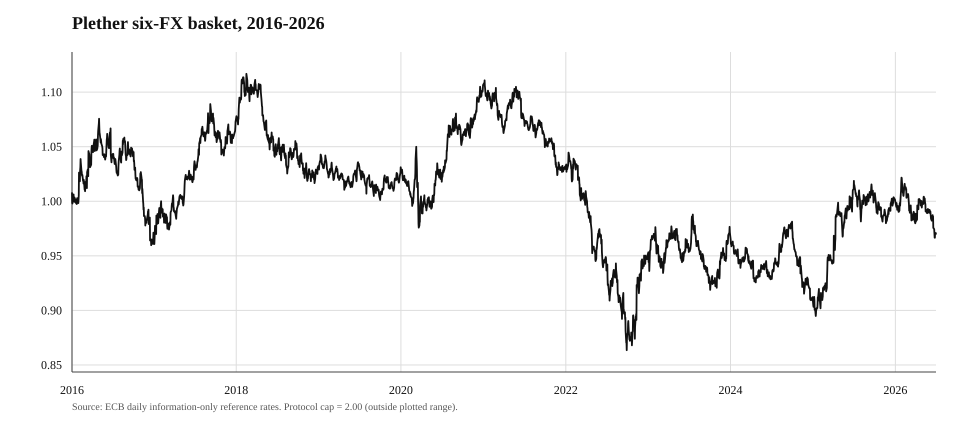
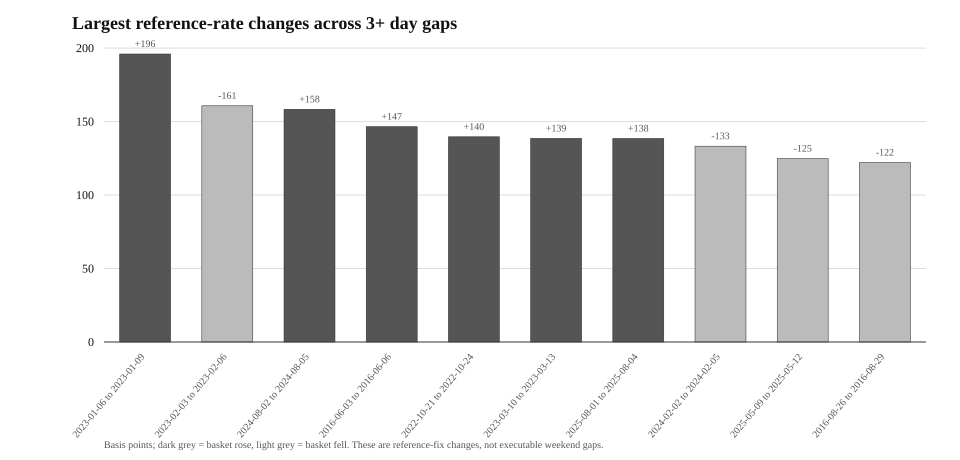
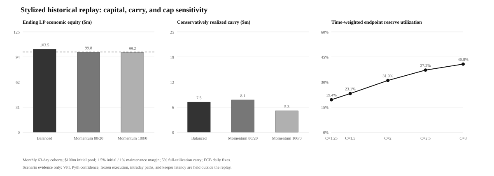
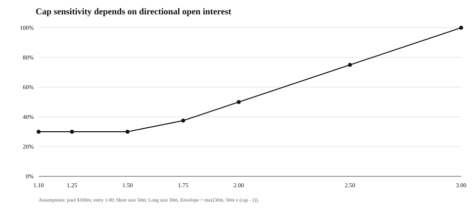

# Bounded Perpetuals

## Physical-First Solvency and Tranched Risk Capital for Oracle-Settled Markets

**Stanisław Wasiutyński - Plether Labs - Version 1.0 - 28 July 2026**

### Abstract

Perpetual markets normally manage an instrument whose price domain and cumulative
settlement path are not bounded in advance. Plether Perps instead offers
indefinite, oracle-settled directional exposure to a normalized six-currency
basket whose mark is constrained to the interval \([0,C]\). The bounded price
domain makes every position's price-PnL finite and permits a constant-time,
common-mark liability envelope computed from two side aggregates. Plether
combines that envelope with a USDC balance sheet that distinguishes physical
cash from mathematical claims, a senior/junior LP capital stack, delayed
historical-oracle execution, utilization-priced LP capital, and fail-soft
terminal settlement. LP entry and exit use one exact signed mark-to-close
adjustment: an Engine-maintained terminal book aggregates account-local price
PnL from whole lots, exact entry cost, and collectible collateral caps.

The bound is useful but narrower than a blanket solvency guarantee. It limits
gross positive **price PnL at one common mark**. It does not fully reserve every
possible sequence in which Long and Short positions close at different prices,
and it does not independently cap VPI rebates, carry, fees, oracle failures, or
stablecoin losses. Plether therefore treats the endpoint envelope as a
risk-admission and withdrawal primitive, not as a substitute for settlement
containment. Profitable exits may become senior trader claims when cash is
unavailable; valid terminal exits can complete even when they reveal
insolvency; and a degraded-mode latch then prevents further risk expansion.

This paper formalizes the bounded-liability result and its counterexample,
defines Plether's four accounting views, explains the HousePool capital
waterfall and execution state machine, and evaluates the design against 2,685
ECB daily reference-rate observations from January 2016 through June 2026. A
companion Python model reproduces selected Solidity accounting kernels, executes
the numerical settlement vectors, and produces all reported empirical results
from a deterministic scenario replay.

### Status and scope

This paper describes the Plether Perps implementation at Git revision
`06d0ab451ad9bb42f4e9869fc94b0eeb1e88efe5`. The implementation and
[accounting specification](ACCOUNTING_SPEC.md) are normative where this paper
and implementation differ. The paper is a market-design and accounting
analysis, not investment advice, a promise of solvency, or a security audit.
At this revision the system is pre-deployment. It has completed an external
pre-audit consultation but not a formal production audit.

---

## 1. The market-design question

The modern crypto perpetual swap typically anchors a non-expiring contract to a
spot index through transfers between long and short positions [1-3]. Other
on-chain designs place a liquidity pool behind oracle-settled trader PnL or
simulate execution against a virtual AMM. These approaches differ in execution
and counterparty structure, but they share a difficult balance-sheet question:
how much capital is enough when a reference asset can move without a contractual
upper bound?

Plether starts from a different instrument:

> Can an on-chain market provide leveraged, indefinite synthetic exposure
> without requiring balanced open interest, forced AMM selling, or treating
> unrealized trader losses as spendable assets?

The answer developed here has five parts:

1. Bound the reference-price domain so price-PnL liability is finite.
2. Admit new risk against a constant-time endpoint envelope.
3. Keep physical cash, trader claims, reserved custody, terminal deficits, and
   LP equity as separate accounting objects.
4. Price directional concentration and the use of LP capital separately.
5. Preserve terminal settlement liveness even when it exposes a balance-sheet
   deficit.

Plether is therefore not best understood as a conventional matched order-book
future. It is a pooled, oracle-settled perpetual CFD with USDC cross-margin
custody, explicit position-margin buckets, and a tranched external capital
provider. Long means long the Plether basket and gains as its mark rises; Short
means short the basket and gains as its mark falls. Accounts may hold one live
side at a time, and changing direction requires closing first.

### 1.1 Contributions and prior art

No individual mechanism in Plether should be presented as unprecedented.
Capped, fully escrowed decentralized derivatives predate this work [4].
Pooled-counterparty perps, asynchronous post-commit oracle execution, integrated
skew charges, utilization fees, and epoch-based LP entry all have direct
precedents [13-19].

The design contribution is the combination:

- a capped price-PnL instrument;
- endpoint-derived, constant-time side liabilities;
- exact symmetric LP share pricing from an account-capped terminal NAV book;
- physical-first LP and solvency accounting;
- a senior/junior underwriting waterfall;
- LP-capital carry paid independently by both sides;
- senior trader claims and degraded containment rather than automatic profitable
  position deleveraging; and
- invariant-oriented separation of trader custody, queued intent, engine
  accounting, and pool capital.

This combination makes a precise claim possible: Plether can reserve the
maximum gross positive price PnL of the current book at a common mark without
iterating positions. It intentionally does **not** claim that the same reserve
funds every future settlement path.

---

## 2. Instrument and basket

### 2.1 A normalized dollar-directional basket

Plether's mark is a normalized linear combination of six foreign currencies
against USD:

| Component | Weight | Deployment base USD price |
| --- | ---: | ---: |
| EUR | 57.6% | 1.1750 |
| JPY | 13.6% | 0.00638 |
| GBP | 11.9% | 1.3448 |
| CAD | 9.1% | 0.7288 |
| SEK | 4.2% | 0.1086 |
| CHF | 3.6% | 1.2610 |

For component USD prices \(x_{j,t}\), deployment bases \(x_{j,0}\), and weights
\(w_j\) summing to one, the unconstrained basket is

\[
\tilde p_t = \sum_j w_j\frac{x_{j,t}}{x_{j,0}}.
\]

The engine mark used for PnL is

\[
p_t = \min(\tilde p_t,C), \qquad 0 \le p_t \le C.
\]

The reference deployment uses \(C=2\). The basket rises when its foreign
currencies strengthen against USD and falls when USD strengthens.

The weights resemble those of the conventional ICE U.S. Dollar Index, but the
instruments are not the same. ICE USDX is a proprietary geometrically weighted
index with its own formula and market conventions [20]. Plether uses a
normalized **linear** basket and must be described as dollar-directional or
DXY-oriented, not as an on-chain DXY print.

### 2.2 Position price PnL

Let:

- \(q_i \ge 0\) be position size;
- \(e_i \in [0,C]\) be its capped entry price;
- \(p \in [0,C]\) be a common settlement mark; and
- \([z]^+=\max(z,0)\).

Signed price PnL is

\[
\Pi_i^{\mathrm{SHORT}}(p)=q_i(e_i-p)
\]

for Short and

\[
\Pi_i^{\mathrm{LONG}}(p)=q_i(p-e_i)
\]

for Long. The pool's gross positive price-PnL obligation at \(p\) is

\[
G(p)=
\sum_{i\in\mathrm{SHORT}}q_i[e_i-p]^+
+
\sum_{i\in\mathrm{LONG}}q_i[p-e_i]^+.
\]

Position margin is held in the MarginClearinghouse. Returning that trader-owned
margin is distinct from paying positive price PnL from HousePool capital.

### Proposition 1 - Common-mark endpoint envelope

Define the side endpoint liabilities

\[
L_{\mathrm{SHORT}}=\sum_{i\in\mathrm{SHORT}}q_i e_i
\]

and

\[
L_{\mathrm{LONG}}=\sum_{i\in\mathrm{LONG}}q_i(C-e_i).
\]

Then, for every common mark \(p\in[0,C]\),

\[
G(p)\le L_{\max}
=\max(L_{\mathrm{SHORT}},L_{\mathrm{LONG}}).
\]

**Proof.** Every term \([e_i-p]^+\) and \([p-e_i]^+\) is convex in
\(p\), so their nonnegative weighted sum \(G(p)\) is convex. A convex
function on a closed interval reaches its maximum at an endpoint. At \(p=0\),
Long positive PnL is zero and \(G(0)=L_{\mathrm{SHORT}}\). At \(p=C\),
Short positive PnL is zero and \(G(C)=L_{\mathrm{LONG}}\). Therefore the
maximum is the larger endpoint value. \(\square\)

The engine stores side open interest, entry notional, margin, borrow base, and
maximum-profit totals. A new position adds either \(q e\) or \(q(C-e)\) to one
side. Computing \(L_{\max}\) therefore requires two aggregate reads and one
comparison, independent of account count.

The implementation fixes position size to whole 100-token lots. With an
eight-decimal price, one lot times one price is already an exact six-decimal
USDC atom quantity. For each account the Engine therefore stores the lot count
and exact entry cost

\[
E_i=\sum_j \ell_{i,j}p_{i,j},
\]

rather than reconstructing economic basis from a rounded average entry price.
The average remains a display field only. Opens add exact endpoint profit,
while a partial close assigns a proportional floor of entry cost to the closed
lots and leaves every remainder atom on the surviving position. Exact entry
cost and endpoint liability are consequently conserved across increases and
partial closes. The earlier weighted-average dust counterexample is excluded by
the canonical lot boundary; non-quantized open, increase, and close intents are
rejected before entering the router queue.

### 2.3 What the envelope does not prove

Proposition 1 is an instantaneous result under one shared mark. It is not
pathwise.

Consider one unit Short and one unit Long, both entered at \(e=1\), with
\(C=2\). Each endpoint liability is 1, so \(L_{\max}=1\). At any one
mark, aggregate positive price PnL is at most 1. But if Short closes at \(p=0\)
and is credited 1, then Long remains open and later closes at \(p=2\),
cumulative realized price-PnL obligations equal 2. The second obligation may be
a trader claim rather than an immediate cash payment. Reserving 1 at inception
did not fund this sequential path.

This counterexample is not an implementation accident. It identifies the exact
boundary of the accounting primitive:

- `max(Short, Long)` is a common-mark price-PnL envelope;
- `Short + Long` is a more conservative bound on independently realized endpoint
  maxima;
- neither expression alone captures VPI, fees, carry, collateral seizure,
  claims, cash timing, or external loss; and
- the live protocol recomputes its balance sheet after each transition and may
  enter degraded mode after a terminal action.

Likewise, an individual **cash settlement** is not capped solely by its stored
maximum price profit. A skew-reducing close can receive a negative VPI amount,
while a position can also carry a negative lifetime VPI balance only when its
gross clawback target is held in a dedicated reserve. The price-PnL envelope,
VPI reserve, and all-in settlement equation must not be conflated.

---

## 3. A physical-first balance sheet

The central accounting discipline is to avoid using one quantity called
"equity" for every decision. A protocol can be solvent for current risk
admission while having no safely withdrawable LP cash. A trader can own a valid
claim without the corresponding USDC being immediately available. A losing
trader can owe value that has not entered HousePool custody.

### 3.1 Asset and obligation categories

| Quantity | Meaning | Canonical location |
| --- | --- | --- |
| Raw assets | Literal USDC token balance at HousePool | USDC `balanceOf(HousePool)` |
| Accounted assets | USDC admitted into protocol economics | HousePool accounting ledger |
| Physical assets \(A\) | Conservative backing `min(raw, accounted)` | `HousePool.totalAssets()` |
| Excess assets | Unsolicited raw surplus not yet assigned | `raw - accounted`, floored at zero |
| Free trader settlement | Withdrawable trader cash | MarginClearinghouse account |
| Position margin | Trader value locked behind a live position | Clearinghouse position bucket plus engine mirror |
| Order reservation | Margin committed to one queued order | Clearinghouse reservation keyed by order ID |
| Keeper reserve | Trader-funded order-execution bounty | Clearinghouse reserved-settlement bucket |
| Trader claims \(K\) | Senior pool obligations from deferred payouts | Engine beneficiary balances |
| Terminal deficit | Negative terminal LP equity at the authenticated mark | Engine/HousePool snapshot; blocks deposit activation |
| Unrealized trader gain | Exact marked LP obligation before close | Account terminal curve; not yet a cash claim |
| Unrealized trader loss | Account-capped marked LP receivable before close | Account terminal curve; never spendable pool cash |
| LP principals | Senior and junior claimant allocations | HousePool waterfall state |
| LP accounting equity | Physical backing net of claims plus the exact signed terminal price delta | HousePool reconciliation view, allocated by the waterfall |
| Treasury fees | Cash-realized protocol inventory | Treasury clearinghouse account |

An unsolicited transfer to HousePool does not automatically increase economic
depth. Conversely, a raw-balance shortfall reduces physical backing immediately.
This `min(raw, accounted)` boundary prevents a donation from silently changing
solvency, VPI depth, or share value before the transfer has an assigned owner.

Terminal NAV V2 has no accumulated-debt ledger or owner repayment selector.
An unpaid trader payout remains explicit as a senior trader claim. Independently
negative terminal LP equity is exposed as terminal deficit and blocks deposit
activation. Price loss above an account's collectible cap was never included as
an LP receivable and is emitted only as diagnostic write-off telemetry; a
terminally uncollectible action-charge remainder is waived.

Marked ownership is sign-symmetric even though cash availability is not. An
unrealized trader gain reduces LP share NAV. An unrealized trader loss increases
that same NAV only up to value collectible from the losing account's dedicated
PnL pledge and nettable same-account claim. The receivable remains non-cash and
cannot fund a redemption until settlement collects it. Senior and junior
principal allocate the resulting terminal equity through the waterfall. These
categories must not be collapsed merely because an off-chain dashboard can net
them into one number.

### 3.2 Four views for four questions

| Accounting view | Question | Primary construction |
| --- | --- | --- |
| Risk admission | May the protocol accept more price risk? | Post-operation physical assets net of trader claims versus \(L_{\max}\) |
| LP withdrawal | How much physical USDC may leave now? | Physical assets less endpoint liability, trader claims, and explicit reserves |
| Tranche reconciliation and share pricing | What marked ownership backs tranche shares? | Physical assets less claims plus the exact signed account-capped terminal price delta |
| Terminal reachability | What trader-owned value can this close or liquidation actually consume? | Explicit clearinghouse buckets and permitted terminal reservation paths |

The views share source data but answer different questions. Reusing a less
conservative view merely because its field names look similar is an accounting
error.

### 3.3 Risk-increasing admission

Let:

- \(A^+\) be projected post-operation physical assets;
- \(K^+\) be projected aggregate trader claims;
- \(P^+\) be a pending payout not yet reflected in \(A^+\); and
- \(L_{\max}^+\) be the projected common-mark endpoint envelope.

The engine's effective assets are

\[
A_{\mathrm{eff}}^+
=\max(A^+-K^+-P^+,0).
\]

Risk expansion is rejected unless

\[
A_{\mathrm{eff}}^+\ge L_{\max}^+.
\]

For a simple open with no preexisting claims or pending payout, this reduces to
the familiar expression

\[
A_{\mathrm{physical}}\ge
\max(L_{\mathrm{SHORT}},L_{\mathrm{LONG}}).
\]

Open planning includes immediate pool changes. Positive VPI increases physical
pool assets; a VPI rebate reduces them; the protocol execution fee belongs to
treasury rather than LP assets. The admission test therefore uses the projected
post-operation balance sheet rather than a stale pre-trade asset number.

### Proposition 2 - Constant-time admission predicate

Given correctly maintained side maximum-profit aggregates and current
physical/claim totals, evaluating the engine's risk-admission predicate is
\(O(1)\) in the number of positions.

This is a statement about computational complexity and conformance to the
protocol's chosen predicate. Because of the sequential-settlement counterexample
in Section 2.3, it is not a theorem that every future close path is fully funded.

### 3.4 LP withdrawal firewall

The base withdrawal reservation is

\[
R_{\mathrm{base}}=L_{\max}+K+R_{\mathrm{sup}},
\]

where \(R_{\mathrm{sup}}\) is the explicit supplemental-reserve slot. Live
HousePool paths can layer pending claimant buckets and unassigned assets on top.
The base free cash is

\[
W_{\mathrm{free}}=\max(A-R_{\mathrm{base}},0).
\]

### Proposition 3 - Snapshot withdrawal preservation

Assume the snapshot already satisfies \(A\ge R_{\mathrm{base}}\). If an LP
withdrawal \(w\) satisfies \(0\le w\le W_{\mathrm{free}}\), then the remaining
physical assets satisfy

\[
A-w\ge R_{\mathrm{base}}.
\]

The proof follows directly from the definition of \(W_{\mathrm{free}}\) under
the stated precondition. Equivalently, the live withdrawal gate permits success
only from an already reserved snapshot and only up to its computed free cash.
The property preserves the current snapshot reserve; it does not extend
Proposition 1 into a pathwise guarantee.

**Boundary example.** Let physical assets be $60 million, trader claims $5
million, and \(L_{\max}\) $55 million. Effective assets equal $55 million, so
the risk balance is exactly at its chosen solvency boundary. Withdrawal reserves
equal all $60 million and LP free cash is zero. "Solvent" and "withdrawable" are
therefore not synonyms.

### 3.5 Exact symmetric terminal NAV

Share pricing asks an ownership question, not a cash-withdrawal question. It
therefore uses the same exact mark-to-close adjustment for incoming and outgoing
LPs while retaining the endpoint envelope of Section 3.4 for physical redemption
funding.

For account \(i\), let \(\ell_i\) be its number of 100-token lots, \(E_i\) its
exact entry cost in USDC atoms, and \(k_i\) its effective collectible cap: the
smaller of its dedicated PnL pledge plus nettable same-account claim and its
maximum possible price loss inside \([0,C]\). With the protocol's BULL side
profiting as the oracle price falls and BEAR profiting as it rises, the LP-side
terminal price delta is

\[
\delta_i(p)=
\begin{cases}
\min(\ell_i p-E_i,k_i), & \text{BULL},\\
\min(E_i-\ell_i p,k_i), & \text{BEAR}.
\end{cases}
\]

A negative value is marked value owed by LPs to that trader. A positive value
is a trader loss recognized for LP ownership only to the extent the same
account can pay it. Carry, VPI, fees, frozen spreads, liquidation reserves,
order margin, and action reserves are separate realized-settlement quantities
and are excluded from this curve.

`TerminalNavBookV2` maintains

\[
\Delta_{\mathrm{terminal}}(p)=\sum_i\delta_i(p)
\]

without iterating active accounts. Each account contributes a piecewise-affine
curve with at most one cap breakpoint. A fixed-depth radix-16 prefix tree over
the 32-bit price domain aggregates its base coefficient and breakpoint event,
so reads and mutations are bounded independently of account count. Only the
immutably bound Engine can set or remove a curve. Domain-separated curve hashes
authenticate replacement, and a monotonic book version exposes every effective
mutation.

At the Engine's authenticated cached mark, the common share-pricing snapshot is

\[
T=A-K+\Delta_{\mathrm{terminal}}(p),
\qquad
D_{\mathrm{reconcile}}=\max(T,0),
\qquad
D_{\mathrm{deficit}}=\max(-T,0),
\]

before any additional explicit claimant or unassigned-asset adjustments. The
Engine updates position lots, exact entry cost, pledge/claim state, and the
account curve atomically; HousePool separately enforces mark-age and frozen
market policy before LP actions.

Both deposit activation and redemption share pricing use this one signed
snapshot. A new entrant therefore receives the same discount for inherited
marked trader-profit liabilities borne by an exiting LP, and receives credit
only for collectible trader losses. Positive marked receivables still do not
increase the physical cash available to fund redemptions. A current terminal
deficit blocks deposit activation rather than minting ownership into negative
equity.

### 3.6 Conservation is category-specific

Let \(H\) be physical USDC in HousePool and \(Q\) physical USDC in the
MarginClearinghouse across trader, treasury, and keeper ownership buckets. For
one internal settlement transition with no deposit, withdrawal, unsolicited
transfer, stablecoin rebase, or token failure:

\[
\Delta(H+Q)=0.
\]

That token identity is necessary but incomplete. A settlement can replace a
cash payout with a non-cash trader claim, consume an existing claim against a
price loss, write off price loss that was never recognized beyond the account's
collectible cap, or waive an uncollectible terminal action charge. Those items
change entitlement or telemetry without minting physical USDC.

### Proposition 4 - Transition-level conservation of value categories

Assume the planner and apply path use the same settlement amounts and the
underlying USDC transfers conserve tokens. For every successful close or
liquidation:

1. every physical debit has one physical credit across HousePool,
   MarginClearinghouse ownership buckets, and any explicit external flow;
2. a deferred fresh payout increases trader claims by exactly the unpaid
   payout and causes no contemporaneous HousePool cash debit;
3. claim consumption reduces the same beneficiary liability and offsets only
   that account's exact realized price loss;
4. price loss above the precommitted collectible cap is emitted as a diagnostic
   write-off and creates no asset, claim, deficit, or protocol debt;
5. every surviving account curve equals its remaining lots, entry cost, and
   post-settlement collectible cap; and
6. for a frozen voluntary close,

   \[
   \mathrm{spread}_{\mathrm{assessed}}
   =\mathrm{spread}_{\mathrm{paid}}
   +\mathrm{spread}_{\mathrm{waived}}.
   \]

**Proof sketch.** The price-GAIN branch either transfers the complete fresh
payout or creates an equal claim; it never does both. The price-LOSS branch
partitions exact realized loss into same-account claim consumption, PnL-pledge
seizure, and an explicit amount above the cap that was absent from pre-close LP
NAV. Carry, VPI, execution fees, frozen spread, and liquidation charges use
separate action and liquidation reserves; a terminally uncollectible action
remainder is waived rather than recast as price debt. The apply path then
installs the residual curve or removes the full-close curve atomically.
Liquidation separately partitions its dedicated charge reserve among keeper,
protocol, and LP recipients. Each branch is a disjoint exhaustive partition.
The proposition proves ledger conservation conditional on correct planning and
application; it does not prove that the resulting claims are liquid or that the
pool remains solvent.

The executable vectors test these identities directly. The on-chain evidence is
the economic/value-conservation invariant family discussed in Section 11.

---

## 4. HousePool as a capital structure

LPs are not passive AMM depositors in this design. They underwrite the bounded
price-PnL claims of the trader book and receive realized trading revenue, carry,
and frozen-market compensation. Their capital is divided into senior and junior
ERC-4626 vaults [8].

### 4.1 Senior and junior claims

Let \(S\) and \(J\) denote senior and junior principal. Let \(H\) be the
senior high-water mark: the unimpaired senior entitlement that future revenue
must restore before junior receives residual value.

The waterfall applies these rules:

1. Loss reduces junior principal first.
2. Loss beyond junior reduces senior principal.
3. Loss does not reduce \(H\).
4. Later revenue first restores \(S\) to \(H\).
5. Revenue remaining after senior restoration accrues to junior.
6. The senior target coupon is paid from junior principal and is capped by
   available junior principal.
7. Coupon paid above an unimpaired senior balance ratchets both \(S\) and
   \(H\), protecting that paid coupon from later junior extraction.

Prioritized claims can transform the distribution of risk but cannot remove
aggregate risk. Structured-finance literature is especially clear that senior
safety depends on the quality of the underlying loss model and on systematic
tail dependence [10-11]. Plether's tranche labels are priorities, not credit
ratings.

### 4.2 Waterfall example

Suppose the pool begins with:

- senior principal \(S=\$60\) million;
- junior principal \(J=\$40\) million; and
- senior high-water mark \(H=\$60\) million.

A $50 million reconciliation loss produces:

- \(J=0\);
- \(S=\$50\) million; and
- \(H=\$60\) million.

If $25 million of revenue later becomes distributable, the first $10 million
restores senior to its high-water mark and the remaining $15 million establishes
junior principal. The resulting state is \(S=60\), \(J=15\), \(H=60\), all in
millions of USDC.

### 4.3 Synchronized LP epochs are an accounting and liquidity control

Ordinary entry and exit are fully asynchronous. Both tranches share a one-hour
clock and one permissionless HousePool coordinator. A deposit request targets
the current epoch plus two, while a redemption request targets the current
epoch plus one. One bounded settlement transaction then:

1. reconciles HousePool accounting and fixes one execution-time signed
   terminal-NAV and waterfall snapshot;
2. funds matured senior redemption demand before any junior redemption demand;
3. funds junior demand only from remaining free liquidity and subordinated
   capital capacity;
4. finalizes matured junior deposits and then matured senior deposits from the
   same signed accounting snapshot; and
5. leaves funded assets or shares in vault escrow for later user claims.

Redemption priority is demand-based: dormant senior NAV does not reserve cash
from junior claimants, but any newly matured senior request moves ahead of an
older unfunded junior remainder. Incoming deposits never expand the withdrawal
budget captured for the same settlement call. Deposit cancellation is
unconditional before activation and follows the documented impairment/capacity
policy after activation; redemption cancellation is available only before
maturity while the request is wholly unfunded. Funded claims remain callable
independently of later settlement, pause, or oracle liveness.
If no queued epoch can advance, settlement reverts and rolls back its reconcile
and carry checkpoints; this prevents permissionless no-op calls from changing
time-based accounting.

This implements the pending-to-claimable lifecycle standardized for
asynchronous vaults in ERC-7540 [9], with protocol-specific shared request ids,
terminal refund states, and bounded queue rules.

The delay separates request funding from activation; it is not a substitute for
exact valuation. At settlement, both deposit activation and redemption pricing
consume the current signed TerminalNavBookV2 adjustment. A close or liquidation
that converts marked price PnL into physical cash, a trader claim, or an
explicit write-off also replaces or removes the account curve in the same
transition. Finalizing before or after that transition therefore cannot select
the retired deposit-only valuation: each valid snapshot applies one economic
state to both LP directions.

Epochs do not remove ordinary timing and liveness risk. There is no auction or
user-specified share-price limit, so a matured request is priced at the valid
snapshot when a permissionless caller actually settles it. Until activation,
deposit assets remain in request escrow under the cancellation policy rather
than silently becoming active LP capital.

### 4.4 Frozen-market LP operations

When the oracle is genuinely frozen, new deposit requests are unavailable and
queued deposits remain escrowed rather than activating against a frozen mark.
Eligible exits remain live under a tranche-local surcharge. Reference defaults
are 25 basis points for senior and 75 basis points for junior. At synchronized
settlement, redemptions pay fewer net assets against the gross tranche claim.
The fee remains in the same tranche and does not become protocol revenue.
Preview methods revert for these asynchronous flows; explicit exit estimate
views expose nonbinding current quotes.

### 4.5 Recapitalization and ownership routing

"More USDC in the pool" is not one accounting event. Plether distinguishes:

- **Claimant recapitalization with cash arrived:** new cash intended to restore
  the LP waterfall;
- **Revenue with cash arrived:** a fresh claimant-owned inflow, such as
  collected trading revenue;
- **Revenue already retained:** cash is already physical in HousePool and only
  its ownership is being assigned, so accounted assets must not increase twice;
- **Excess admission:** governance explicitly admits an unsolicited raw-token
  surplus into canonical assets.

Revenue restores impaired senior principal to its high-water mark before junior
participates. Recapitalization can restore claimant value and solvency capacity,
but it does not automatically clear degraded mode: the explicit owner recovery
action remains necessary after the balance sheet is genuinely restored.

---

## 5. Pricing capital and directional concentration

Plether separates five prices that are often collapsed into a generic "trading
fee."

| Charge or adjustment | Economic purpose | Primary beneficiary |
| --- | --- | --- |
| Execution fee | Protocol service revenue on traded notional | Treasury, only when cash credited |
| VPI | Price a change in directional skew | Pool when positive; trader rebate when negative |
| Carry | Rent for LP capital committed behind maximum-profit exposure | LP claimants when realized |
| Oracle confidence shift | Side-adverse execution within Pyth uncertainty | Protective execution adjustment |
| Frozen close spread | Compensate LPs for voluntary stale-mark exit | LPs only; never treasury |

### 5.1 Virtual price impact

At fixed pool depth \(D\), Plether assigns absolute skew \(S\) the potential

\[
\mathcal C(S)=\frac{kS^2}{2D},
\]

where \(k\) is the VPI factor. A trade pays

\[
\mathrm{VPI}
=\mathcal C(S_{\mathrm{post}})
-\mathcal C(S_{\mathrm{pre}}).
\]

A trade increasing absolute imbalance pays a positive amount; a trade reducing
imbalance earns a negative amount. Because VPI is the difference of a state
potential, a sequence at unchanged \(D\) telescopes:

\[
\sum_n\Delta\mathcal C_n
=\mathcal C(S_N)-\mathcal C(S_0).
\]

Splitting the same skew change into pieces therefore does not avoid VPI under
fixed depth. The implemented integer potential also telescopes exactly when
each charge is the difference of the same floor-rounded potential at unchanged
depth; flooring changes its value relative to the continuous curve but not
that algebraic cancellation. Changing depth between trades breaks the
fixed-potential assumption, and the position lifetime clamp can truncate close
rebates. Partial-close VPI release is a bounded linear approximation rather than
a fresh exact curve evaluation. Liquidation computes no fresh VPI delta, though
negative accrued VPI is included in its action-charge settlement.

The gross target \(\max(-\mathrm{VPI}_{\mathrm{accrued}},0)\) is held as a
dedicated nonwithdrawable sub-balance of action reserve. An open or increase
that makes the target larger must fund it immediately or fail. Generic action
collection cannot cross the combined floor protecting execution bounties and
this VPI reserve. VPI does not add to or subtract from P+C price-risk equity:
reserve value above the target never adds price collateral, while reserve value
below the target is an independent delinquency that blocks withdrawal and makes
the account liquidatable. A close or liquidation consumes the reserve when the
clawback is realized and releases only value no longer required by the surviving
target. A new close-time action rebate still comes only from pool cash free of
existing trader claims; an unfunded remainder is waived rather than claim-backed.
The reserve is excluded from the terminal price curve, so LPs cannot withdraw it
as marked equity before the matching position obligation settles.

Integrated skew pricing has clear prior art in Synthetix and Perennial [14,18];
the relevant Plether contribution is how this pricing interacts with the
bounded balance sheet and lifetime accounting.

**Example.** With \(D=\$100\) million, \(k=0.005\), and skew moving from
$10 million to $30 million:

\[
\mathcal C(10\mathrm{m})=\$2{,}500,
\qquad
\mathcal C(30\mathrm{m})=\$22{,}500.
\]

The VPI charge is $20,000. Reversing the move at unchanged depth produces a
$20,000 rebate before the lifetime clamp.

### 5.2 LP-capital carry

For position \(i\), Plether defines an LP-backed borrow base

\[
b_i=\max(L_i^{\max}-m_i,0),
\]

where \(m_i\) is active position margin and \(L_i^{\max}\) is that position's
maximum price profit. Subtracting margin is a **carry-pricing convention**: it
prices only the portion of maximum-profit exposure governance treats as rented
LP capacity. Trader-owned position margin remains in MarginClearinghouse and
does not reduce HousePool's endpoint reserve. A fully margined position may
therefore have zero borrow base while its full maximum price profit remains in
the HousePool liability aggregate.

For side \(s\), the implementation's zero-asset edge cases are explicit:

\[
B_s=\sum_{i\in s}b_i,
\qquad
u_s=\min(B_s/A,1)
\quad\text{when}\quad A>0.
\]

If \(B_s=0\), utilization is zero. If \(B_s>0\) while \(A=0\),
utilization is defined as 100% rather than dividing by zero.

If \(r_{\max}\) is the annual simple carry rate at full utilization, the side
rate is

\[
r_s=r_{\max}u_s.
\]

Each position accrues against a cumulative side index:

\[
\mathrm{carry}_i
=b_i\Delta I_s.
\]

The implementation performs the utilization and time multiplication in one
combined integer expression to retain more precision than first rounding a
displayed basis-point rate.

This is capital rent, not a transfer from the heavier side to the lighter side.
Both Long and Short can pay simultaneously because both can reserve LP balance
sheet capacity simultaneously. Carry continues during stale and frozen oracle
windows. Health checks first project it against eligible free settlement. A
fully funded carry obligation therefore does not reduce the separate exact
price-risk health basis; any uncovered remainder blocks withdrawal and
independently makes the account liquidatable. PnL pledge plus same-account claim
backs only exact price risk and cannot offset that remainder. Before a mutation
changes its basis or rate denominator, elapsed carry is checkpointed. The
protocol collects it physically when that is safe; otherwise the amount remains
in the account-specific `unsettledCarryUsdc` bucket for later collection. A
checkpoint therefore preserves accrued history without pretending every
checkpoint is an immediate cash realization.

**Example.** Let pool assets be $100 million and the full-utilization base rate
be 5%:

| Side | Max-profit envelope | Position margin | Borrow base | Utilization | Effective annual rate | One-year carry |
| --- | ---: | ---: | ---: | ---: | ---: | ---: |
| Long | $25.0m | $2.5m | $22.5m | 22.5% | 1.125% | $253,125 |
| Short | $40.0m | $4.0m | $36.0m | 36.0% | 1.800% | $648,000 |

The example produces $901,125 of total one-year carry before changes in
positions, pool depth, or collection. The Solidity rate-view helper displays
the Long rate as 112 basis points after flooring, while the combined index
calculation preserves the 112.5-basis-point economic product.

---

## 6. Delayed execution and oracle policy

Plether does not expose a same-transaction trader market-order path. A user
commits a binding intent; a keeper later executes the global FIFO head against
verified Pyth data. Delayed settlement is a recognized defense against oracle
latency exploitation, while finite settlement windows limit the option value
given to the trader [5,15]. Delay does not eliminate transaction-ordering MEV,
and FIFO does not by itself prove fairness [21-22].

### 6.1 Order lifecycle

1. The trader deposits USDC into MarginClearinghouse.
2. `commitOrder` records side, size, margin, slippage limit, commit time, commit
   block, and close/open intent.
3. The router moves open margin into an order-specific reservation and reserves
   a keeper bounty from trader value.
4. The order becomes the global FIFO head in turn.
5. For live execution, a keeper supplies Pyth updates and native-token oracle
   fees.
6. The router resolves the unique historical update in the configured window
   strictly after commit.
7. Basket components are normalized, confidence is propagated, publish-time
   dispersion is checked, and the side-adverse execution price is capped at
   \(C\).
8. Typed policy determines whether the order executes, fails terminally, or
   remains pending for retry.
9. Reserved value is consumed, paid, refunded, forfeited, or remains claimable
   exactly once.

Pyth's `parsePriceFeedUpdatesUnique` primitive verifies that returned updates are
the first qualifying feed updates in a specified range [6]. Plether obtains
"strictly after commit" by setting the lower bound after the commit timestamp,
not because Pyth globally assigns that semantic. Pyth confidence is an
uncertainty interval width, not a confidence score [5,23].

### 6.2 Basket-specific oracle checks

The PletherOracle:

- fixes feed IDs, weights, bases, inversion flags, and Pyth endpoint per oracle
  deployment;
- converts each feed to the shared price scale;
- computes the weighted normalized basket;
- propagates basket confidence from weighted component relative confidence;
- rejects a component whose confidence-to-price ratio exceeds policy;
- rejects excessive publish-time dispersion between basket legs;
- uses the oldest component publish time as the basket timestamp; and
- caps the basket and execution price at \(C\).

Live and FAD-only trades use a side-adverse fraction of the Pyth confidence
interval. Oracle-frozen voluntary closes instead use the unshifted validated
basket and pay a fixed LP-owned spread. Liquidations retain conservative
side-adverse pricing and do not pay the frozen voluntary-close spread.

### 6.3 Regimes as a product state machine

Oracle condition and balance-sheet condition are separate dimensions. Define
the execution state

\[
\mathcal{M}=(O,D),
\qquad
O\in\{\mathrm{Live},\mathrm{FAD},\mathrm{Frozen},
\mathrm{OverStale}\},
\qquad
D\in\{\mathrm{Healthy},\mathrm{Degraded}\}.
\]

The oracle/calendar component \(O\) moves according to the FAD schedule, frozen
calendar, authenticated publish times, and configured freshness limits. It
returns toward `Live` only when those exogenous conditions again pass. The
orthogonal latch \(D\) moves from `Healthy` to `Degraded` when a permitted
terminal close or liquidation leaves projected physical assets net of claims
below the current admission envelope. It does not auto-clear: after genuine
recapitalization or risk reduction restores the balance sheet, an explicit
owner action is required to return it to `Healthy`.

An action is authorized only if both coordinates permit it. Thus a healthy but
over-stale market still blocks settlement, while a degraded but live market
permits protective closes and liquidations but no new position risk. The table
below is the resulting permission projection; `Degraded` intersects every
oracle row rather than replacing it.

| Regime | Risk increase | Voluntary close | Liquidation | Principal policy |
| --- | --- | --- | --- | --- |
| Live | Allowed if all checks pass | Live historical tick | Live conservative tick | Normal margin and freshness |
| FAD/runway | Blocked | Live close-only tick | Available | Elevated FAD margin |
| Oracle frozen, within limit | Blocked | Validated stale-window price plus fixed spread | Available under frozen policy | Risk reduction prioritized |
| Frozen beyond max staleness | Blocked | Blocked | Blocked | Wait for valid data |
| Degraded | Blocked | Allowed when oracle regime permits | Allowed when oracle regime permits | Protective transitions and recapitalization |

FAD addresses scheduled FX-market closure risk. BIS guidance notes that major FX
markets trade through the working week but not over weekends, so the reopening
rate may jump relative to Friday [24]. Plether's reference defaults start a
close-only runway before the closure period and raise the margin basis to 3%.
Administrators may add expected FX-holiday dates.

### 6.4 Keeper economics and queue liveness

Keeper rewards are reserved from trader clearinghouse value, not drawn from
HousePool. Open and close orders use free settlement. Close commitment may
checkpoint carry first, but it never reclassifies PnL pledge to fund a bounty,
including on the stale-mark path. Execution-time user failures and specified
protocol-state invalidations pay the keeper so an invalid FIFO head can be
removed.

Binding orders reduce the ability to treat a queue position as a free option,
but they remove user cancellation after an order has entered the queue. The
global head also creates a liveness dependency: no keeper may skip it merely
because a later order is more attractive. Order age, per-account pending limits,
bounded cleanup, typed failure categories, and reserved bounties are the
compensating controls.

---

## 7. Settlement and failure containment

The protocol prioritizes completing valid **terminal** risk-reducing transitions
over preserving the appearance of pre-transition solvency. A partial close may
write off price loss above its precommitted collectible cap, but it still
reverts if a separate action charge must be collected in full or if the
surviving position and terminal curve cannot remain consistent.

### 7.1 Profitable close

A close first computes:

\[
\mathrm{net\ settlement}
=\mathrm{realized\ price\ PnL}
-\mathrm{VPI}
-\mathrm{execution\ fee}
-\mathrm{frozen\ spread}
-\mathrm{pending\ carry}.
\]

When this value is positive, the pool pays it immediately only if physical cash
remaining after reserving **existing aggregate trader claims** covers the entire
fresh payout. Otherwise the complete fresh amount becomes a new
beneficiary-based trader claim. There is no partial immediate payout and no
FIFO claim queue.

Claims are senior in:

- risk-admission effective assets;
- LP withdrawal reserves;
- tranche reconciliation; and
- future cash-priority decisions.

An account claim may be settled only by its beneficiary and only when aggregate
claims are fully covered. Settlement credits the MarginClearinghouse account
rather than transferring directly to the wallet.

**Claim example.** Suppose HousePool has $18 million of physical assets and $15
million of existing claims. Only $3 million is free for a fresh payout under the
claim-priority rule. A profitable full close owed $5 million completes, but the
full $5 million becomes a new claim. The mechanism preserves position-exit
liveness; it does not provide immediate liquidity.

### 7.2 Losing partial and full closes

For a losing close, the exact entry cost allocated to the closed lots determines
price loss. Settlement nets a same-account trader claim first and then consumes
the dedicated PnL pledge. It does not treat order margin, liquidation reserve,
execution-bounty reserve, or generic action reserve as additional price-loss
backing. Any price loss beyond the pre-close account cap is a diagnostic
write-off because LP NAV never counted it as receivable.

A partial close is therefore not blocked merely because uncapped price loss
exceeds collectible value. Instead it must:

1. consume the exact claim and pledge amounts selected by the planner;
2. retain any pledge required to make the residual curve conserve the pre-close
   terminal value;
3. collect required carry, VPI, execution-fee, and frozen-spread action charges
   in full; and
4. atomically replace the account curve with the remaining lots, entry cost,
   and collectible cap.

A full close follows the same separated price channel, may waive a terminally
uncollectible action-charge remainder, and removes the curve. Price loss above
the cap never creates protocol debt or a terminal deficit.

**Underwater close example.** Suppose an exact closed-lot basis produces an
$800,000 trader price loss while the account has no nettable claim and only
$300,000 of PnL pledge. LP NAV immediately before the close includes a $300,000
marked receivable, not $800,000. Settlement transfers $300,000 to HousePool,
emits a $500,000 price-loss write-off, and removes or replaces the account curve.
The recognized terminal value is conserved. Execution fee, carry, VPI, and any
frozen spread are assessed through their separate action-charge path.

### 7.3 Liquidation

Liquidation eligibility uses exact P+C price-risk health. Negative lifetime VPI
is a separate typed obligation: reserve backing below its gross target is an
independent liquidation condition, while excess reserve never adds price
collateral. Carry is likewise isolated: eligible free settlement covers pending
carry first, while any uncovered carry independently makes the account
liquidatable and cannot be offset by PnL pledge or claim. A liquidation is a
full-position terminal transition; there is no partial-liquidation recovery path
for an oversized account. Liquidation then:

1. consumes exact price loss from same-account claim and PnL pledge and writes
   off only the excess;
2. assesses the capped liquidation charge against its dedicated reserve and
   allocates the configured keeper and protocol shares plus the exact LP
   remainder;
3. settles carry and the negative lifetime-VPI clawback through their separate
   action path, waiving any terminally uncollectible remainder;
4. preserves a positive fresh trader payout as cash or a senior trader claim;
5. removes the position, terminal curve, and bounded account-local pending
   order state; and
6. evaluates degraded mode.

**Liquidation allocation example.** If the capped liquidation charge is $2,000
and its dedicated reserve contains $2,000, the keeper and protocol allocations
round down from that amount and LPs receive the exact remainder. Price PnL is
settled independently against the account's claim and PnL pledge; an uncovered
price-loss tail neither reduces the $2,000 allocation nor creates protocol debt.

Because liquidation settles against an external oracle mark, one liquidation
does not mechanically trade through an AMM curve and move the next account's
execution price. A common oracle shock can still liquidate many accounts at
once, and keeper/oracle capacity remains a liveness dependency.

Plether uses claims and degraded containment rather than automatically reducing
profitable positions solely to repair a pool PnL ratio. This differs from
oracle-pool designs that employ auto-deleveraging as a solvency backstop [17].

### 7.4 Frozen voluntary closes

During oracle freeze, the reference configuration assesses a fixed 50-basis
point spread on reduced notional. The spread:

- replaces the live side-adverse confidence shift for voluntary closes;
- belongs entirely to LP claimants;
- never credits treasury;
- remains separate from signed VPI;
- must be fully collectible for a partial close; and
- may be partly waived only for a terminal full close.

For every valid frozen voluntary close,

\[
\mathrm{spread}_{\mathrm{assessed}}
=\mathrm{spread}_{\mathrm{paid}}
+\mathrm{spread}_{\mathrm{waived}}.
\]

Liquidations never assess this spread.

**Frozen terminal-exit example.** A full close reduces $2 million of notional,
so the 50-basis-point frozen spread is $10,000 and the 4-basis-point execution
fee is $800. Suppose the position also has a $2,000 price loss, no VPI or pending
carry, and only $5,000 is reachable. The $12,800 obligation is allocated in
priority order:

- $800 pays the execution fee;
- $2,000 pays the entire base price loss;
- $2,200 pays part of the LP-owned frozen spread;
- $7,800 of spread is waived; and
- no protocol liability or terminal deficit is created because all base loss
  was collected.

The full close completes and
\(\$10{,}000=\$2{,}200+\$7{,}800\). A partial close with the same shortfall
would revert.

### 7.5 Degraded mode

After a close or liquidation, the engine compares effective physical assets with
the remaining endpoint envelope. If the former is smaller, degraded mode
latches. While degraded:

- new opens are blocked;
- position-backed withdrawals are blocked;
- closes and liquidations remain available when oracle policy permits;
- mark updates remain available; and
- recapitalization can restore the balance sheet.

Degraded mode is not a global pause. It is a latched containment response to a
terminal transition that the protocol deliberately allowed to finish; it does
not auto-clear merely because a later mark looks solvent. After genuine
restoration, the owner may clear the latch through the explicit recovery path.

---

## 8. Empirical evaluation

### 8.1 Data and method

The empirical dataset contains 2,685 complete ECB daily reference-rate
observations from 4 January 2016 through 30 June 2026 [7]. ECB quotes each
currency as units per EUR. For non-EUR component \(j\), the model derives

\[
x_{j/\mathrm{USD}}
=\frac{x_{\mathrm{USD}/\mathrm{EUR}}}
{x_{j/\mathrm{EUR}}},
\]

then applies Plether's deployment weights and bases.

The fixed API response has SHA-256:

`45a8b4e376c3f518c6687335ba849d087cb34906e1bfa6217e0305e0223b4eca`

ECB rates are published on working days for information purposes and are not
recommended as transaction prices [7]. The study is therefore a transparent
macro-price proxy, not a replay of Pyth ticks. The descriptive statistics do not
model confidence width, intraday paths, keeper latency, or tradable
Friday-close/Monday-open quotes. Section 8.4 adds a stateful daily-fix scenario
replay with integer PnL, admission, carry, fees, liquidation, claims, and legacy
uncovered-loss telemetry,
and two explicitly non-production tranche overlays: a realized-cash view and a
conservative side-envelope stress after each observation's ordinary actions,
plus one final reconciliation after forced end-of-sample closes. The replay
predates the exact account-capped TerminalNavBookV2 kernel and does not estimate
production LP share prices. It also holds VPI, oracle confidence, frozen
execution, slippage rejection, pending epochs, and intraday keeper behavior
outside the experiment.



### 8.2 Basket range and cap distance

| Statistic | Result |
| --- | ---: |
| Complete observations | 2,685 |
| Mean normalized basket | 1.0070 |
| Minimum | 0.8636 on 28 Sep 2022 |
| Maximum | 1.1168 on 15 Feb 2018 |
| Maximum as fraction of cap \(C=2\) | 55.84% |
| Largest peak-to-trough decline | 22.67% |
| Last observation | 0.9695 on 30 Jun 2026 |

The cap did not bind in this sample. That is not evidence that it cannot bind.
It shows the capital-efficiency price of an endpoint guarantee: a large fraction
of reserved tail space was unused by the historical macro proxy.

For the most favorable forward Long move in the sample, a position entering at
0.9597 and exiting at a later 1.1168 used 15.09% of its cap-endpoint
maximum-profit reserve. For Short, the highest reserve utilization was 22.67%,
from an entry at 1.1168 to a later 0.8636. These are ex-post sample maxima, not
risk limits.

### 8.3 Adjacent fixes and weekend proxy

| Interval sample | Count | Median absolute change | 95th percentile | 99th percentile | Maximum |
| --- | ---: | ---: | ---: | ---: | ---: |
| All adjacent observations | 2,684 | 22.67 bps | 83.03 bps | 136.10 bps | 358.37 bps |
| Gaps of at least 3 calendar days | 550 | 24.53 bps | 92.11 bps | 138.54 bps | 195.97 bps |
| Friday-to-Monday observations | 523 | 24.61 bps | 90.33 bps | 138.54 bps | 195.97 bps |

The largest Friday-to-Monday reference-fix move was +195.97 basis points from 6
January to 9 January 2023. The largest adjacent-fix move overall was +358.37
basis points from 10 to 11 November 2022.



As a deliberately simple move-threshold diagnostic, the model counts absolute
reference-rate changes greater than 1%, 1.5%, and 3%:

| Absolute move threshold | All adjacent intervals | 3+ day gaps | Friday-Monday |
| --- | ---: | ---: | ---: |
| 1.0% | 79 | 22 | 20 |
| 1.5% | 18 | 3 | 3 |
| 3.0% | 1 | 0 | 0 |

No Friday-to-Monday reference-fix change in the sample exceeded 3%. This does
**not** validate a 3% FAD margin basis as sufficient. These thresholds are not
liquidation buffers: actual eligibility depends on starting equity relative to
the applicable maintenance basis, current notional, carry, lifetime VPI
clawback, confidence adjustment, and execution timing. The calculation also
ignores the tradable path between fixes and extreme events outside the sample.

### 8.4 Stateful historical cohort replay

The replay starts with $100 million of physical HousePool cash split into $50
million senior and $50 million junior principal. That LP capital is static:
there are no deposits, withdrawals, or recapitalizations during a scenario. At
the first available fix of each month, after a 20-observation signal history:

1. it requests a $90 million entry-notional cohort;
2. the allocation signal uses the previous fix versus the fix 20 observations
   before it;
3. the current fix is the one-observation-lagged entry-price proxy;
4. the signal-aligned side receives 50%, 80%, or 100% of requested notional and
   the other side receives the remainder;
5. the paired allocation is scaled on an integer \(10^{18}\) grid until both
   endpoint solvency and the reference 40% final-skew wall pass;
6. each position posts 1.5% margin, has a 1% maintenance requirement, and is
   scheduled to close after 63 calendar days;
7. carry accrues at 5% annually at full side utilization;
8. the senior coupon checkpoints at the 8% reference rate over each observed
   calendar interval;
9. voluntary closes pay the 4-basis-point treasury execution fee; and
10. each intervening ECB observation tests liquidation with the reference
    10-basis-point bounty and $1 floor.

Each position uses a unique synthetic account whose terminal reachable
collateral is only its posted position margin; no additional free or committed
cross-margin collateral is supplied. The replay holds maintenance at 1%
throughout and does not switch to the 3% FAD basis around closure windows. The
paired cohort is an aggregate research allocation whose legs are assumed to be
interleaved; the model checks final skew but does not simulate transaction-level
intermediate skew, VPI, or queue execution.

The historical model labels uncollectible price loss as uncovered-loss telemetry.
That label is not current Terminal NAV V2 settlement semantics: production caps
the marked receivable by same-account claim plus PnL pledge and emits any excess
as `PriceLossWrittenOff` without creating protocol debt or an LP deficit. The
reported telemetry below is retained only to reproduce the published research
run.

After price and parameter ratios are quantized, cohort scaling and every
accounting transition use integer arithmetic. A post-construction assertion
rechecks endpoint solvency and skew for every admitted cohort; there is no
arbitrary minimum scale. The baseline processes liquidations before scheduled
closes and uses ascending account order inside each class. Claims can be
serviced only at a strictly later observation where physical cash covers the
entire aggregate, and every position still open at the end of the sample is
forcibly full-closed at the last fix. Opening fees are funded by the synthetic
trader account rather than HousePool.

| Metric | Balanced 50/50 | Momentum 80/20 | Momentum 100/0 |
| --- | ---: | ---: | ---: |
| Admitted / scaled / rejected cohorts | 64 / 0 / 61 | 93 / 85 / 32 | 105 / 105 / 20 |
| Cumulative admitted entry notional | $5.760bn | $5.759bn | $3.904bn |
| Time-weighted endpoint reserve utilization | 30.21% | 30.95% | 22.20% |
| Time-weighted capped aggregate borrow-to-assets | 32.68% | 32.50% | 21.94% |
| Time-weighted Long / Short carry utilization | 15.64% / 17.04% | 16.79% / 15.80% | 11.16% / 10.84% |
| Liquidations | 100 | 145 | 87 |
| Liquidations after a 3+ day gap | 25 | 38 | 18 |
| Carry assessed | $7.600m | $8.100m | $5.340m |
| Carry conservatively realized | $7.531m | $8.060m | $5.319m |
| Legacy loss telemetry | $0.991m | $0.919m | $0.654m |
| Trader claims created | $0 | $0 | $0 |
| Ending LP economic equity | $103.493m | $99.817m | $99.196m |

There are 125 monthly requests in each scenario. In the balanced case, later
one-sided liquidation can leave a skewed live book that an equal-size paired
cohort cannot heal; 61 such requests have no admissible positive scale. The
80/20 and 100/0 allocations hit the hard-skew constraint in 85 and 105 admitted
cohorts respectively. This is why the directional scenarios admit less notional
than a model that silently disables the skew wall.



The liquidation counts remain intentionally sobering. At 1.5% initial margin
and 1% maintenance, an account begins with only about a
0.5%-of-notional price-loss buffer before carry and other adjustments. Testing
only at daily fixes almost certainly understates intraday liquidations while
sometimes overstating the loss realized at a delayed daily mark.

Ordering sensitivity did not change this daily-grid 80/20 result. All four
combinations of liquidation-first versus scheduled-close-first and ascending
versus descending account order produced 145 liquidations, 40 scheduled closes,
$0.919 million of legacy uncovered-loss telemetry, zero claims, $99.817 million of ending LP equity,
and a $22.944 million minimum senior principal in the legacy side-envelope
stress shadow.
That equality is a result of these observations and event dates, not a theorem
that settlement ordering is immaterial.

Each scenario has one forced end-of-sample close. These ending values are
scenario outputs, not profitability forecasts. The momentum allocation is a
deterministic book generator, not a claim that momentum is profitable or
representative of production demand.

### 8.5 Cap and directional-book sensitivity

Consider a stylized $100 million pool, entry price 1.00, 50 million Long units,
and 30 million Short units. The common-mark endpoint envelope is

\[
L_{\max}(C)=\max(30\mathrm{m},50\mathrm{m}(C-1)).
\]

| Cap | Long endpoint | Short endpoint | \(L_{\max}\) | Pool reserve utilization |
| ---: | ---: | ---: | ---: | ---: |
| 1.10 | $5.0m | $30.0m | $30.0m | 30.0% |
| 1.25 | $12.5m | $30.0m | $30.0m | 30.0% |
| 1.50 | $25.0m | $30.0m | $30.0m | 30.0% |
| 1.75 | $37.5m | $30.0m | $37.5m | 37.5% |
| 2.00 | $50.0m | $30.0m | $50.0m | 50.0% |
| 2.50 | $75.0m | $30.0m | $75.0m | 75.0% |
| 3.00 | $100.0m | $30.0m | $100.0m | 100.0% |



The result is piecewise. Lowering the cap below 1.60 does not reduce this book's
reserve because Short remains the dominant endpoint. Cap governance cannot be
analyzed without side composition.

Re-running the stateful 80/20 scenario changes both admitted size and the carry
base:

| Cap | Cumulative admitted notional | Time-weighted reserve utilization | Realized carry | Ending LP equity | Legacy loss telemetry |
| ---: | ---: | ---: | ---: | ---: | ---: |
| 1.25 | $5.601bn | 19.43% | $4.117m | $97.126m | $0.904m |
| 1.50 | $5.591bn | 23.13% | $4.879m | $97.123m | $0.905m |
| 2.00 | $5.759bn | 30.95% | $8.060m | $99.817m | $0.919m |
| 2.50 | $5.891bn | 37.16% | $12.495m | $107.043m | $0.949m |
| 3.00 | $5.702bn | 40.75% | $15.850m | $110.259m | $1.023m |

Admitted notional is non-monotonic in this path. A larger cap raises Long
endpoint liability and borrow base, but the 40% skew wall, prior liquidations,
cash evolution, and the admission state jointly determine which later cohorts
fit. Carry rises across these particular runs because the surviving admitted
book rents more maximum-profit-minus-margin capacity. Neither pattern is a
general theorem about volume or LP returns. The \(C=2.5\) and \(C=3\) runs
also triggered and, under the stated research assumption, later owner-cleared
degraded mode twice and four times respectively.

### 8.6 Claims and tranche loss distribution

No historical replay produced a trader claim. This zero was **not imposed**:
the cash-or-claim branch ran on every positive settlement, after reserving
outstanding claims. In these scenarios, no fresh payout exceeded available
physical cash. Claim duration is therefore undefined rather than reported as
zero. Because the scenarios hold LP capital static, this result is conditional
on the absence of LP withdrawals and other external HousePool cash outflows.

This does not make claims irrelevant. They become active after cash is reserved
for existing claims, after physical impairment, or when sequential settlements
realize the path risk in Section 2.3. The $18m cash / $15m claims / $5m fresh
payout vector executes the same kernel and creates a $5m claim:

\[
\mathrm{new\ claim\ if}\quad
\mathrm{fresh\ payout}>A-K.
\]

Tranche results require a valuation convention. The first view below is a
**realized-cash overlay**: it applies each change in physical cash minus claims
through the waterfall and checkpoints the 8% senior coupon over each observed
interval. It omits the signed terminal price delta and therefore is not the
production share-NAV view.

| Realized-cash overlay metric | Balanced 50/50 | Momentum 80/20 | Momentum 100/0 |
| --- | ---: | ---: | ---: |
| Cumulative senior coupon transfer | $54.447m | $52.046m | $50.566m |
| Realized loss-event count | 27 | 40 | 18 |
| Median realized loss event | $1.002m | $0.591m | $1.335m |
| 95th-percentile realized loss event | $2.439m | $2.549m | $2.791m |
| Maximum realized loss event | $2.611m | $3.458m | $2.791m |
| Minimum junior principal after coupon and settlement | $0 | $0 | $0 |
| Minimum senior principal | $50.000m | $50.000m | $50.000m |

Junior reaches zero partly because it funds the senior coupon; that is not the
same category as a trading loss. Losses can still impair senior relative to its
coupon-ratcheted high-water mark even when its absolute principal never falls
below the initial $50 million.

The second view is a **daily conservative side-envelope stress shadow** retained
from the original empirical study. After each ECB observation's actions, it
computes

\[
D_{\mathrm{shadow}}
=\max(A-K-M(p),0)
\]

and reconciles the coupon-adjusted waterfall to that value. This is not the
production kernel: \(M(p)\) is the retired side-aggregate envelope and ignores
both account entry distributions and collectible caps. The current protocol
instead uses \(\Delta_{\mathrm{terminal}}(p)\) from Section 3.5. The legacy
shadow remains useful only as an intentionally conservative sensitivity view.
Its automatic once-per-observation cadence is also a research convention; the
replay performs one additional reconciliation at the final fix after forcibly
closing every remaining position.

| Legacy side-envelope stress metric | Balanced 50/50 | Momentum 80/20 | Momentum 100/0 |
| --- | ---: | ---: | ---: |
| Maximum side-envelope stress | $50.424m | $78.368m | $66.418m |
| Minimum distributable value | $50.813m | $22.944m | $36.854m |
| Minimum junior principal | $0 | $0 | $0 |
| Minimum senior principal | $50.000m | $22.944m | $36.854m |

The shadow view reverses any inference that the replay proves senior safety. In
the directional scenarios, this deliberately conservative stress can materially
impair senior even though realized HousePool cash remains near $100 million.
Because it is not the exact account-capped production NAV, it does not quantify
current Senior or Junior share value; it demonstrates sensitivity to valuation
assumptions.

As a separate counterfactual gross price-PnL stress with the skew gate disabled,
applying the largest observed Friday-to-Monday change to a fully utilized
one-sided $100m book produces a $1.960m loss: junior falls to $48.040m and senior
remains $50m. A hypothetical $60m shock wipes junior and impairs senior to $40m
while the high-water mark remains $50m. A 100% one-sided book is not admissible
under the reference 40% skew wall. This overlay also ignores trader margin
recovery and all charges.

### 8.7 Interpretation

The empirical results support five modest conclusions:

1. The cap creates a tail reserve far beyond moves in this ten-year daily proxy,
   which improves boundedness but consumes capital.
2. Weekend closure deserves a distinct policy even though the historical
   Friday-Monday fixes were smaller than the largest weekday change.
3. Default 1.5% initial margin produces many daily-fix liquidation events once
   the 1% maintenance requirement and carry are applied.
4. Claim formation is state- and sequence-dependent; its absence in these
   historical scenarios is evidence about the scenarios, not a protocol
   guarantee.
5. Realized cash and the legacy side-envelope stress can diverge sharply; the
   replay does not substitute for an account-level TerminalNavBookV2 simulation
   of production share NAV.

The dataset does not establish future loss probabilities, protocol
profitability, safe leverage, or an optimal cap.

---

## 9. Comparison with other perpetual architectures

| Dimension | Matched CLOB perpetual | vAMM perpetual | Unbounded oracle pool | Plether bounded oracle pool |
| --- | --- | --- | --- | --- |
| Execution price | Order matching | Endogenous curve | External oracle plus impact rules | Historical external basket plus VPI/confidence policy |
| Counterparty | Matched traders/clearing system | Virtual inventory plus collateral vault | LP pool | Tranched USDC HousePool |
| Price domain | Generally unbounded | Generally unbounded | Generally unbounded | Contractually capped \([0,C]\) |
| Recurring payment | Long-short funding | Funding and/or curve economics | Funding/borrow fees | LP-capital carry; both sides can pay |
| Concentration price | Book spread/depth | Curve slippage | OI impact/funding | Quadratic VPI plus hard skew limit |
| LP NAV treatment | Not applicable or insurance fund | Protocol-specific | Often includes trader PnL | Physical-first; exact signed account-capped terminal PnL, with marked receivables kept non-cash |
| Tail backstop | Insurance/social loss/ADL | Protocol-specific | OI caps, reserves, ADL | Endpoint admission, claims, degraded mode, recapitalization |
| Liquidation feedback | Book execution can move price | Curve trade can move price | Oracle-settled | Oracle-settled |

Synthetix documents a pooled counterparty with skew-driven funding and OI caps
[13-15]. GMX uses oracle-based pooled markets with reserve factors, adaptive
funding/borrowing, LP valuation that includes pending trader PnL, and ADL in
specified conditions [16-17]. Earlier Perpetual Protocol designs illustrate the
vAMM alternative [19].

Plether's principal distinction is not that it has an oracle, a pool, delayed
orders, or a skew curve. It is that a capped payoff permits endpoint-derived
side liabilities, while physical-first accounting refuses to turn unsettled
loser debt into LP cash. The cost is capital conservatism, asynchronous LP
entry, and a settlement path that can produce explicit senior claims rather than
pretend every valid close is immediately liquid.

This also differs from a balanced-OI funding model. In a matched long-short
market, recurring funding is primarily a transfer between opposing trader
cohorts and balanced open interest is the natural clearing condition. Plether
does not require one side's notional to fund the other. The HousePool can
underwrite net directional open interest up to its bounded-credit admission
limits, and carry prices each side's use of LP-backed capacity independently.
Consequently both sides can pay carry at once: their rents compensate pool
capital rather than forcing a zero-sum funding transfer between Long and Short.

---

## 10. Security model and limitations

### 10.1 Assumptions

The strongest paper claims require:

- all executed marks are correctly authenticated, normalized, and capped;
- every live entry price lies in \([0,C]\);
- side aggregates remain equal to the underlying live-position state;
- HousePool `totalAssets()` correctly reflects conservative physical USDC;
- clearinghouse buckets preserve ownership and reachability semantics;
- privileged contracts and one-time dependency wiring are correct;
- USDC maintains the settlement value assumed by the model, remains
  transferable with standard ERC-20 behavior, and is not made unavailable by
  issuer blacklisting or an issuer-controlled upgrade;
- keepers can submit eligible orders and liquidations within policy windows; and
- governance acts within disclosed timelocks and parameter bounds.

The contracts are non-upgradeable. Risk parameters and oracle address rotation
remain governance-controlled behind the documented delays, while core deployed
logic and `CAP_PRICE` are immutable.

### 10.2 Oracle risk

Pyth or its publishers can be wrong, unavailable, stale, or internally
dispersed. The basket can combine components whose economic liquidity differs.
Exponent normalization and Solidity arithmetic round. Historical update data
may be unavailable to keepers. Confidence is an uncertainty measure, not a
guarantee that a true price lies inside the interval. General oracle literature
also distinguishes source manipulation, aggregation, delivery, and
consumer-contract failures [23].

Plether mitigates but does not eliminate these risks through:

- delayed unique historical settlement;
- side-adverse confidence use;
- component confidence and publish-time-dispersion limits;
- distinct freshness windows;
- close-only freeze policy;
- immutable cap; and
- timelocked oracle rotation.

### 10.3 Economic and accounting limits

- **Sequential settlement:** \(L_{\max}\) is not a pathwise reserve.
- **Lot lattice:** exact entry-cost and terminal-book arithmetic relies on every
  open, increase, and close being a whole 100-token lot; changing the price
  decimals or quantum invalidates the USDC-atom identity and requires a new
  deployment.
- **Cap selection:** a tighter cap lowers some liabilities but changes the
  economic instrument and may not reduce the dominant side.
- **Capital efficiency:** historical moves can use only a small fraction of the
  endpoint reserve.
- **VPI scope:** the continuous and floor-rounded potentials telescope at
  constant depth, but changing depth and lifetime clamps alter path outcomes;
  partial-close release is a bounded linear approximation, and liquidation
  computes no fresh VPI.
- **Carry governance:** the rate curve is parameterized, not a market-clearing
  theorem.
- **Claims:** claims preserve exit-state liveness, not immediate redemption.
- **Price-loss tails:** loss above the account's precommitted collectible cap is
  written off rather than converted into LP equity, deficit, trader claim, or
  protocol debt; correctness depends on keeping that cap synchronized with pledge and
  nettable claim state.
- **Tranches:** junior subordination redistributes loss; it does not reduce total
  loss.
- **Terminal NAV:** exactness depends on atomic synchronization among position
  lots, entry cost, PnL pledge, same-account claims, and each account curve;
  deployment therefore binds one empty book to one Engine with no repair path.
- **Deposit epochs:** synchronized pricing removes the entry/exit NAV mismatch,
  but permissionless finalization still has timing and liveness risk because
  requests have neither an auction nor a user-specified share-price limit.
- **Frozen spreads:** a fixed spread does not scale with staleness inside the
  permitted window.
- **Frozen execution precision:** frozen-oracle exits deliberately sacrifice
  price precision for exit liveness by using the last validated stale-window
  basket plus a fixed spread.
- **Historical replay:** daily ECB fixes, synthetic monthly cohorts, isolated
  scenario accounts, paired/interleaved cohort admission, constant 1%
  maintenance, static LP capital, an observation-level reconciliation shadow
  plus a post-forced-close reconciliation, forced final closes, and zero
  VPI/confidence/frozen adjustments are research controls, not a production
  backtest.
- **Stablecoin risk:** accounting in USDC units does not guarantee one-dollar
  economic value, unrestricted transferability, standard token behavior, or
  freedom from issuer blacklisting and issuer upgrades.

### 10.4 Execution and liveness limits

- Global FIFO can be delayed by an unexecutable head until policy permits retry
  or finalization.
- Queued binding orders cannot be cancelled by users.
- Keepers require native-token fees, working infrastructure, and historical
  oracle payloads.
- Component publication schedules can diverge.
- Over-stale frozen conditions intentionally block even risk-reducing execution.
- A common market shock can make many accounts liquidatable simultaneously.
- Oracle settlement avoids AMM price-impact cascades but not congestion,
  correlated insolvency, or keeper scarcity.

### 10.5 Governance and implementation risk

Timelocks make changes observable; they do not make them correct. Senior coupon,
margin ratios, VPI factor, skew cap, carry rate, freshness limits, keeper
bounties, frozen spreads, and LP surcharges all embody economic judgment.
Non-upgradeability reduces logic-replacement risk while increasing the cost of
repairing an undiscovered flaw. Sidecars with settlement authority and any
future external method added to them must be reviewed as core custody code.

---

## 11. Verification strategy

The white paper's Python model independently reproduces selected integer kernels
for PnL, maximum profit, the legacy conservative side-envelope stress, VPI,
carry indexes, cash-priority payouts, close-loss allocation, liquidation,
solvency, and the tranche waterfall. It tests Proposition 1 over real-valued
books and one-shot stored-integer positions, reproduces the historical
non-quantized multi-increase rounding counterexample that motivated exact lots,
executes the conservation vectors, includes the sequential-close counterexample,
and runs the historical cohort scenarios. It does not implement the account
curves or radix accumulator of TerminalNavBookV2 and is not a second
implementation of the complete router, oracle, clearinghouse, or epoch state
machines.

The direct Solidity unit, fuzz, matrix, and differential suites remain the
highest-signal evidence for individual arithmetic kernels. Stateful evidence
and known gaps are mapped to the invariant families documented in the invariant
guide:

| Claimed property | Invariant evidence or explicit gap |
| --- | --- |
| Capped PnL and endpoint arithmetic | Full-path conservation in `PerpExplicitAccountingInvariant.t.sol`; direct exact-lot arithmetic and close-conservation tests cover increases and partial closes, while non-quantized intents are rejected at router and Engine boundaries |
| Constant-time endpoint aggregation and admission arithmetic | Companion model and direct arithmetic/open-planning tests; no stateful invariant proves computational complexity |
| Exact account-capped terminal NAV and symmetric LP pricing | `TerminalNavBookV2.t.sol`, `TerminalNavCloseConservation.t.sol`, `TerminalNavIntegrationSecurity.t.sol`, `HousePool.t.sol`, and synchronized epoch integration tests; the Python replay does not reproduce the radix book |
| Protocol accounting-view alignment | `PerpPreviewInvariant.t.sol`, `PerpEconomicConservationInvariant.t.sol` |
| Withdrawal-reserve composition | `PerpEconomicConservationInvariant.t.sol`; Proposition 3 is the algebraic snapshot result |
| Preview/live close and liquidation parity | `PerpExplicitAccountingInvariant.t.sol`, `PerpClosePreviewParityInvariant.t.sol`, `PerpPreviewInvariant.t.sol` |
| Physical and ownership-category conservation | `PerpEconomicConservationInvariant.t.sol`, `PerpValueConservationInvariant.t.sol`, `PerpExplicitAccountingInvariant.t.sol` |
| Trader-claim totals, isolation, and cash gating | `PerpTraderClaimInvariant.t.sol`, `PerpMultiAccountInvariant.t.sol`, `PerpEconomicConservationInvariant.t.sol` |
| Account-capped price collection, write-off isolation, and failed-full-close value safety | `TerminalNavCloseConservation.t.sol`, `TerminalNavIntegrationSecurity.t.sol`, `PerpEconomicConservationInvariant.t.sol`, and `PerpValueConservationInvariant.t.sol`; close/liquidation cleanup and preview parity also use `PerpAccountingInvariant.t.sol` and `PerpExplicitAccountingInvariant.t.sol` |
| Universal terminal completion and new-risk blocking | Direct close/liquidation and degraded-mode policy tests; no stateful invariant spans every valid insolvent terminal path and every new-risk entry point |
| Degraded transition and preview/live parity | `PerpPreviewInvariant.t.sol`, `PerpExplicitAccountingInvariant.t.sol` |
| Carry history and ownership | `PerpValueConservationInvariant.t.sol`; utilization/rate arithmetic and simultaneous two-side carry are direct/model tests, not statefully invariant-tested |
| VPI lifetime conservation | No nonzero-VPI stateful invariant at this revision; direct VPI unit/fuzz/matrix tests are required |
| Frozen-spread conservation | No successful nonzero frozen-spread stateful invariant at this revision; dedicated frozen-close tests are required |
| Oracle/FAD/freshness boundaries | `PerpOracleBoundaryInvariant.t.sol`, `PerpOraclePathInvariant.t.sol` |
| Regime authorization matrix | Direct oracle-freshness/router/engine policy tests; boundary invariants do not span the complete two-axis action matrix |
| FIFO and reservation conservation | `PerpAccountingInvariant.t.sol`, `PerpMultiAccountInvariant.t.sol` |
| Binding order fields and first unique post-commit tick | Direct `OrderRouter.t.sol` tests; no dedicated stateful invariant covers intent immutability or strict historical-tick uniqueness |
| Active tranche lifecycle, cooldowns, and excess | `PerpHousePoolLifecycleInvariant.t.sol`, `PerpValueConservationInvariant.t.sol` |
| Junior-first loss, high-water restoration, coupon ratchet, and recapitalization priority | Direct `HousePool.t.sol` tests plus companion-model vectors; no dedicated stateful waterfall invariant at this revision |
| Synchronized LP deposit/redemption epochs | Dedicated coordinator, FIFO, allocation-dust, plateau-liveness, and exact inverse-rounding integration/fuzz tests; no long-running stateful invariant yet spans both queue directions |
| Account isolation | `PerpMultiAccountInvariant.t.sol` |
| Fee custody | `PerpFeeFlowInvariant.t.sol` |

Tests demonstrate conformance within their harnesses; they are not formal proofs
of the entire system. The [invariant guide](test/perps/invariant/README.md)
documents the suites, ghost ledgers, handlers, and these coverage boundaries.

---

## 12. Conclusion

Bounding a perpetual market's price domain does something valuable and precise:
it turns each position's price-PnL into a finite contingent claim and permits a
constant-time upper envelope for gross positive price PnL at a common mark. That
is enough to build clearer admission, withdrawal, and LP-capital accounting than
an unbounded pooled liability permits.

It is not enough to promise perpetual solvency. Traders settle over time, the
mark moves between settlements, all-in cash flows include more than price PnL,
and physical liquidity can fail independently of mathematical entitlement.
Plether's serious design choice is therefore not the cap alone. It is the
combination of a bounded snapshot envelope with accounting that admits what is
physical, what is reserved, what is owed, and what has failed to arrive.

The HousePool makes that credit structure explicit. Junior and senior LPs own
different loss priorities. Carry prices the LP capital actually supporting
maximum-profit exposure. VPI prices directional concentration. Delayed execution
prices oracle latency. Trader claims make cash shortfall visible. Degraded mode
contains a deficit without trapping users in positions solely to preserve a
pre-close accounting state.

The result is best characterized as **bounded-credit perpetual market
infrastructure**: finite in instantaneous price-PnL geometry, explicit about
temporal and liquidity risk, and designed so the balance sheet remains legible
when normal settlement assumptions fail.

---

## Appendix A. Notation

| Symbol | Definition |
| --- | --- |
| \(A\) | Canonical physical HousePool assets |
| \(C\) | Immutable protocol price cap |
| \(D\) | Pool depth used by VPI |
| \(E_i\) | Exact entry cost of account \(i\), in USDC atoms |
| \(e_i\) | Position entry price |
| \(G(p)\) | Gross positive price PnL at common mark \(p\) |
| \(H\) | Senior high-water mark |
| \(J\) | Junior principal |
| \(K\) | Aggregate trader-claim liability |
| \(k_i\) | Effective collectible price-loss cap of account \(i\) |
| \(\ell_i\) | Number of canonical 100-token lots in account \(i\) |
| \(L_i^{\max}\) | Position maximum price profit |
| \(L_{\mathrm{LONG}}\) | Long endpoint liability at \(p=C\) |
| \(L_{\mathrm{SHORT}}\) | Short endpoint liability at \(p=0\) |
| \(L_{\max}\) | Larger side endpoint liability |
| \(M(p)\) | Legacy side-envelope stress used only in the empirical replay |
| \(m_i\) | Position margin |
| \(p\) | Capped basket mark |
| \(q_i\) | Position size |
| \(S\) | Absolute directional skew, or senior principal where stated |
| \(T\) | Signed terminal LP equity before the tranche waterfall |
| \(u_s\) | LP borrow-base utilization for side \(s\) |
| \(w_j\) | Basket component weight |
| \(\delta_i(p)\) | Account \(i\)'s signed LP-side terminal price delta |
| \(\Delta_{\mathrm{terminal}}(p)\) | Exact aggregate signed terminal price delta |

## Appendix B. Reproduction

The companion source is
[`whitepaper/bounded_perps_model.py`](whitepaper/bounded_perps_model.py).

Run:

```bash
python3 packages/perps/whitepaper/bounded_perps_model.py \
  --fetch \
  --output-dir packages/perps/whitepaper/generated

cd packages/perps/whitepaper
python3 -m unittest -v test_bounded_perps_model.py

cd ../../..
python3 packages/perps/whitepaper/render_whitepaper.py
```

Machine-readable results are in
[`whitepaper/generated/results.json`](whitepaper/generated/results.json), and
the derived observation series is
[`whitepaper/generated/ecb_plether_basket.csv`](whitepaper/generated/ecb_plether_basket.csv).
The publication renderer writes
`output/pdf/plether-perps-bounded-credit-whitepaper.pdf`.
The [reproducibility guide](whitepaper/README.md) describes the fixed data
window, checksum behavior, and limitations.

## References

1. Shiller, R. J. "Measuring Asset Values for Cash Settlement in Derivative
   Markets: Hedonic Repeated Measures Indices and Perpetual Futures." *Journal
   of Finance* 48(3), 1993.
   [doi:10.1111/j.1540-6261.1993.tb04024.x](https://doi.org/10.1111/j.1540-6261.1993.tb04024.x).

2. Angeris, G., Chitra, T., Evans, A., and Lorig, M. "A Primer on Perpetuals."
   *SIAM Journal on Financial Mathematics* 14(1), 2023.
   [doi:10.1137/22M1520931](https://doi.org/10.1137/22M1520931).

3. Ackerer, D., Hugonnier, J., and Jermann, U. "Perpetual Futures Pricing."
   *Mathematical Finance*, 2025.
   [doi:10.1111/mafi.70018](https://doi.org/10.1111/mafi.70018).

4. Eskandari, S., Clark, J., Sundaresan, V., and Adham, M. "On the Feasibility
   of Decentralized Derivatives Markets." *Financial Cryptography Workshops*,
   proceedings published in 2017.
   [doi:10.1007/978-3-319-70278-0_35](https://doi.org/10.1007/978-3-319-70278-0_35).

5. Pyth Data Association. "Best Practices." Pyth Developer Hub.
   [docs.pyth.network/price-feeds/core/best-practices](https://docs.pyth.network/price-feeds/core/best-practices).

6. Pyth Data Association. "`parsePriceFeedUpdatesUnique`." Pyth EVM API
   Reference.
   [api-reference.pyth.network/price-feeds/evm/parsePriceFeedUpdatesUnique](https://api-reference.pyth.network/price-feeds/evm/parsePriceFeedUpdatesUnique).

7. European Central Bank. "Euro foreign exchange reference rates" and ECB Data
   Portal EXR API documentation.
   [Reference rates](https://www.ecb.europa.eu/stats/policy_and_exchange_rates/euro_reference_exchange_rates/html/index.en.html);
   [API](https://data.ecb.europa.eu/help/api/data).

8. Ethereum Improvement Proposal 4626. "Tokenized Vaults."
   [eips.ethereum.org/EIPS/eip-4626](https://eips.ethereum.org/EIPS/eip-4626).

9. Ethereum Improvement Proposal 7540. "Asynchronous ERC-4626 Tokenized Vaults."
   [eips.ethereum.org/EIPS/eip-7540](https://eips.ethereum.org/EIPS/eip-7540).

10. DeMarzo, P. "The Pooling and Tranching of Securities." *Review of Financial
    Studies* 18(1), 2005.
    [doi:10.1093/rfs/hhi008](https://doi.org/10.1093/rfs/hhi008).

11. Coval, J., Jurek, J., and Stafford, E. "The Economics of Structured Finance."
    *Journal of Economic Perspectives* 23(1), 2009.
    [doi:10.1257/jep.23.1.3](https://doi.org/10.1257/jep.23.1.3).

12. BitMEX. "Perpetual Contracts Guide."
    [bitmex.com/app/perpetualContractsGuide](https://www.bitmex.com/app/perpetualContractsGuide).

13. Synthetix. "SIP-80: Futures Markets."
    [sips.synthetix.io/sips/sip-80](https://sips.synthetix.io/sips/sip-80/).

14. Synthetix. "SIP-279: Perps V2."
    [sips.synthetix.io/sips/sip-279](https://sips.synthetix.io/sips/sip-279/).

15. Synthetix. "SIP-285: Off-chain market price updates."
    [sips.synthetix.io/sips/sip-285](https://sips.synthetix.io/sips/sip-285/).

16. GMX. "Providing liquidity."
    [docs.gmx.io/docs/providing-liquidity](https://docs.gmx.io/docs/providing-liquidity/).

17. GMX. "Liquidations and ADL."
    [docs.gmx.io/docs/trading/liquidations](https://docs.gmx.io/docs/trading/liquidations/).

18. Perennial. "Price Impact and Trading Fees."
    [docs.perennial.finance/protocol/markets/price-impact-and-trading-fees](https://docs.perennial.finance/protocol/markets/price-impact-and-trading-fees).

19. Perpetual Protocol. "v1 Litepaper." Archived architecture.
    [v3docs.perp.com/perp-v1/library/litepaper](https://v3docs.perp.com/perp-v1/library/litepaper).

20. Intercontinental Exchange. "ICE U.S. Dollar Index FAQ."
    [ice.com/publicdocs/futures_us/ICE_Dollar_Index_FAQ.pdf](https://www.ice.com/publicdocs/futures_us/ICE_Dollar_Index_FAQ.pdf).

21. Daian, P. et al. "Flash Boys 2.0: Frontrunning in Decentralized Exchanges,
    Miner Extractable Value, and Consensus Instability." *IEEE Symposium on
    Security and Privacy*, 2020.
    [doi:10.1109/SP40000.2020.00040](https://doi.org/10.1109/SP40000.2020.00040).

22. Budish, E., Cramton, P., and Shim, J. "The High-Frequency Trading Arms Race:
    Frequent Batch Auctions as a Market Design Response." *Quarterly Journal of
    Economics* 130(4), 2015.
    [doi:10.1093/qje/qjv027](https://doi.org/10.1093/qje/qjv027).

23. Eskandari, S. et al. "SoK: Oracles from the Ground Truth to Market
    Manipulation." *ACM Advances in Financial Technologies*, 2021.
    [doi:10.1145/3479722.3480994](https://doi.org/10.1145/3479722.3480994).

24. BIS Innovation Hub. "Managing FX Liquidity." Nexus documentation.
    [docs.bis.org/nexus/fx-provision/managing-liquidity](https://docs.bis.org/nexus/fx-provision/managing-liquidity).

All web references were accessed on 26 July 2026.
