# Plether Spot

The Spot package contains Plether's collateralized synthetic-token protocol and its supporting staking, routing, oracle,
yield, and savings-vault contracts.

Spot depends only on the [`shared`](../shared/README.md) workspace package and third-party libraries. Its production code
and package-owned tests can be built and run without compiling options, perps, or the root integration workspace.

## How It Works

Users deposit USDC into `SyntheticSplitter` to mint equal amounts of two paired synthetic tokens:

- **plDXY-BEAR** appreciates when the US dollar weakens and the foreign-currency basket rises.
- **plDXY-BULL** appreciates when the US dollar strengthens and the basket falls.

The tokens are minted and burned as a pair. Their combined bounded redemption value corresponds to the USDC collateral
deposited for the pair.



## Package Layout

```text
packages/spot/
├── src/
│   ├── adapters/     # Yield adapters
│   ├── base/         # Spot-owned base contracts
│   ├── core/         # SyntheticSplitter, SyntheticToken, and INVAR
│   ├── interfaces/   # Spot-owned public APIs
│   ├── libraries/    # Spot-specific libraries
│   ├── oracles/      # Basket, Pyth, Morpho, and staked-token pricing
│   ├── routers/      # Spot and leverage entry/exit routers
│   └── staking/      # StakedToken and RewardDistributor
├── test/             # Unit, fuzz, invariant, security, and integration tests
└── foundry.toml      # Independent Foundry package configuration
```

## Architecture

### Core and Staking

| Contract | Responsibility |
| --- | --- |
| [`SyntheticSplitter`](src/core/SyntheticSplitter.sol) | Accepts USDC, mints and burns paired synthetics, and manages idle collateral deployment |
| [`SyntheticToken`](src/core/SyntheticToken.sol) | ERC-20 and ERC-3156 flash-mint implementation for plDXY-BEAR and plDXY-BULL |
| [`StakedToken`](src/staking/StakedToken.sol) | ERC-4626 wrapper for synthetic assets with streamed rewards |
| [`RewardDistributor`](src/staking/RewardDistributor.sol) | Allocates USDC yield across BEAR-side rewards, optional INVAR donation, and the staked BULL vault |
| [`InvarCoin`](src/core/InvarCoin.sol) | Savings vault backed by USDC and plDXY-BEAR Curve liquidity |

### Pricing

| Contract | Responsibility |
| --- | --- |
| [`BasketOracle`](src/oracles/BasketOracle.sol) | Computes the six-currency plDXY basket and validates it against Curve EMA pricing |
| [`PythAdapter`](src/oracles/PythAdapter.sol) | Adapts Pyth FX data to the Chainlink `AggregatorV3Interface` shape |
| [`MorphoOracle`](src/oracles/MorphoOracle.sol) | Exposes basket pricing at Morpho Blue's oracle scale |
| [`StakedOracle`](src/oracles/StakedOracle.sol) | Prices ERC-4626 staked-token shares from their underlying asset oracle |

### Routing and Yield

| Contract | Responsibility |
| --- | --- |
| [`ZapRouter`](src/routers/ZapRouter.sol) | Single-sided BULL entry and exit using flash mints and Curve |
| [`LeverageRouter`](src/routers/LeverageRouter.sol) | Leveraged BEAR positions using Morpho Blue flash liquidity |
| [`BullLeverageRouter`](src/routers/BullLeverageRouter.sol) | Leveraged BULL positions using Morpho and paired-token flash minting |
| [`VaultAdapter`](src/adapters/VaultAdapter.sol) | ERC-4626 adapter for deploying idle USDC into a Morpho Vault |

## Basket Oracle

`BasketOracle` uses normalized arithmetic weighting rather than the geometric formula of the ICE USDX index:

```text
price = Σ(weight_i × price_i / basePrice_i)
```

Normalizing every currency by its base price preserves the intended weights even though absolute FX price scales differ
substantially. The basket is quoted as the USD value of foreign currencies, so it moves inversely to the conventional USDX
index.

| Currency | Weight | Base price in USD |
| --- | ---: | ---: |
| EUR | 57.6% | 1.1750 |
| JPY | 13.6% | 0.00638 |
| GBP | 11.9% | 1.3448 |
| CAD | 9.1% | 0.7288 |
| SEK | 4.2% | 0.1086 |
| CHF | 3.6% | 1.2610 |

Weights and base prices are immutable deployment parameters. Chainlink supplies EUR, JPY, GBP, CAD, and CHF pricing;
Pyth supplies SEK through `PythAdapter`.

## INVAR

INVAR is a passive savings token backed by a balanced USDC and plDXY-BEAR position in Curve. The position is intended to
retain exposure to a basket of global currencies while isolating Curve fee yield for sINVAR stakers.

- Deposits mint INVAR against optimistic NAV to prevent dilution.
- Single-sided withdrawals combine the local USDC buffer with just-in-time Curve LP unwinding and caller-defined slippage.
- LP deposits and withdrawals support balanced advanced entry and emergency exit paths.
- `harvest()` captures LP fee growth and streams it to sINVAR without treating underlying price appreciation as yield.
- Solver functions rebalance between the local USDC buffer and Curve LP at oracle/EMA-validated prices.


Advanced balanced flows are illustrated in the
[LP deposit](../../assets/diagrams/invar-lp-deposit.svg) and
[LP withdrawal](../../assets/diagrams/invar-lp-withdraw.svg) diagrams.

## External Integrations



- **Chainlink** provides five FX feeds and L2 sequencer-uptime data where applicable.
- **Pyth Network** provides the SEK/USD input through `PythAdapter`.
- **Curve Finance** provides USDC/plDXY-BEAR liquidity and the EMA bound used by safety checks.
- **Morpho Blue** provides lending markets and fee-free flash liquidity for leveraged routes.
- **Morpho Vaults** provide yield on idle USDC through `VaultAdapter`.

The leverage flows are documented visually for
[BEAR](../../assets/diagrams/bear-leverage.svg) and
[BULL](../../assets/diagrams/bull-leverage.svg) positions. Staking and reward allocation are shown in the
[staking flow](../../assets/diagrams/staking.svg).

## Lifecycle and Safety Model

The paired-token protocol has three lifecycle states:

1. **ACTIVE**: minting, burning, routing, and reward operations are available subject to oracle validation.
2. **PAUSED**: risk-increasing operations are blocked while redemption and recovery paths remain available where designed.
3. **SETTLED**: the bounded product has reached end-of-life and only settlement/redemption behavior remains.

Important controls include collateral-backing invariants, oracle freshness and deviation checks, user-defined slippage,
flash-loan callback validation, reentrancy guards, protected reward-token routing, emergency liquidity recovery, and
timelocks for critical configuration changes.

The complete trust assumptions, invariants, external dependency risks, and emergency procedures are maintained in the
repository [security document](../../SECURITY.md). Keeper, liquidity, reward, gauge, and deployment procedures are in the
Spot [operations guide](OPERATIONS.md).

## Development

Run these commands from the repository root:

```bash
forge build --root packages/spot
forge test --root packages/spot
make coverage-spot
FOUNDRY_PROFILE=docs FOUNDRY_SRC=packages/spot/src forge doc --out docs/spot
```

Spot unit, fuzz, invariant, security, and intra-package integration tests live under `packages/spot/test`. Cross-product,
deployment-script, and RPC-backed tests live in the root integration harness; see the
[integration test guide](../../test/README.md).

To run the root RPC-backed suite, which includes Spot integration tests:

```bash
(source .env && forge test --match-path "test/fork/*" \
  --no-match-path "test/fork/PythRealUpdateFork.t.sol" \
  --fork-url "$MAINNET_RPC_URL" -vvv)
```

Use a narrower `--match-path` when only a specific Spot integration is required.

## Deployment

Environment prerequisites, operational setup, and target-specific commands are maintained in
[`OPERATIONS.md`](OPERATIONS.md#deployment-runbooks).

Deployment scripts remain in the root [`script/`](../../script/) directory because they wire external integrations and may
exercise more than one workspace package.

| Target | Script |
| --- | --- |
| Ethereum mainnet | [`DeployToMainnet.s.sol`](../../script/DeployToMainnet.s.sol) |
| Ethereum Sepolia | [`DeployToSepolia.s.sol`](../../script/DeployToSepolia.s.sol) |
| Arbitrum Sepolia | [`DeploySpotArbitrumSepolia.s.sol`](../../script/DeploySpotArbitrumSepolia.s.sol) |
| Local mainnet fork | [`DeployToAnvilFork.s.sol`](../../script/DeployToAnvilFork.s.sol) |

The Arbitrum Sepolia dry-run helper fetches current Pyth updates before simulating the Spot deployment:

```bash
source .env && scripts/deploy-spot-arbitrum-sepolia-dry-run.sh
```

After validating the simulation and required environment variables, broadcast the exact target script explicitly. For
example:

```bash
source .env && forge script script/DeploySpotArbitrumSepolia.s.sol:DeploySpotArbitrumSepolia \
  --rpc-url "$ARB_SEPOLIA_RPC_URL" \
  --broadcast
```

Do not infer production parameters from a testnet script. Review constructor inputs, external addresses, oracle settings,
timelocks, and generated bytecode for the target release before broadcasting.
