# Perps Accounting Spec

This document defines the intended accounting model for the Plether Perpetuals Engine. It is the target semantic model for future refactors and the source of truth for distinguishing solvency, withdrawable cash, liquidation equity, and queued-order escrow.

The implementation now treats four engine-side accounting domains as first-class modules:

- close settlement,
- liquidation settlement,
- protocol solvency,
- LP withdrawal reserves.

The spec below defines the semantic boundary for each domain and the points where they are allowed to interact.

## Purpose

The protocol has several closely related but non-identical views of the same system state:

- whether the protocol may accept more directional risk,
- how much LP cash may leave the vault,
- how much value a liquidator may seize from a trader,
- how much of a trader's balance is reserved for pending orders.

These views must never share a helper unless they are intentionally using the exact same assumptions.

## Core Principles

1. Physical USDC and mathematical claims are different objects.
2. Unrealized trader losses are not vault assets until physically settled.
3. Withdrawals must be more conservative than solvency checks.
4. Pending-order reserves are not free trader equity.
5. Any realized shortfall must either be seized immediately or recorded as bad debt.
6. A voluntary close must not be trapped by a post-trade solvency failure; the protocol must contain that failure with `degradedMode` instead.

## Canonical Quantities

All values below are denominated in 6-decimal USDC unless stated otherwise.

### Physical Assets

Use the following vocabulary consistently:

- `rawAssets`: the actual USDC token balance currently sitting in `HousePool`
- `accountedAssets`: the canonical protocol-owned asset ledger maintained by controlled protocol paths
- `excessAssets = max(rawAssets - accountedAssets, 0)`: unsolicited or otherwise unaccounted positive balance sitting in the pool
- `physicalAssets = totalAssets() = min(rawAssets, accountedAssets)`: the effective economic vault backing recognized by funding, solvency, reconciliation, and withdrawal logic
- `protocolFees`: `accumulatedFeesUsdc`, which are owned by the protocol and not LP equity
- `netPhysicalAssets = physicalAssets - protocolFees`

Operational consequences:

- unsolicited positive transfers do not increase economic depth until explicitly accounted,
- raw-balance shortfalls reduce `physicalAssets` immediately via the `min(rawAssets, accountedAssets)` boundary,
- all core accounting paths must consume canonical `physicalAssets` / `totalAssets()` rather than raw token balance.

Controlled inflow families must remain distinct:

- `recordProtocolInflow`: protocol-owned fees or ambiguous accounted inflows that are not LP equity,
- `recordRecapitalizationInflow`: governance recapitalization intended to restore senior-first economics,
- `recordTradingRevenueInflow`: LP-owned realized trading revenue (trade cost capture, seized losses, collectible funding losses).

These inflow entrypoints must not mutate LP principal through ad hoc, path-specific logic. They should translate external events into typed accounting intents that flow through a single HousePool application path with one checkpoint / freshness policy.

`netPhysicalAssets` is the starting point for both withdrawal and solvency views.

### Trader Liability Bounds

- `bullMaxProfit`: worst-case payout to all open BULL positions at one basket extreme
- `bearMaxProfit`: worst-case payout to all open BEAR positions at the opposite basket extreme
- `maxLiability = max(bullMaxProfit, bearMaxProfit)`

This is the protocol's bounded directional liability surface.

### Funding Views

Funding must be represented in two different ways.

#### 1. Solvency Funding

Used only for economic solvency decisions.

- Positive funding means the vault owes traders.
- Negative funding means traders owe the vault.
- Negative funding may be counted only up to collectible backing, i.e. capped by side margin.

Definition:

- `solvencyFunding = cappedBullFunding + cappedBearFunding`
- where each side's negative value is clipped at `-totalSideMargin`

This is the correct funding input for `effectiveAssets` and degraded-mode decisions.

#### 2. Withdrawal Funding Liability

Used only for LP withdrawal firewalls.

- Positive funding liabilities must be reserved.
- Negative funding receivables must be ignored until physically seized.

Definition:

- `withdrawalFundingLiability = max(bullFunding, 0) + max(bearFunding, 0)`

This is intentionally more conservative than solvency funding.

### Unrealized MtM Liability

The vault may only recognize unrealized trader profits as liabilities, never unrealized trader losses as assets.

Definition:

- cap each side's negative funding at collectible backing (`-totalSideMargin`),
- compute `(PnL + cappedFunding)` per side,
- clamp each side at zero,
- sum the remaining positive values.

This quantity is suitable for conservative LP equity accounting and tranche reconciliation.

### Bad Debt

- `badDebt`: realized trader obligations that were not covered by seized balance, seized margin, or fees

Bad debt must be explicit state. It must never be left implicit in a mismatch between expected equity and physically recoverable equity.

## Accounting Views

The engine should continue to maintain separate kernels for the following four domains:

- `CloseAccounting`: trader-facing position reductions and net settlement.
- `LiquidationAccounting`: forced close settlement, keeper bounty, residual payout, and bad debt.
- `SolvencyAccounting`: protocol-level effective assets versus bounded max liability.
- `WithdrawalAccounting`: LP cash firewall and immediately withdrawable vault cash.

Any shared helper across domains is acceptable only when the assumptions are intentionally identical.

## Snapshot Interfaces

The engine exposes several snapshot structs as boundary objects between core accounting and downstream consumers. These snapshots are not just convenience getters; they define which assumptions are safe for LP accounting, UI previews, and operator tooling to consume.

### A. `HousePoolInputSnapshot`

Produced by:

- `CfdEngine.getHousePoolInputSnapshot()`

Consumed by:

- `HousePoolAccountingLib.buildWithdrawalSnapshot()`
- `HousePoolAccountingLib.buildReconcileSnapshot()`
- `HousePool.isWithdrawalLive()` and `HousePool.getVaultLiquidityView()`

Purpose:

- canonical accounting payload for LP withdrawals and tranche reconciliation

Field semantics:

- `netPhysicalAssetsUsdc`: vault cash net of protocol-owned fees; starting point for LP-facing accounting
- `maxLiabilityUsdc`: bounded directional payout ceiling from live positions; the main withdrawal reserve component
- `withdrawalFundingLiabilityUsdc`: funding liabilities only, with trader debts ignored until collected; conservative LP withdrawal reserve input
- `unrealizedMtmLiabilityUsdc`: conservative unrealized mark-to-market liability used for tranche reconciliation, not risk-increasing solvency
- `deferredTraderPayoutUsdc`: profitable-close payouts already owed to traders but not yet paid; senior claim on vault cash
- `deferredClearerBountyUsdc`: unpaid liquidation bounties; also a senior claim on vault cash
- `protocolFeesUsdc`: protocol-owned fees excluded from LP equity
- `markFreshnessRequired`: true when live bounded liability depends on a fresh mark, so stale-mark LP actions must be blocked or deferred
- `maxMarkStaleness`: action-specific staleness threshold chosen by the engine for the current oracle regime

Design rule:

- this snapshot is conservative by construction and should be sufficient for LP accounting without re-reading raw engine state

### B. `HousePoolStatusSnapshot`

Produced by:

- `CfdEngine.getHousePoolStatusSnapshot()`

Consumed by:

- `HousePool.isWithdrawalLive()`
- `HousePool._requireWithdrawalsLive()`
- `HousePool.getVaultLiquidityView()`

Purpose:

- canonical non-accounting status payload for LP liveness gates

Field semantics:

- `lastMarkTime`: timestamp of the most recent accepted mark update; paired with `maxMarkStaleness` from the input snapshot
- `oracleFrozen`: indicates the protocol is in a frozen-oracle regime, so the engine may relax staleness policy for LP and close-path actions
- `degradedMode`: containment latch that blocks LP withdrawals depending on position-backed equity

Design rule:

- status flags should stay separate from accounting quantities so downstream consumers can explain whether an action is blocked by state gating or by insufficient free cash

### C. Preview Solvency Outputs

Produced by:

- close and liquidation preview APIs in `CfdEngine`

Consumed by:

- frontends, keeper tooling, and operator review flows

Purpose:

- explain not only whether an action is legal, but whether it would newly degrade the protocol or leave it degraded afterward

Field semantics:

- `effectiveAssetsAfterUsdc`: post-action solvency assets after applying the previewed transition
- `maxLiabilityAfterUsdc`: post-action bounded liability after applying the same transition
- `postOpDegradedMode`: whether the protocol would be degraded after the action
- `triggersDegradedMode`: whether the action newly crosses into degraded mode from a previously healthy state

Design rule:

- preview callers should use these fields to distinguish "this action is allowed but containment will latch" from "the protocol is already degraded"

### D. Snapshot Consumer Graph

- `CfdEngine -> HousePoolInputSnapshot -> HousePoolAccountingLib -> withdrawal limits / reconciliation`
- `CfdEngine -> HousePoolStatusSnapshot -> withdrawal liveness gates / status views`
- `CfdEngine preview APIs -> solvency outputs -> frontend and keeper decisioning`

## Canonical Deployment Lifecycle

The preferred steady state is seeded ownership continuity, not repeated governance bootstrap.

Required deployment order for a fresh perps pool:

1. Deploy `HousePool`, `TrancheVault` contracts, engine, router, and clearinghouse wiring.
2. Set the senior and junior vault addresses on `HousePool`.
3. Call `initializeSeedPosition(true, ...)` for senior and `initializeSeedPosition(false, ...)` for junior using real USDC.
4. Only after both seeds are live should ordinary LP deposits, trading activity, and recapitalization flows be considered canonical.

Lifecycle rule:

- seed positions are the default owner-continuity mechanism,
- share-backed `assignUnassignedAssets(...)` is the exceptional fallback,
- `unassignedAssets` should only appear when value exists but no seeded claimant path can safely determine ownership.

## Ownership Routing Model

The final routing model is:

- protocol fees remain outside LP equity via `accumulatedFeesUsdc`, even when the raw USDC transfer itself is accounted immediately,
- recapitalization inflows restore seeded senior claimants first through `recordRecapitalizationInflow`,
- LP-owned trading revenue uses `recordTradingRevenueInflow`; if live principal exists, normal reconcile applies the waterfall, and if both principals are zero but seed claimants exist, the revenue attaches directly to the seeded waterfall path (senior restoration first, junior residual second),
- only inflows whose owner cannot be inferred from source semantics or seeded claimant continuity may remain in `unassignedAssets` for explicit governance assignment.

The intended end state is that `unassignedAssets` is exceptional telemetry, not a routine accounting mode.

### A. Risk-Increasing Solvency View

Question answered:

- may the protocol accept a new open or increase?

Definition:

- `effectiveSolvencyAssets = netPhysicalAssets - positive(solvencyFunding) + negativeCredit(solvencyFunding)`
- where `negativeCredit(x)` means adding `abs(x)` when `x < 0`

Rule:

- a risk-increasing trade is allowed only if `effectiveSolvencyAssets >= maxLiability` after applying the trade

Notes:

- This view may count collectible funding receivables.
- It must not count unrealized trader losses beyond collectible bounds.

### B. LP Withdrawal View

Question answered:

- how much USDC may LPs withdraw right now?

Definition:

- `freeUSDC = netPhysicalAssets - maxLiability - positive(withdrawalFundingLiability)`

Rule:

- LP withdrawals may only use `freeUSDC`

Notes:

- This view ignores uncollected trader debts.
- It is intentionally stricter than the solvency view.

### C. LP Reconciliation View

Question answered:

- what is current tranche equity for share pricing and revenue distribution?

Definition:

- start from `netPhysicalAssets`
- apply conservative unrealized MtM liability only
- do not recognize unrealized trader losses as assets

Notes:

- This view is for principal and yield accounting, not open-path solvency.
- Temporary under-recognition is acceptable; over-recognition is not.
- If economic assets exist while no tranche shares can validly claim them, those assets must sit in an explicit `unassignedAssets` bucket rather than being silently attributed to the next LP.
- While `unassignedAssets > 0`, tranche deposits must remain blocked until governance explicitly assigns the bucket by minting matching tranche shares to a chosen bootstrap receiver.
- A tranche with `totalSupply == 0` must not accumulate live principal; any revenue that would otherwise land there must be redirected into `unassignedAssets`.
- Preferred steady state is permanent seed-share ownership in each tranche: protocol-controlled seed shares remain non-redeemable below a configured floor so ordinary LP exits cannot make a tranche ownerless.

Required liabilities in this view:

- accumulated protocol fees,
- deferred trader payouts,
- deferred liquidation bounties.

These deferred liabilities are senior claims on vault cash and must be subtracted before tranche equity or share pricing is derived.

### D. Liquidation Equity View

Question answered:

- how much value may a liquidator or the vault actually seize from this account right now?

Definition:

- start from account balance in the clearinghouse
- exclude only keeper execution-bounty reserves that are already earmarked for queued cleanup
- include free balance, the position margin being settled, and same-account committed margin from pending orders
- never assume access to funds that are merely theoretical or already reserved elsewhere

Rule:

- liquidation bounty and residual recovery must be capped by physically reachable account value, not by stale accounting notions of margin or equity

### E. Pending-Order Escrow View

Question answered:

- what portion of account collateral is reserved for queued actions?

Escrow contains:

- `committedMargin`
- `keeperReserve`

Rules:

- escrowed funds are not withdrawable,
- escrowed funds are not free buying power,
- escrowed funds must not silently disappear from liquidation or settlement accounting,
- releasing or consuming escrow must happen exactly once per order lifecycle.

## Trader Balance Semantics

Each account must have conceptually distinct balances even if the current implementation stores them in fewer variables.

- Trader-owned domain:
  - `balance`: physical collateral deposited in the clearinghouse
  - `activePositionMargin`: collateral backing currently open positions
  - `committedMargin`: collateral reserved for pending orders in clearinghouse-owned reservation records and still owned by the trader until terminal settlement or valid refund
- Non-trader-owned domain:
  - `keeperExecutionReserve`: USDC reserved to pay order executors and no longer economically owned by the trader once committed
- `freeBalance = balance - activePositionMargin - committedMargin - keeperExecutionReserve`

Required properties:

- `freeBalance` is the only quantity that may be withdrawn voluntarily,
- order commits may only reserve from `freeBalance`,
- `committedMargin` is refundable only while its clearinghouse reservation record remains active and trader-owned,
- `committedMargin` remains terminally reachable whenever it is still refundable to the trader,
- `keeperExecutionReserve` must not be modeled inside `balances[accountId]` once committed,
- liquidation and other terminal settlement paths may seize all same-account trader-owned settlement collateral except `keeperExecutionReserve`,
- no operation may make a shortfall disappear by subtracting from an ineligible bucket.

Canonical invariant:

- `protected_from_terminal_settlement => not_refundable_to_trader`
- `refundable_to_trader => terminally_reachable`

Operational consequence:

- no future order-deletion path may return value that has already crossed into the non-trader-owned domain.
- user-cancelled keeper reserves should route to explicit protocol-owned revenue rather than back to the trader.
- once committed, keeper reserves should live in a dedicated queue-fee custody domain rather than inside trader collateral accounting.
- committed order reservations should be owned and released by the clearinghouse reservation ledger, with the router limited to queue membership and execution ordering.

## Settlement Rules

All position-reducing paths should satisfy the same economic rules whether they come from a user close or a liquidation.

### Full or Partial Close

When a close realizes a loss:

1. Seize what is immediately collectible from the account's reachable balance.
2. If the close fully exits the position, same-account committed reservations may also be consumed by explicit reservation id before bad debt is recorded.
3. If the close is partial and the realized loss cannot be fully covered without invading the remaining backing of the open residual position, revert the partial close.
4. Any remaining uncovered realized loss must be recorded as bad debt only when the settlement path intentionally allows the position to end with a shortfall.

Implication:

- a user may not partially close, externalize realized losses to LPs, and keep a protected residual position alive.
- a user may not shield otherwise reachable settlement USDC by parking it in queued committed margin right before terminal settlement.

Implementation note:

- close preview and live execution should share one close-accounting kernel so the net settlement answer differs only where live settlement intentionally mutates state.

### Liquidation

Liquidation must:

1. seize reachable account value,
2. realize any residual shortfall as bad debt,
3. delete the position,
4. re-evaluate protocol solvency,
5. latch `degradedMode` if the remaining system becomes insolvent.

Keeper bounty rule:

- liquidation keeper bounty should be capped by positive equity when available,
- otherwise it should be capped by physically reachable liquidation collateral (or the actual seized value derived from the same liquidation accounting path),
- not by stale notions of active position margin alone.

If the liquidation bounty cannot be paid immediately from the vault:

6. the liquidation must still succeed,
7. the unpaid liquidation bounty must become a deferred clearer-bounty liability,
8. solvency and LP reconciliation accounting must include that deferred liability immediately.

Implementation note:

- liquidation preview and live execution should share one liquidation-accounting kernel for liquidatability, reachable collateral, bounty, residual payout, and bad debt.

## Degraded Mode Spec

`degradedMode` is a containment latch, not a retroactive revert mechanism.

It must trigger whenever a realized state transition leaves:

- `effectiveSolvencyAssets < maxLiability`

Implementation note:

- solvency accounting should remain distinct from withdrawal accounting even when both start from the same physical vault assets, because solvency may count bounded receivables that LP withdrawals must ignore.
- preview APIs should expose both the transition flag and the raw post-op solvency state so frontends can tell whether an action newly enters degraded mode or simply remains there.

Allowed while degraded:

- closes
- liquidations
- mark updates
- recapitalization
- owner action to clear the mode after solvency is restored

Blocked while degraded:

- new opens
- risk-increasing modifications
- withdrawals that depend on position-backed equity

Required property:

- containment must be checked after both voluntary closes and liquidations.

## Oracle Policy Spec

Oracle freshness policy must be action-specific.

### Open / Increase

- requires fresh post-commit oracle data,
- stale data must revert,
- the order remains pending.

### Close

- in live markets, requires fresh data under the close execution freshness rule,
- stale data must revert rather than blame the user,
- in frozen-oracle windows, use the dedicated frozen-window policy.

### Liquidation

- uses its own stricter freshness rule in live markets,
- may use relaxed FAD/frozen-oracle rules only where explicitly intended.

### Reconciliation / Withdrawals

- must use a freshness policy suitable for LP accounting,
- stale marks may block reconciliation entirely, or allow only conservative admin actions that do not accrue stale-window yield or move LP value across the waterfall.

Required principle:

- stale oracle input supplied by a keeper is a keeper failure, not a user failure.

## Order State Machine

Every order should conceptually live in one of these states:

- `Committed`
- `Executable`
- `Executed`
- `Expired`

In the live router implementation, storage persists a slightly lower-level state machine:

- `None`
- `Pending`
- `Executed`
- `Failed`

Interpretation rules:

- `Executable` is a derived condition, not a stored enum member. An order is executable only while it is `Pending` and has reached the FIFO head with valid oracle inputs.
- `Expired` is represented as a `Failed` order that resolved through the expiry path/reason, not as its own stored terminal enum value.

Required transition rules:

- execution consumes escrow exactly once,
- user cancellation is disallowed once an order is pending,
- expiry releases user margin and applies the configured execution-bounty policy,
- non-terminal failures caused by missing or stale oracle data do not destroy a valid pending order.

Current bounty policy notes:

- Risk-increasing orders reserve router-custodied execution bounty at commit time and pay it from that escrow on success/failure/expiry according to policy.
- Close orders reserve a flat user-funded router escrow bounty at commit time.
- Successful, expired, and otherwise invalid close executions pay the clearer from that router escrow according to the same terminal bounty policy used by other orders.
- Close-order execution bounty flow does not create protocol-fee revenue or deferred vault liabilities.
- The deferred bounty liability bucket is reserved for liquidation bounties when immediate vault payment is unavailable. Order-execution bounties are user-funded router escrow and should never enter this liability bucket.

## Required Invariants for the Refactor

The refactor should preserve or enforce the following:

1. `withdrawableAssets <= netPhysicalAssets`
2. `withdrawableAssets <= effectiveSolvencyAssets`
3. no realized shortfall goes unrecorded
4. no pending-order reserve is counted as free trader equity
5. no liquidation assumes access to nonexistent or already-reserved funds
6. solvency accounting and withdrawal accounting never share a helper unless both intentionally use the same assumptions
7. a successful close may reduce solvency, but it must never be reverted solely to preserve it
8. terminal full closes and liquidations must not perform work proportional to total queue length
9. full closes must not eagerly cancel unrelated queued orders, while liquidations may perform bounded account-local eager cleanup under the per-account pending-order cap
10. each account must have a hard upper bound on simultaneously pending orders so liquidation cleanup remains bounded in practice
11. every path that deletes a position re-checks degraded-mode containment

## Refactor Target Modules

The preferred end state is four explicit internal accounting domains:

- `SolvencyAccounting`
- `WithdrawalAccounting`
- `LiquidationAccounting`
- `OrderEscrowAccounting`

Each module should consume a common raw state snapshot but produce domain-specific answers.

The architecture goal is not to eliminate conservatism. It is to make each conservative assumption local, explicit, and impossible to accidentally reuse in the wrong context.
