# Perps Accounting Spec

This document defines the accounting model for the Plether perps system.

It is the source of truth for:

- solvency,
- LP withdrawal limits,
- close and liquidation settlement,
- deferred liabilities,
- router escrow treatment,
- LP-capital carry.

Use it together with:

- [`README.md`](README.md) for the system overview,
- [`SECURITY.md`](SECURITY.md) for invariants and trust assumptions,
- [`INTERNAL_ARCHITECTURE_MAP.md`](INTERNAL_ARCHITECTURE_MAP.md) for the custody map,
- [`PRE_AUDIT_GUIDE.md`](PRE_AUDIT_GUIDE.md) for the consolidated policy tables, quantity ownership table, and transaction narratives.

## Accounting Model In One Page

The protocol deliberately keeps several different accounting views instead of trying to collapse everything into one notion of equity.

The key rules are:

1. Physical USDC and mathematical claims are different objects.
2. Unrealized trader losses are not LP assets until they are physically realized.
3. LP withdrawals are stricter than protocol solvency.
4. Pending-order reservations are not free trader collateral.
5. Realized shortfall must become either immediate seizure, deferred liability, or bad debt.
6. A valid risk-reducing transition must not revert just to preserve pre-close solvency; the protocol contains the outcome with `degradedMode` instead.

## Canonical Quantities

All quantities are in 6-decimal USDC unless stated otherwise.

### Physical asset terms

Use these terms consistently:

- `rawAssets`: literal USDC token balance held by `HousePool`
- `accountedAssets`: canonical protocol-owned USDC recognized by pool accounting
- `excessAssets = max(rawAssets - accountedAssets, 0)`: unsolicited or otherwise unaccounted positive balance
- `physicalAssets = totalAssets() = min(rawAssets, accountedAssets)`: conservative economic pool backing
- `protocolFees = accumulatedFeesUsdc`: protocol-owned inventory, not LP equity
- `netPhysicalAssets = physicalAssets - protocolFees`

Operational rules:

- unsolicited positive transfers do not become economic depth until explicitly admitted,
- raw-balance shortfalls reduce effective backing immediately,
- all core accounting paths should read canonical physical assets rather than raw token balance.

### Liability terms

- `bullMaxProfit`: worst-case payout to all live BULL positions at one price extreme
- `bearMaxProfit`: worst-case payout to all live BEAR positions at the opposite price extreme
- `maxLiability = max(bullMaxProfit, bearMaxProfit)`
- `badDebt`: realized shortfall that could not be covered by reachable account value or available settlement paths

### Conservative unrealized MtM

For LP accounting, unrealized trader profits may be recognized as liabilities, but unrealized trader losses must not be recognized as present assets.

Definition:

- compute unrealized PnL per side,
- clamp each side at zero,
- sum the remaining positive values.

This quantity is appropriate for conservative LP equity and tranche reconciliation, not for pretending the vault has already collected losing traders' money.

## The Four Core Accounting Views

The engine needs separate views because different actions answer different questions.

### 1. Risk-increasing solvency view

Question answered:

- may the protocol accept more risk right now?

Definition:

- start from `netPhysicalAssets`,
- compare post-op assets to post-op `maxLiability`.

Rule:

- a risk-increasing action is allowed only if post-op effective solvency assets remain at least as large as post-op bounded liability.

Notes:

- this view does not rely on speculative receivables,
- it must not count unrealized trader losses as spendable assets,
- it is less conservative than LP withdrawal accounting, but still bounded and physical-first.

### 2. LP withdrawal view

Question answered:

- how much USDC may LPs withdraw right now?

Definition:

```text
freeUsdc = netPhysicalAssets - withdrawalReservedUsdc
```

Where `withdrawalReservedUsdc` is built from the canonical reserve model, including at least:

- bounded trader liability,
- deferred trader credit,
- deferred keeper credit,
- protocol-owned inventory.

Rule:

- LP withdrawals may use only conservative free cash.

Notes:

- this view is intentionally stricter than solvency,
- it ignores uncollected trader debts as a funding source for withdrawal.
- during `oracleFrozen`, ERC4626 LP exits remain live but the user-facing withdraw/redeem output is reduced by the tranche's frozen-window surcharge rather than hard-blocking immediately.

### 3. LP reconciliation view

Question answered:

- what is tranche equity for share pricing and revenue distribution?

Definition:

- start from `netPhysicalAssets`,
- subtract deferred liabilities and protocol-owned balances,
- apply conservative unrealized MtM liability only,
- do not book unrealized trader losses as assets.

Rules:

- over-recognition is forbidden,
- temporary under-recognition is acceptable,
- value with no valid claimant path must sit in explicit `unassignedAssets`.
- during `oracleFrozen`, tranche entry/exit pricing remains live by applying fixed tranche-local LP surcharges instead of requiring a fresh live mark.
- during `oracleFrozen`, bootstrap admin flows (`initializeSeedPosition`, `assignUnassignedAssets`) are blocked rather than inheriting LP frozen-fee pricing.

Required consequences:

- `unassignedAssets > 0` blocks ordinary tranche deposits,
- a wiped tranche cannot be silently revived by a normal ERC-4626 deposit,
- seeded ownership continuity is preferred over governance re-assignment.

### 4. Trader reachability / terminal settlement view

Question answered:

- what value is actually reachable from this account for close, liquidation, and generic health checks?

Rules:

- use physically reachable clearinghouse collateral for generic views and withdraw checks,
- same-account deferred trader credit is a separate explicit netting bucket rather than generic collateral,
- liquidation and close settlement must cap seizure and payout logic by actually reachable value,
- pending-order reservations and router escrow must be handled explicitly rather than assumed to be free cash.

## Snapshot Boundaries

Snapshot structs are boundary objects between engine accounting and downstream consumers.

### `HousePoolInputSnapshot`

Purpose:

- canonical accounting payload for LP withdrawals and tranche reconciliation.

Key fields:

- `netPhysicalAssetsUsdc`
- `maxLiabilityUsdc`
- `supplementalReservedUsdc`: reserved extension slot for LP-withdrawal accounting; currently zero in the carry model
- `unrealizedMtmLiabilityUsdc`
- `deferredTraderCreditUsdc`
- `deferredKeeperCreditUsdc`
- `protocolFeesUsdc`
- `markFreshnessRequired`
- `maxMarkStaleness`

Rule:

- downstream LP accounting should not need to re-derive these values from raw engine state.

### `HousePoolStatusSnapshot`

Purpose:

- non-accounting liveness flags for LP actions.

Key fields:

- `lastMarkTime`
- `oracleFrozen`
- `degradedMode`

Rule:

- keep status gating distinct from accounting insufficiency.

## Frozen-Window LP Fees

The protocol keeps LP actions live during `oracleFrozen` by charging fixed stale-price surcharges rather than fully disabling ERC4626 entry and exit.

Default configured fees:

- senior tranche: `25 bps`
- junior tranche: `75 bps`

Governance model:

- `HousePool` governance may update these fees through the same 48-hour timelock pattern used for other LP-facing config,
- the active fee is zero whenever `oracleFrozen == false`, even during the FAD-only shoulder windows.

Accounting rules:

- `deposit` and `mint` move gross USDC into the tranche while charging the frozen fee by minting fewer net shares (or grossing up the requested share target for `mint`),
- `withdraw` and `redeem` burn shares against the gross tranche claim while paying only net user assets after the frozen fee,
- the fee does not become protocol revenue,
- the fee does not increase `accumulatedFeesUsdc`,
- the fee remains inside the same tranche and therefore benefits incumbent LPs of that tranche only.

Consequences:

- senior frozen-window actions must not reprice junior shares,
- junior frozen-window actions must not reprice senior shares,
- preview and live ERC4626 paths must match under the active frozen fee,
- `maxWithdraw` and `maxRedeem` must be derived from the same live net-payout constraint used by `withdraw` and `redeem`.

### Preview and simulation solvency outputs

Purpose:

- tell integrators whether an action is legal, whether it newly degrades the protocol, and what the raw post-op solvency looks like.

Required fields:

- `effectiveAssetsAfterUsdc`
- `maxLiabilityAfterUsdc`
- `postOpDegradedMode`
- `triggersDegradedMode`

Rule:

- canonical preview reads live protocol depth,
- hypothetical simulation reads caller-supplied what-if depth,
- both must preserve the same economic stage ordering.

## Ownership Routing For Pool Inflows

Not every inflow into `HousePool` is LP equity.

Keep these categories separate:

- `recordProtocolInflow`: protocol-owned value such as fees
- `recordClaimantInflow(amount, Recapitalization, CashArrived)`: recapitalization intended to restore waterfall claimants
- `recordClaimantInflow(amount, Revenue, CashArrived)`: claimant-owned value where fresh cash entered the vault in this flow
- `recordClaimantInflow(amount, Revenue, AlreadyRetained)`: claimant-owned value already retained physically by the vault and only needing ownership routing

Rules:

- source semantics decide the owner of the inflow,
- explicit cash inflow vs implicit retained value decides whether `accountedAssets` should increase,
- claimant continuity should prefer seeded ownership paths when available,
- only value with no safe claimant path belongs in `unassignedAssets`.

`unassignedAssets` should be exceptional telemetry, not a normal operating bucket.

## LP-Capital Carry

The protocol uses LP-capital carry instead of side-to-side funding.

Definitions:

- `positionNotionalUsdc = size * markPrice / scale`
- `lpBackedNotionalUsdc = max(positionNotionalUsdc - reachableCollateralUsdc, 0)`
- `pendingCarryUsdc = lpBackedNotionalUsdc * baseCarryBps * elapsedSeconds / (10_000 * 365 days)`
- `unsettledCarryUsdc[accountId]`: carry that has been checkpointed at a basis change but not yet physically collected

Rules:

- carry accrues continuously by wall-clock time,
- carry does not pause when the oracle is stale or frozen,
- both sides pay when they consume LP-backed capital,
- pending carry reduces equity for guard and risk checks before realization,
- basis-changing settlement credits must checkpoint carry even when physical collection is deferred,
- carry is computed on clearinghouse deposit/withdraw using the pre-mutation reachable basis,
- on deposit, realized carry may be collected from post-deposit settlement in the same transaction,
- on withdraw, carry is realized before settlement balance is reduced,
- liquidation does not have its own separate carry-realization path,
- realized carry is booked as LP trading revenue.

## Deferred Liabilities

The protocol supports fail-soft terminal settlement.

### Deferred trader credit

- profitable closes and some liquidation residuals may create `deferredTraderCreditUsdc[accountId]`,
- only the beneficiary account owner may call `claimDeferredTraderCredit(accountId)`,
- claims may be partial,
- settlement is credited into `MarginClearinghouse`.

### Deferred keeper credit

- illiquid liquidation bounties may create `deferredKeeperCreditUsdc[beneficiary]`,
- only the recorded beneficiary may call `claimDeferredKeeperCredit()`,
- settlement is credited into `MarginClearinghouse`.

Rules:

- deferred liabilities are beneficiary-balance based, not FIFO queue based,
- they are senior claims on vault cash,
- deferred claim servicing outranks protocol fee withdrawals when cash is insufficient to satisfy both,
- deferred claim servicing is frozen entirely while physical vault cash is below aggregate deferred liabilities,
- fee withdrawal, fresh payout funding, fresh liquidation bounty payment, and deferred servicing must all agree on what cash is actually free.

## Pending-Order Escrow Model

Question answered:

- what value is reserved for queued actions and therefore not free to withdraw or reuse?

Escrow / reservation buckets include:

- committed order margin,
- router-custodied execution bounty reserve.

Rules:

- escrowed value is not withdrawable,
- escrowed value is not free buying power,
- releasing or consuming escrow must happen exactly once,
- clearinghouse reservation records are the source of truth for committed trader margin,
- router escrow is not LP cash and should not become a deferred vault liability bucket.

### Close-order bounty policy

- close intents may source their flat router-custodied bounty from active position margin when free settlement is exhausted,
- this is an explicit bounded liveness tradeoff,
- `closeOrderExecutionBountyUsdc` is governance-configured but hard-capped at `1 USDC`,
- the amount parked in escrow is bounded by `MAX_PENDING_ORDERS * 1 USDC` per account,
- collateral reachability should treat that escrow as temporarily unavailable until the order resolves,
- terminal-invalid close execution must not refund margin-backed bounty escrow to the external wallet.

### Open-order failure policy

- deterministic live-state open failures may be rejected at commit time,
- execution-time user-invalid opens pay the clearer from router escrow,
- genuine post-commit protocol-state invalidations pay the clearer from router escrow so FIFO head cleanup remains incentive compatible,
- typed engine policy categories, not raw revert selectors, should drive the split.

## Settlement Rules

Close and liquidation should share the same economic assumptions wherever the question is identical, and differ only where the product deliberately differs.

### Close settlement

When a close realizes a loss:

1. seize what is immediately collectible from reachable trader-owned value,
2. if this is a full close, same-account committed reservations may also be consumed through the clearinghouse reservation path before bad debt is recorded,
3. if this is a partial close and the realized loss would invade the backing of the surviving residual position, revert the partial close,
4. any intentional uncovered shortfall becomes explicit bad debt.

Required properties:

- a user must not partially close, externalize realized losses to LPs, and keep a protected residual alive,
- a user must not shield otherwise reachable settlement by parking it in queued committed margin right before terminal settlement,
- carry-adjusted close loss must be planned once and consumed live from that same canonical loss amount,
- preview and live close paths should share one close-accounting kernel.

### Open projection

- skew-reducing rebates must count as reachable collateral for projected IMR checks,
- open preview and execution should not reject a trade solely because the planner omitted a rebate that the live settlement would credit.

### Fee withdrawals

- protocol fee withdrawal may be partial,
- withdrawing a safe subset of `accumulatedFeesUsdc` must not require the entire fee balance to be currently withdrawable,
- post-withdraw solvency and deferred-liability reservations must still hold.

### Liquidation settlement

Liquidation must:

1. seize reachable account value,
2. pay or defer the keeper bounty according to available vault cash,
3. preserve residual trader value when positive,
4. realize remaining shortfall as bad debt,
5. delete the position,
6. re-evaluate degraded-mode containment.

Keeper bounty rule:

- cap by positive equity when available,
- otherwise cap by physically reachable liquidation collateral,
- never by stale notions of notional or margin alone.

Required property:

- liquidation eligibility, bounty caps, and residual planning must use carry-adjusted equity,
- negative accrued VPI must reduce liquidation equity before keeper-bounty and residual planning,
- preview and live liquidation should share the same liquidation-accounting kernel.

### Three-bucket liquidation residual accounting

Liquidation residuals must be modeled explicitly as:

- settlement retained on-ledger in the clearinghouse,
- existing deferred trader credit consumed / remaining,
- fresh trader payout created by the liquidation itself.

This prevents overloading one residual bucket with multiple meanings.

## Degraded Mode

`degradedMode` is a containment latch, not a retroactive revert mechanism.

It must trigger whenever a realized transition leaves:

```text
effectiveSolvencyAssets < maxLiability
```

Allowed while degraded:

- closes,
- liquidations,
- mark updates,
- recapitalization,
- owner action to clear the mode after solvency is genuinely restored.

Blocked while degraded:

- new opens,
- other risk-increasing modifications,
- withdrawals that rely on position-backed equity.

Required properties:

- both close and liquidation re-check containment,
- preview and simulation should expose both `triggersDegradedMode` and `postOpDegradedMode`.

## Oracle And Freshness Policy

Freshness policy is action-specific.

### Opens and increases

- require fresh post-commit oracle data,
- stale data reverts and leaves the order pending.

### Closes

- in live markets, require fresh oracle data under the close execution rule,
- stale data is a keeper/oracle failure rather than a user failure,
- frozen-oracle windows use the dedicated frozen-market policy.

### Liquidations

- use a stricter live-market freshness rule,
- may use relaxed FAD/frozen policy only where explicitly intended.

### LP accounting actions

- withdrawals and reconcile use LP-accounting freshness policy,
- during `oracleFrozen`, LP entry and exit stay live under the fixed frozen-fee policy rather than introducing a second outer stale-action gate,
- already-funded pending buckets may still settle through the same settlement entrypoint,
- preview and live LP paths must agree on the active frozen-fee treatment whenever `oracleFrozen` is true.

## Order State Model

Conceptually, an order can be thought of as:

- `Committed`
- `Executable`
- `Executed`
- `Expired`

In storage, the live router persists:

- `None`
- `Pending`
- `Executed`
- `Failed`

Interpretation rules:

- `Executable` is derived, not stored,
- `Expired` is represented by the failure path rather than its own enum member.

Required transition rules:

- execution consumes escrow exactly once,
- user cancellation is disallowed once pending,
- expiry resolves through the configured bounty and reservation policy,
- stale or missing oracle data does not destroy a valid pending order,
- slippage-invalid orders fail terminally and must not pin the FIFO head,
- live-market execution requires `order.commitTime < oraclePublishTime <= block.timestamp`; only genuine frozen-oracle close-only windows may relax commit-time ordering.



## Required Global Invariants

The accounting system should preserve the following:

1. `withdrawableAssets <= netPhysicalAssets`
2. LP-withdrawable cash is at least as conservative as solvency assets
3. no realized shortfall goes unrecorded
4. no pending-order reservation is treated as free trader equity
5. no liquidation assumes access to nonexistent or already-reserved funds
6. solvency and withdrawal accounting do not silently share assumptions
7. a successful close may reduce solvency but must not revert solely to preserve it
8. terminal full closes and liquidations must not perform work proportional to total queue length
9. full closes do not eagerly cancel unrelated queued orders
10. liquidation may perform bounded account-local cleanup under the per-account pending-order cap
11. every position-deletion path re-checks degraded-mode containment

## Architecture Goal

The system uses multiple conservative accounting kernels because different paths answer different questions: solvency, withdrawal availability, close settlement, liquidation planning, deferred liabilities, and router escrow all need different boundaries.

Design rules:

- keep each kernel explicit and local to its purpose,
- share logic only when the economic question is truly the same,
- make cross-domain reuse deliberate rather than accidental,
- prefer duplication over silently mixing assumptions from the wrong domain.
