# Perps Internal Architecture Map

This page is a compressed operational map of where value lives, who owns it, which contract may mutate it, which accounting view may read it, and which flows move it across protocol domains.

For normative semantics, use [`ACCOUNTING_SPEC.md`](ACCOUNTING_SPEC.md). For module-level overview, use [`README.md`](README.md). For compact audit policy tables and transaction narratives, use [`PRE_AUDIT_GUIDE.md`](PRE_AUDIT_GUIDE.md).

## Asset Buckets

| Bucket | Economic owner | Custody / source of truth | May mutate | Read by accounting views |
|--------|----------------|---------------------------|------------|--------------------------|
| Free settlement USDC | Trader account | `MarginClearinghouse.balanceUsdc(accountId)` | `MarginClearinghouse` via user deposit/withdraw, `CfdEngine` settle/seize paths, `OrderRouter` bounty seizure through clearinghouse auth | Close, liquidation, pending-order escrow, withdrawal eligibility |
| Position margin | Trader until settled, then vault or counterparty by outcome | `MarginClearinghouse` locked-position bucket plus `pos.margin` mirrors in `CfdEngine` | `CfdEngine` lock/unlock/consume on open, close, liquidation; `OrderRouter` may indirectly source close bounty from active margin | Close, liquidation, solvency reachability, pending-order escrow exclusions |
| Committed order margin | Trader, but reserved for one queued order | `MarginClearinghouse` reservation record keyed by `orderId` | `OrderRouter` commits/cancels/executes through clearinghouse reservation APIs; `CfdEngine` consumes on execution | Pending-order escrow, liquidation reachability, withdrawable trader balance |
| Router execution-bounty escrow | Trader-funded keeper escrow until paid or forfeited | `OrderRouter` USDC balance and `OrderRecord.reservedExecutionBountyUsdc` | `OrderRouter` seizes at commit, pays/refunds/forfeits on terminal lifecycle events | Pending-order escrow, liquidation reachability, queue liveness review |
| Canonical pool assets (`accountedAssets`, `totalAssets()`) | Protocol-recognized `HousePool` assets | `HousePool` raw/accounted asset ledger | `HousePool` deposit/withdraw/accountExcess/sweepExcess plus engine-authorized inflow hooks (`recordProtocolInflow`, `recordClaimantInflow(...)`) | Withdrawal, reconciliation, solvency base cash |
| Excess assets | No economic owner until explicitly assigned | `HousePool.excessAssets()` via `max(rawAssets - accountedAssets, 0)` | `HousePool.accountExcess()` / `sweepExcess()` | Operator review only; excluded from canonical withdrawal, solvency, and NAV until admitted |
| Protocol fees | Protocol / treasury, never LP equity | `HousePool` cash plus `CfdEngine.accumulatedFeesUsdc` liability tag | `CfdEngine` accrues fees; `HousePool` accounts the cash inflow; owner may withdraw only through the fee path | Withdrawal reserves, reconciliation, solvency cash reservation |
| Deferred trader credit | Traders owed realized close proceeds | `CfdEngine.deferredTraderCreditUsdc[accountId]`; cash remains in `HousePool` until paid | `CfdEngine` records on illiquid profitable close and services claims as cash becomes available | Withdrawal reserves, reconciliation, solvency |
| Deferred keeper credit | Liquidation keepers owed unpaid value | `CfdEngine.deferredKeeperCreditUsdc[keeper]`; cash remains in `HousePool` until paid | `CfdEngine` records on illiquid liquidation and services claims as cash becomes available | Withdrawal reserves, reconciliation, solvency |
| Realized carry revenue | LP-owned trading revenue sourced from trader capital rent | `HousePool` claimant inflow routing plus `CfdEngine` carry realization paths | `CfdEngine` realizes on open/close/add-margin and on clearinghouse deposit/withdraw using the pre-mutation reachable basis; deposits may collect realized carry from post-deposit settlement in the same transaction, while withdraws realize carry before reducing settlement, then routes ownership via `recordClaimantInflow(...)` | LP revenue, reconciliation, solvency |
| Unsettled carry | Protocol-recorded carry debt awaiting later physical collection | `CfdEngine.unsettledCarryUsdc[accountId]` | engine carry-checkpoint paths on basis-changing settlement credits | Account risk/equity, planner previews, audit/operator reads |
| Tranche principal / seeded claim path | Senior then junior LPs by waterfall | `HousePool` principal state, seed positions, and `TrancheVault` share supply | `HousePool` reconcile, deposit, withdraw, recap/trading-revenue application, unassigned-asset assignment | Reconciliation and withdrawal views; not trader settlement views |
| Unassigned assets | No owner yet; explicit governance assignment required | `HousePool.unassignedAssets` | `HousePool` only, through exceptional fallback assignment flows | Reconciliation, deposit gating, and operator review |

## Mutation Boundaries

| Domain | What it may do | What it must not do |
|-------|----------------|---------------------|
| `MarginClearinghouse` | Custody trader settlement USDC, lock/release reserved buckets, settle or seize balances under trusted engine/router calls | Reprice the vault, classify LP ownership, or pay arbitrary third parties |
| `OrderRouter` | Convert trader balance into queued committed margin and execution-bounty escrow; advance or unwind order lifecycle | Mutate `HousePool` accounting directly or invent trader/vault economics outside engine-validated outcomes |
| `CfdEngine` | Own core state, planner orchestration, carry realization, and narrow settlement host hooks | Hold funds directly or bypass clearinghouse / `HousePool` custody boundaries |
| `CfdEngineSettlementModule` | Execute externalized close/liquidation settlement orchestration through engine-owned host hooks | Own storage or bypass engine authorization boundaries |
| `HousePool` | Maintain canonical pool asset ledger, LP principal waterfall, fee segregation, and exceptional excess/unassigned buckets | Inspect raw trader balances or execute order logic |

## Critical Capability Boundaries

- `OrderRouter` is the main external capability boundary: it can drive engine settlement paths and, through approved caller checks, reach `HousePool.payOut(...)` and `recordProtocolInflow(...)`.
- `CfdEngineSettlementModule` is engine-gated, but any external surface added there is security-critical because it inherits engine settlement authority.
- `MarginClearinghouse` operator paths trust `engine`, `orderRouter`, and `settlementModule` to move trader custody across settlement, escrow, and seizure buckets.
- `HousePool.payOut(...)` and `HousePool.recordProtocolInflow(...)` trust `engine`, `orderRouter`, and `settlementModule` as high-authority callers.
- Any new helper/module that can reach these caller sets should be treated as a core custody/settlement boundary and reviewed accordingly.

## Accounting Readers

| View | Canonical readers | Buckets intentionally visible |
|------|-------------------|------------------------------|
| Close accounting | `CloseAccountingLib`, close preview/live engine paths | Free settlement, released position margin, realized fees, trader payout, bad debt, deferred trader credit fallback |
| Liquidation accounting | `LiquidationAccountingLib`, liquidation preview/live engine paths | Liquidation-reachable trader value, router escrow exclusions, keeper bounty cap, residual payout, bad debt |
| Solvency / withdrawal cash state | `SolvencyAccountingLib`, degraded-mode checks, fee-withdraw gate, protocol accounting snapshot builders | `HousePool.totalAssets()` / net physical assets, bounded max liability, deferred liabilities, protocol fees, withdrawal reserve, free withdrawable cash |
| Reconciliation / NAV | `HousePoolAccountingLib.buildReconcileSnapshot()` | Net physical assets, unrealized MtM liability only, protocol fees, deferred liabilities, tranche principal / HWM, unassigned assets |
| Pending-order escrow view | Router + clearinghouse escrow getters, liquidation reachability helpers | Committed order margin, router bounty escrow, free settlement excluded by active reservations |

## Cross-Domain Value Flows

| Flow | From -> To | Initiator | Accounting effect |
|------|------------|-----------|-------------------|
| User funds account | External wallet -> `MarginClearinghouse` free settlement | Trader | Increases trader free cash only |
| Commit open order | Free settlement -> committed margin + router bounty escrow | `OrderRouter` via clearinghouse | Moves trader cash into pending-order escrow; no vault effect |
| Commit close order | Free settlement, then active position margin fallback -> router bounty escrow | `OrderRouter` via clearinghouse | Reduces immediately reachable trader collateral by a bounded escrow amount |
| Execute open | Committed margin -> live position margin; fees / adverse cash -> `HousePool` accounted inflow when realized | `CfdEngine` | Converts pending escrow into live exposure; protocol and trading inflows become canonical pool cash through `HousePool` hooks |
| Profitable close | Position margin + free settlement + vault cash -> trader settlement or deferred trader credit | `CfdEngine` / `CfdEngineSettlementModule` | Realizes trader claim; may create deferred senior vault liability instead of reverting |
| Losing close / collectible funding / liquidation seizure | Trader reachable balance -> `HousePool` accounted inflow | `CfdEngine` | Realized trader loss becomes physical pool cash, then routes as protocol fee, trading revenue, or recapitalization by source semantics |
| Liquidation bounty | Reachable trader value first, otherwise vault cash or deferred bounty queue | `CfdEngine` | Pays or records the keeper claim without overstating reachable collateral |
| Carry realization | Trader reachable capital on realizing actions -> `HousePool` claimant revenue routing | `CfdEngine` via open/close/add-margin and clearinghouse deposit/withdraw hooks | Time-based LP-capital rent becomes claimant-owned revenue via `recordClaimantInflow(...)` without a separate liquidation settlement path |
| Router forfeiture on liquidation cleanup | Router bounty escrow -> `HousePool` protocol-owned cash | `OrderRouter` / `CfdEngine` fee-record path | Converts abandoned queued-order escrow into accounted protocol-fee revenue |
| LP deposit / redeem | External wallet <-> `HousePool` / `TrancheVault` | LP through vaults | Changes tranche ownership and principal, never trader balances |
| Governance recapitalization | External wallet -> `HousePool` canonical cash | Owner-controlled recap path | Restores the senior-first claimant path or lands in `unassignedAssets` if no valid claimant exists |
| Excess assignment / sweep | Raw unsolicited pool cash -> canonical accounting or treasury sweep | `HousePool` owner path | Resolves cash that exists physically but has no admitted economic owner |

## Mental Model

- `MarginClearinghouse` owns trader custody.
- `OrderRouter` owns queued-intent escrow.
- `CfdEngine` owns state transitions and liability classification.
- `HousePool` owns canonical pool cash, LP waterfall accounting, and all protocol-wide asset ownership routing once value crosses out of trader custody.

When auditing a path, ask four questions in order: who owns the bucket before the action, which contract may mutate it, which accounting view may read it, and whether crossing into a new domain changes owner semantics or only custody semantics.
