# Plether Perps

Plether Perps is a bounded, delayed-order perpetuals engine for synthetic USD-directional exposure.

Traders post USDC margin, submit delayed orders through `OrderRouter`, and take `BULL` or `BEAR` exposure against a tranched USDC `HousePool`. LP capital sits behind senior and junior tranche vaults. The system is designed so worst-case trader liability is bounded at entry because the market price is capped:

```text
0 <= markPrice <= CAP_PRICE
```

If you want the accounting model first, read [`ACCOUNTING_SPEC.md`](ACCOUNTING_SPEC.md). If you want the operational and trust assumptions, read [`SECURITY.md`](SECURITY.md). If you want a one-page system map, read [`INTERNAL_ARCHITECTURE_MAP.md`](INTERNAL_ARCHITECTURE_MAP.md). If you are preparing for audit review, start with [`PRE_AUDIT_GUIDE.md`](PRE_AUDIT_GUIDE.md).

## Perps In 5 Minutes

### What traders are trading

- There is one bounded directional market.
- The mark is the Plether basket price, not a raw DXY index print.
- `BEAR` profits when the basket price rises.
- `BULL` profits when the basket price falls.
- Payouts are bounded because the mark is clamped to `CAP_PRICE`.

### Who does what

- Traders deposit USDC into `MarginClearinghouse`, then submit delayed orders through `OrderRouter`.
- Keepers execute queued orders and liquidations using Pyth update data.
- LPs deposit USDC into `HousePool` through senior and junior `TrancheVault`s.
- `CfdEngine` is the canonical ledger. It does the math but does not custody raw tokens.
- The owner can delegate emergency `pause()` authority on `OrderRouter` and `HousePool` to a dedicated `pauser` address while retaining owner-only `unpause()` and role assignment.

### Core product rules

- Delayed orders only. There is no same-tx trader market-order path.
- One live position per account address at a time. Side flips must pass through a close.
- Orders are binding once committed. Users cannot cancel queued orders.
- Queue execution is FIFO from the global head.
- LP-capital carry is used instead of side-to-side funding.
- If the HousePool is short on cash, trader profits and liquidation bounties can become deferred balance claims instead of reverting the state transition.

### Units and accounts

- USDC amounts and margin accounting use 6 decimals.
- Prices use 8 decimals.
- Position size uses 18 decimals.
- Accounts are tracked directly by trader address.

## Canonical Entrypoints

For the intended product-facing surface, see [`CANONICAL_ENTRYPOINTS.md`](CANONICAL_ENTRYPOINTS.md).

In practice, the compact public API is:

- Traders:
  - `MarginClearinghouse.depositMargin(uint256)`
  - `MarginClearinghouse.withdrawMargin(uint256)`
- `OrderRouter.commitOrder(CfdTypes.Side side, uint256 sizeDelta, uint256 marginDelta, uint256 targetPrice, bool isClose)`
- Keepers:
  - `OrderRouter.executeOrder(uint64,bytes[])`
  - `OrderRouter.executeOrderBatch(uint64,bytes[])`
  - `OrderRouter.executeLiquidation(address,bytes[])`
- LPs:
  - `HousePool.depositSenior(uint256)` / `HousePool.withdrawSenior(uint256,address)`
  - `HousePool.depositJunior(uint256)` / `HousePool.withdrawJunior(uint256,address)`
- Readers:
  - `PerpsPublicLens`

The simplified public interfaces live in `src/perps/interfaces/`:

- `IMarginAccount.sol`
- `IPerpsTraderActions.sol`
- `IPerpsTraderViews.sol`
- `IPerpsLPActions.sol`
- `IPerpsLPViews.sol`
- `IPerpsKeeper.sol`
- `IProtocolViews.sol`
- `PerpsViewTypes.sol`

The wider engine, clearinghouse, router, and house-pool interfaces still exist for tests, admin tooling, and deep accounting inspection, but they are not the recommended product integration surface.

## Runtime Components

The main runtime and read surfaces are:

- `MarginClearinghouse`: trader custody and typed margin buckets.
- `OrderRouter`: thin external shell for delayed-order commits, keeper execution, Pyth validation, and keeper bounty escrow.
- `CfdEngine`: canonical execution ledger and solvency boundary.
- `CfdEngineSettlementModule`: externalized close/liquidation settlement orchestration used by the engine.
- `CfdEnginePlanner`: externalized open/close/liquidation plan builder wired into the engine after deployment.
- `HousePool`: LP capital, liabilities, reserves, and tranche waterfall.
- `TrancheVault`: ERC-4626 LP vault wrappers for senior and junior capital.
- `PerpsPublicLens`: compact product-facing read layer.
- `CfdEngineAccountLens` / `CfdEngineProtocolLens`: richer audit and operator read layers.

### Intended boundaries

- `CfdEngine` and `ICfdEngineCore` are the canonical runtime truth for execution, liquidation, and protocol status.
- `CfdEngineSettlementModule` executes close and liquidation choreography, while `CfdEngine` remains the storage owner.
- `CfdEngine`, `CfdEnginePlanner`, `CfdEngineSettlementModule`, and `CfdEngineAdmin` are now deployed separately and wired once through `CfdEngine.setDependencies(...)` to keep engine initcode under EIP-3860.
- `MarginClearinghouse` owns trader settlement balances and locked-margin custody buckets.
- `OrderRouter` owns queued order records and router-custodied execution bounty escrow; its implementation is split into base storage/hooks, handler, validation, and utility modules.
- `HousePool` owns LP capital and pays protocol obligations that must leave the vault.
- `PerpsPublicLens` is the default read surface for product consumers.
- The account and protocol lenses are for deeper diagnostics, tests, audits, and operator tooling.

## Trader Lifecycle

1. Deposit USDC into `MarginClearinghouse`.
2. Submit an open or close intent through `OrderRouter.commitOrder(...)`.
3. The router records a FIFO order, reserves committed margin, and escrows a keeper execution bounty.
4. A keeper later calls `executeOrder(...)` or `executeOrderBatch(...)` with Pyth update data.
5. `OrderRouter` validates oracle freshness, live-market `commitTime < publishTime <= block.timestamp` ordering, slippage, and queue eligibility, then calls `CfdEngine.processOrderTyped(...)`.
6. `CfdEngine` updates the position, realizes fees and carry, and settles through `MarginClearinghouse` and `HousePool`.

Important details:

- `acceptablePrice == 0` behaves like a delayed market-style order.
- Open orders are rejected during degraded mode and close-only windows.
- Failed orders are finalized from router-custodied bounty escrow; blocked FIFO heads remain pending.
- Execution-time user-invalid opens, protocol-state invalidations, and terminal-invalid closes pay the clearer from escrow so FIFO cleanup remains incentive compatible.
- Close orders can still execute during genuine frozen-oracle windows using the last valid mark subject to the relaxed frozen-market rules.
- Close-intent queue validation is account-local and bounded by the per-account pending-order queue.

### Deferred trader credit

Profitable closes and some liquidation residuals can create deferred trader credit if the HousePool cannot immediately fund them.

- Deferred trader credit is tracked by beneficiary balance: `deferredTraderCreditUsdc[account]`.
- There is no FIFO deferred-claim queue.
- `claimDeferredTraderCredit(account)` is beneficiary-only and requires the caller to own `account`.
- Claims can be partial if current HousePool cash is insufficient.
- Claimed amounts are credited into `MarginClearinghouse`, not sent directly to the wallet.

### Deferred keeper credit

Liquidation bounties are fail-soft when the HousePool is illiquid.

- The liquidation still completes.
- Any unpaid keeper value is recorded in `deferredKeeperCreditUsdc[keeper]`.
- `claimDeferredKeeperCredit()` is beneficiary-only and settles to clearinghouse credit rather than direct wallet transfer.
- Deferred trader credit and deferred keeper credit are included in reserve and solvency accounting.

## LP Lifecycle

LPs provide USDC to the `HousePool`, which is split into senior and junior ERC-4626 tranche vaults.

- Senior gets fixed-rate yield and last-loss protection.
- Junior absorbs first loss and receives residual upside.
- LP withdrawals are gated by solvency, reserved liabilities, lifecycle state, mark freshness policy, and holder cooldown rules.
- During `oracleFrozen`, tranche deposits and withdrawals remain live under stale-priced ERC4626 math with a fixed tranche-local surcharge: entry charges the fee by minting fewer net shares, exit charges the fee by paying fewer net assets, and the retained value stays in that same tranche (senior `25 bps`, junior `75 bps`).
- During `oracleFrozen`, bootstrap admin flows stay blocked: `initializeSeedPosition(...)` and `assignUnassignedAssets(...)` must wait for the oracle to become live again instead of inheriting the stale-window LP fee path.

The withdrawal firewall is the key LP safety mechanism:

```text
freeUSDC = totalAssets - withdrawalReservedUsdc
```

Only unencumbered USDC can leave the pool.

### HousePool basics

- `rawAssets`: literal USDC balance held by `HousePool`.
- `accountedAssets`: canonical protocol-owned assets recognized by pool accounting.
- `excessAssets`: unsolicited positive transfers that have not been admitted into protocol economics.
- `totalAssets()`: conservative physically backed depth derived from `min(rawAssets, accountedAssets)`.

Operationally:

- unsolicited donations stay quarantined as `excessAssets` until explicitly accounted or swept,
- raw-balance shortfalls reduce effective backing immediately,
- reconcile, solvency, and withdrawal logic all consume this canonical depth source rather than the raw token balance.

### Senior / junior waterfall

- Senior principal is restored before junior receives surplus if senior has been impaired.
- `seniorHighWaterMark` is a compounded protected senior claim watermark, not a principal-only watermark.
- When fresh revenue pays accrued senior yield into `seniorPrincipal`, that paid yield also ratchets `seniorHighWaterMark` upward and remains senior-protected after later losses.
- The mark increases additively on deposits, scales proportionally on withdrawals, and resets cleanly after wipeout plus recapitalization.
- Deposits remain blocked while senior is partially impaired.

### Reachability domains

- Generic collateral reachability excludes queued committed-order and reserved-settlement buckets.
- Use the generic basis for carry, withdraw checks, and other non-terminal position health paths.
- Terminal collateral reachability may consume queued/reserved buckets, but only in full-close and liquidation settlement paths that explicitly unlock them.

### Bootstrap and withdrawal gates

- Trading does not become live until both tranche seed positions exist and the owner activates trading.
- Risk-increasing order commits and ordinary tranche deposits stay blocked during the seed lifecycle.
- `TrancheVault.maxDeposit()` / `maxMint()` return zero while lifecycle, stale-mark, deposit-pause, senior-impairment, or pending-bootstrap-assignment gates block deposits.
- `TrancheVault.maxWithdraw()` / `maxRedeem()` enforce cooldown plus pool-level withdrawal availability.

### Reconcile / freshness nuance

`HousePool` separates mark-dependent reconcile math from already-funded pending buckets.

- If mark freshness is required and stale, it skips mark-dependent yield and waterfall math.
- That stale path does not back-accrue senior yield across the stale interval.
- `finalizePoolConfig()` cannot change `seniorRateBps` while the mark is stale; governance must refresh the mark first.
- Already-funded pending recapitalization or trading-revenue buckets may still apply through the same settlement entrypoint.

This is why the LP docs distinguish freshness-gated repricing from already-funded cash movements.

## Accounting Model

### Bounded solvency at entry

Before increasing risk, the engine checks that the vault can cover the worst-case side payout after the trade.

```text
vault total assets >= max(globalBullMaxProfit, globalBearMaxProfit)
```

This does not mean LPs can never take loss. It means trader upside is bounded and the system can reason about the worst case without iterating positions.

### Carry instead of funding

Plether Perps uses a fixed global carry rate on LP-backed exposure rather than side-to-side funding.

```text
lpBackedNotionalUsdc = max(positionNotionalUsdc - reachableCollateralUsdc, 0)
```

Carry behavior:

- Accrues continuously by wall-clock time.
- Continues accruing even during stale or frozen oracle windows.
- Is assessed per position on that position's own LP-backed notional rather than on net market imbalance.
- Both `BULL` and `BEAR` positions can accrue carry at the same time if both sides are consuming LP capital.
- Can be checkpointed into `unsettledCarryUsdc` when a basis-changing settlement credit occurs before physical collection is possible.
- Is computed on clearinghouse deposit/withdraw using the pre-mutation reachable basis.
- On deposit, realized carry may be collected from post-deposit settlement in the same transaction.
- On withdraw, carry is realized before settlement balance is reduced.
- Flows to LP trading revenue once realized.
- Affects guard and risk checks before realization.

Close and liquidation use the planner's canonical carry-adjusted settlement/equity outputs; the live executor does not recompute a separate carry-blind loss or liquidation kernel.

Open-risk projection credits skew-reducing trade rebates into reachable collateral before the initial-margin check, so preview and execution do not conservatively reject rebate-backed but valid opens.

### Deferred liabilities

The system can complete terminal transitions even when immediate vault cash is insufficient.

- Trader gains can become deferred trader credit.
- Liquidation bounties can become deferred keeper credit.
- Both are included in reserve and solvency accounting.
- Deferred balances are beneficiary-based, not queue-based.

### Conservative LP accounting

LP accounting intentionally refuses to count unrealized trader losses as present vault assets.

- Unrealized profitable trader PnL is treated as a liability.
- Unrealized trader losses are not booked as instantly withdrawable LP assets.
- Side MtM uses a conservative max-profit envelope so same-side loser debt cannot net down live winner liability before settlement.
- Realized losses increase physical pool cash only when settlement actually happens.

This keeps LP share pricing and withdrawal limits conservative.

### Accounting domains

The perps system intentionally splits accounting into separate kernels:

- `CloseAccountingLib`: realized PnL, execution fee, trader settlement, and bad-debt handling for voluntary decreases.
- `LiquidationAccountingLib`: reachable collateral, keeper bounty, residual payout, and bad debt for forced close.
- `SolvencyAccountingLib`: effective assets, bounded max liability, withdrawal reserves, and free vault cash.
- `OrderEscrowAccounting`: router-held execution bounty reserves and margin-queue bookkeeping.
- `OrderRouterBase` / `OrderHandler` / `OrderValidation` / `OrderUtils`: shared router state, delayed-order lifecycle handling, preflight validation, and liquidation cleanup helper math.
- `HousePool.recordClaimantInflow(amount, kind, cashMode)`: claimant-owned value routing for both revenue and recapitalization, with explicit cash-arrival vs retained-value modes.

These domains answer different questions. They should not silently share assumptions just because the inputs look similar.

## Order Routing and Oracle Model

`OrderRouter` is a delayed-order FIFO queue with commit-now / execute-later semantics.

### Commit rules

- Opens are blocked while paused, degraded, or close-only.
- The router may reject predictably invalid opens at commit time using engine-lens prechecks.
- Each account may have at most `5` pending orders.
- The router escrows the execution bounty at commit time.

### Queue and bounty economics

- Execution always starts from the global queue head.
- Risk-increasing orders reserve an execution bounty quoted from the engine mark and bounded to `[0.01 USDC, 0.20 USDC]`.
- Close intents reserve a flat governance-configured bounty capped at `1 USDC` (default `0.20 USDC`).
- Open bounties come from free settlement.
- Close bounties use free settlement first when carry can be checkpointed from a fresh live mark; otherwise they fall back to bounded active position margin so stale-mark closes remain committable.
- Failed-order rewards stay independent from vault liquidity because they are paid from router escrow rather than LP cash.

### Execute rules

- Keepers execute from the global queue head.
- Pyth update data is required for live-market execution and the caller must attach ETH for the Pyth fee.
- Publish-time ordering and staleness rules enforce MEV resistance when the oracle is live.
- Slippage, expiry, and typed engine failures finalize the order; close-only ineligibility for queued opens blocks execution without consuming the FIFO head.

### Basket oracle and publish-time checks

The router is configured with parallel arrays of Pyth feed ids, quantities, and base prices.

- `_computeBasketPrice()` normalizes each feed to 8 decimals.
- The router computes the weighted basket price in the same shape as the spot basket oracle.
- The minimum `publishTime` across feeds drives MEV checks, staleness validation, and `engine.lastMarkTime()` ordering.
- Live order execution requires `order.commitTime < publishTime <= block.timestamp`; frozen-oracle close-only windows are the only regime that relaxes commit-time ordering.
- The execution price is clamped to `CAP_PRICE` before the slippage check so the user sees the same price the engine executes.

### Frozen oracle behavior

The system distinguishes between:

- `FAD window`: elevated margin and close-only risk policy while FX markets are approaching closure.
- `Oracle frozen`: relaxed staleness and relaxed commit-time publish ordering once FX feeds are actually offline.

LP policy follows that split as well:

- `FAD` alone does not change LP entry/exit pricing.
- `oracleFrozen` keeps LP deposits and withdrawals live, but senior and junior tranche actions pay fixed stale-price surcharges that compensate incumbent LPs in that same tranche.

This preserves close and liquidation liveness during real market closures without turning normal live trading into a free option.

### Stored vs derived order state

- Stored states are `None`, `Pending`, `Executed`, and `Failed`.
- `Executable` is derived from head-of-queue status plus freshness/oracle checks.
- `Expired` is represented by the failure path, not a separate persistent state bucket.




## Risk and Failure Containment

### Degraded mode

If a close or liquidation reveals post-op insolvency, the engine latches `degradedMode`.

While degraded:

- new opens are blocked,
- position-backed withdrawals are blocked,
- closes, liquidations, mark updates, and recapitalization remain available.

This is a containment latch, not a pause. The protocol still allows transitions that reduce risk or move the system back toward solvency.

### Liquidations

- Liquidations are proportional and bounded by actually reachable collateral.
- The keeper bounty is proportional with a floor.
- Liquidation does not compute a fresh VPI delta, but any negative accrued VPI rebate debt is clawed back before residual/bad-debt planning.
- Residual trader value is preserved when positive.
- Same-account deferred trader credit is not treated as liquidation-reachable collateral; it is only netted once as terminal settlement bookkeeping.
- Bad debt is socialized to LP capital if losses exceed reachable collateral.
- Voluntary closes on underwater positions seize what is reachable and let the vault absorb the shortfall rather than trapping the user in an impossible state.

### Friday Auto-Deleverage (FAD)

The protocol raises margin requirements around FX market closure windows.

| Window | Margin basis | Max leverage |
|--------|--------------|--------------|
| Normal | `maintMarginBps = 1%` | 100x |
| FAD | `fadMarginBps = 3%` | 33x |

The owner can also add admin FAD days for expected FX-market holidays.

### Position and side invariants

The important runtime invariants are:

- each account holds at most one live directional position,
- side-local cached accounting stays consistent with the live position set and never overstates bounded payoff or margin state,
- `sides[BULL].totalMargin + sides[BEAR].totalMargin == sum(pos.margin)` across live positions,
- commit-time open preview must not admit orders the router can already classify as commit-time rejectable, and close/liquidation preview math must match live accounting semantics,
- router-custodied USDC execution bounty escrow and admin-custodied ETH refund claims are each conserved across their respective lifecycle transitions.

## Governance and Admin Controls

Most risk-sensitive parameter changes are timelocked for 48 hours.
Engine risk controls live on `CfdEngineAdmin`, and router risk controls plus pause state now live on `OrderRouterAdmin`, with both admin modules finalizing changes onto their host contracts.

Timelocked surfaces include:

- `CfdEngineAdmin.EngineRiskConfig` -> `CfdEngine.riskParams`
- `CfdEngineAdmin.EngineCalendarConfig` -> `CfdEngine.fadDayOverrides`, `CfdEngine.fadRunwaySeconds`
- `CfdEngineAdmin.EngineFreshnessConfig` -> `CfdEngine.fadMaxStaleness`, `CfdEngine.engineMarkStalenessLimit`
- `HousePool.seniorRateBps`
- `HousePool.markStalenessLimit`
- `OrderRouterAdmin` -> `OrderRouter.RouterConfig`

Instant controls remain for one-time wiring and fee withdrawal. `OrderRouter` pause/unpause is now owner-gated on `OrderRouterAdmin` rather than the router itself.

### Pause behavior

- Pausing `OrderRouter` blocks new risk-increasing order commits.
- Keeper execution, liquidation, and other protective paths remain available.
- Pausing `HousePool` blocks new LP deposits but not protective withdrawals or reconcile.

## Default Parameters

| Parameter | Value | Description |
|-----------|-------|-------------|
| `maintMarginBps` | 100 (1%) | Maintenance margin requirement |
| `initMarginBps` | 150 (1.5%) | Initial margin requirement |
| `fadMarginBps` | 300 (3%) | FAD margin requirement |
| `baseCarryBps` | 500 (5%) | Annualized carry on LP-backed notional |
| `bountyBps` | 10 (0.10%) | Liquidation bounty rate |
| `minBountyUsdc` | 1,000,000 ($1) | Liquidation bounty floor |
| `executionFeeBps` | 4 (0.04%) | Timelocked protocol trading fee |
| Open execution bounty | 0.01 to 0.20 USDC | Timelocked router reserve bounds |
| Close execution bounty | 0.20 USDC | Timelocked router reserve amount |
| Normal execution staleness | 60s | Normal order execution freshness |
| Liquidation staleness | 15s | Live-market liquidation freshness |
| `engineMarkStalenessLimit` | 60s | Engine-side mark freshness |
| `markStalenessLimit` | 60s | HousePool mark freshness |
| FAD override days | empty | Admin-set calendar override set |
| `fadMaxStaleness` | 3 days | Frozen-market max staleness |
| `fadRunwaySeconds` | 3 hours | Admin FAD pre-close runway |
| `seniorRateBps` | 800 (8% APY) | Senior fixed-rate target |
| `DEPOSIT_COOLDOWN` | 1 hour | LP anti-flash cooldown |

OrderRouter also exposes timelocked admin control over `maxPendingOrders`, `minEngineGas`, and `maxPruneOrdersPerCall`.

## Further Reading

- [`ACCOUNTING_SPEC.md`](ACCOUNTING_SPEC.md): full accounting and reserve model
- [`SECURITY.md`](SECURITY.md): trust assumptions, liveness tradeoffs, and security posture
- [`CANONICAL_ENTRYPOINTS.md`](CANONICAL_ENTRYPOINTS.md): intended product-facing integration surface
- [`INTERNAL_ARCHITECTURE_MAP.md`](INTERNAL_ARCHITECTURE_MAP.md): one-page component and custody map
