# Plether Perpetuals Engine

Institutional-grade, zero-slippage, bounded synthetic perpetuals. Traders take leveraged directional positions on synthetic assets (plDXY-BULL / plDXY-BEAR) against a tranched USDC House Pool.

## Core Insight: Bounded Solvency

Traditional perpetuals face infinite upside tail risk. Plether's synthetic assets are bounded by a fixed Protocol CAP (`P_bull + P_bear = CAP`), making the maximum directional payout of any trade deterministic at inception. Before any trade opens, the engine proves that the House Pool holds enough USDC to pay the bounded worst-case directional liability — even if the oracle instantly teleports to the extremes. LP bad debt is still possible from realized settlement shortfalls or delayed liquidation, but those losses are explicitly bounded, socialized, and contained through bad-debt accounting, degraded mode, and withdrawal reserves.

## Architecture

Five contracts strictly decouple custody, execution, and ledger math to isolate systemic risk.

For the target accounting model that should govern future refactors, see [`ACCOUNTING_SPEC.md`](ACCOUNTING_SPEC.md). For a one-page operational map of custody buckets, mutators, accounting readers, and cross-domain value flows, see [`INTERNAL_ARCHITECTURE_MAP.md`](INTERNAL_ARCHITECTURE_MAP.md).

### Architectural Changelog

- Accounting is now split into four first-class engine domains: close settlement, liquidation settlement, protocol solvency, and LP withdrawal reserves.
- `CfdEngine` now builds typed internal funding and solvency snapshots, and `HousePool` consumes clearer engine-side liability and reserve answers instead of rebuilding them from scattered getters.
- `OrderRouter` now treats pending-order state as first-class escrow with explicit keeper-fee and committed-margin handling, plus a per-account escrow view for tests and audits.
- `MarginClearinghouse` now exposes clearer balance semantics for free settlement USDC and liquidation-reachable USDC, reducing dependence on raw balance reads in settlement logic.
- Close, liquidation, solvency, and withdrawal views in `CfdEngine` now route through dedicated accounting libraries instead of re-embedding those kernels inline.
- Oracle and mark freshness policy is now centralized around action-specific helpers, and the invariant suite now checks accounting-boundary properties such as reserve backing, liability signaling, and withdrawal-reserve consistency.
- `CfdEngine.syncFunding()` materializes accrued funding into storage only while the live mark is still fresh for weekday trading. All vault-balance-mutating paths (HousePool deposits/withdrawals/reconcile, CfdEngine fee withdrawals, deferred claims, bad debt clearing, degraded mode clearing) and `MarginClearinghouse.withdraw()` now sync funding first, but stale live marks no longer keep advancing funding until a fresh mark arrives or the oracle genuinely enters frozen/FAD policy.
- `OrderRouter.commitOrder()` now rejects risk-increasing opens during degraded mode and close-only windows (FAD/frozen oracle). Only genuinely post-commit protocol-state invalidations on opens refund the execution bounty to the trader; user-insufficiency failures such as `MARGIN_DRAINED_BY_FEES` now pay the clearer from user escrow.
- `TrancheVault.maxWithdraw()`/`maxRedeem()` now return 0 during deposit cooldown, degraded mode, and stale mark — matching ERC-4626 semantics where `maxX` must not exceed what `X` will accept.
- `CfdEngine` liquidation planning now uses an explicit three-bucket residual model: settlement retained in the clearinghouse ledger, legacy deferred payout consumed/remaining, and any fresh trader payout created by the liquidation itself.
- `TrancheVault.maxDeposit()`/`maxMint()` now route through a shared `HousePool` depositability gate, so ERC-4626 max views return 0 not only for lifecycle and senior-impairment blocks but also while the pool is paused, the mark is stale, or bootstrap assignment is pending.
- Partial close positive funding settlement is fail-soft: if the vault is temporarily illiquid, funding is recorded as a deferred payout instead of reverting.

### Accounting Domains

- `CloseAccountingLib`: shared kernel for preview/live close settlement, including realized PnL, funding settlement, execution fees, and net trader settlement.
- `LiquidationAccountingLib`: shared kernel for preview/live liquidation settlement, including reachable collateral, keeper bounty, residual payout, and bad debt.
- `SolvencyAccountingLib`: protocol-level balance-sheet view used for max-liability checks, effective-asset construction, and degraded-mode decisions.
- `WithdrawalAccountingLib`: LP cash-firewall view used for withdrawal reserves and free vault cash after fees, deferred liabilities, and withdrawal-only funding liabilities.

These domains intentionally answer different questions and should not silently share assumptions.

### Accounting Glossary

- `raw assets`: the literal USDC token balance currently sitting in `HousePool`.
- `accounted assets`: canonical protocol-owned USDC recognized by `HousePool` accounting; unsolicited positive transfers do not enter here until explicitly accounted.
- `excess assets`: raw USDC held above `accountedAssets`; quarantined surplus that can be swept or explicitly admitted into protocol economics later.
- `net physical assets`: the physically backed vault depth after applying the canonical accounting boundary, i.e. `min(rawAssets, accountedAssets)` before any higher-level solvency adjustments.
- `effective solvency assets`: the conservative asset figure used by solvency checks after applying protocol-specific adjustments such as unpaid liabilities, withdrawal-reserve treatment, and "do not count unrealized trader losses as assets" policy.
- `terminal reachable collateral`: the maximum collateral the protocol can actually seize and realize from a trader by following the close or liquidation path to completion, after applying margin-bucket access rules and free-settlement reachability constraints.
- `physical reachable collateral`: the clearinghouse USDC the protocol can touch immediately for generic risk checks and views. This excludes deferred payout IOUs.
- `same-account nettable deferred payout`: an existing deferred trader payout owed to the same account. This is not generic collateral and is only consumed where terminal settlement explicitly nets it.

### I. MarginClearinghouse — The Prime Broker

[`MarginClearinghouse.sol`](MarginClearinghouse.sol)

USDC-only cross-margin portfolio manager and collateral custodian. Users deposit settlement USDC, and the clearinghouse tracks settlement balances plus typed locked-margin buckets in 6-decimal USDC.

The Execution Engine never touches raw tokens. It commands the clearinghouse through typed bucket and reservation APIs (`lockPositionMargin()`, `unlockPositionMargin()`, `reserveCommittedOrderMargin()`, `releaseOrderReservation()`, `consumeOrderReservation()`, `settleUsdc()`, `seizeUsdc()`), with the router authorized through the engine's configured `orderRouter()` boundary.

### II. HousePool + TrancheVault — The House Pool & Firewall

[`HousePool.sol`](HousePool.sol) · [`TrancheVault.sol`](TrancheVault.sol)

The House Pool is the USDC counterparty backing all trader payouts. It implements a **tranched** structure with senior and junior vaults, each an ERC-4626 share token (`TrancheVault`).

**Withdrawal Firewall**: `maxWithdraw` / `maxRedeem` compute `freeUSDC = totalAssets() - maxSystemLiability`. LPs can only withdraw unencumbered capital. At 100% utilization, capital is temporarily locked to guarantee all active trader payouts.

**Canonical Pool Depth**: `HousePool` now distinguishes `rawAssets` (actual token balance), `accountedAssets` (canonical protocol-owned depth), `excessAssets` (unaccounted positive balance), and `totalAssets()` / physical assets (`min(rawAssets, accountedAssets)`). Unsolicited positive token transfers are quarantined as excess until the owner explicitly accounts or sweeps them, while raw-balance shortfalls still reduce effective backing immediately. Funding, solvency, reconcile, and withdrawal-firewall paths therefore consume the same controlled depth source instead of letting arbitrary token transfers rewrite historical economics.

**Senior High-Water Mark**: A `seniorHighWaterMark` tracks the peak senior principal. After a catastrophic loss impairs senior capital, revenue first restores `seniorPrincipal` to the high-water mark before any surplus flows to junior. This prevents junior from profiting while senior remains impaired. The mark increases additively on deposits, scales proportionally on withdrawals (along with `unpaidSeniorYield`), and a fully wiped senior tranche can be recapitalized or re-bootstrapped from zero without carrying the stale pre-wipeout mark forward. Deposits remain blocked while senior is partially impaired (`0 < seniorPrincipal < seniorHighWaterMark`).

**Seed Lifecycle Gate**: Once bootstrap seeding begins, new risk-increasing order commits and ordinary tranche deposits stay blocked until both tranche seed positions exist on-chain and the owner explicitly activates trading. This prevents the protocol from drifting into a partially seeded or accidentally live state before initialization is intentionally complete.

**ERC-4626 Deposit View Parity**: `TrancheVault.maxDeposit()` / `maxMint()` now share the same `HousePool.canAcceptTrancheDeposits()` gate used by the mutate path. Integrators therefore see zero deposit capacity not only during lifecycle or senior-impairment blocks, but also while tranche deposits are paused, mark freshness is required but stale, or `unassignedAssets` indicates pending bootstrap assignment.

**Stale Reconcile Clocking**: HousePool now separates the waterfall reconcile clock from the senior-yield checkpoint clock. When mark freshness is required but stale, HousePool skips mark-dependent yield/waterfall math without resetting `lastReconcileTime`, but any stale-path mutation that changes senior principal first checkpoints `lastSeniorYieldCheckpointTime` so later fresh reconciles cannot back-accrue yield across the pre-mutation interval. Pending recapitalization / trading-revenue buckets still apply during these stale passes.

**Projected Withdrawal Parity**: `getPendingTrancheState()` now uses the same pending-bucket mapping as live reconcile and reserves projected assets exactly once. ERC4626 preview consumers therefore see the same post-reconcile principals and withdrawal caps that the mutate-first path will enforce.

### III. OrderRouter — The MEV Shield & Queue

[`OrderRouter.sol`](OrderRouter.sol)

Two-step asynchronous **Commit-Reveal** intent pipeline:

1. **Commit** — User submits intent (Size, Side, Target Price) and locks margin. The router assigns a strictly sequential `orderId` and logs `block.timestamp`.
2. **Reveal** — Keepers push Pyth price payloads. The router aggregates multiple Pyth FX feeds into a weighted basket price (replicating the spot BasketOracle formula) and, while the oracle is live, verifies both weakest-link `publishTime > commitTimestamp` and `publishTime >= engine.lastMarkTime()` so a stale-but-still-fresh oracle update cannot burn a valid queued order. During genuine frozen-oracle windows, closes remain executable against the last valid oracle price instead of being bricked behind an impossible publish-time ordering check. Supports batched multi-order execution for L2 throughput.

**Basket Oracle**: The router is constructed with parallel arrays of Pyth feed IDs, quantities (18-dec weights summing to 1e18), and base prices (8-dec). `_computeBasketPrice()` loops over feeds, normalizes each to 8 decimals, and computes `Σ (price × quantity) / (basePrice × 1e10)` — identical to the spot BasketOracle. The minimum `publishTime` across all feeds is used for MEV checks, action-specific staleness validation, and as the engine's `lastMarkTime` (ensuring mark freshness reflects actual oracle data age, not transaction execution time).

**Slippage Protection**: The execution price is clamped to `CAP_PRICE` before the slippage check, ensuring users see the same price the CfdEngine will actually use. This prevents orders from passing slippage at an oracle price above CAP but executing at the clamped price.

**Queue Economics**: Execution always starts from the current global queue head. The Engine call is wrapped in `try/catch`. Retryable market-state misses such as slippage do not destroy the order or pay the clearer; instead the router emits `OrderSkipped`, moves that order to the global tail, and applies a short retry cooldown so later queued orders can still progress. Risk-increasing orders reserve an execution bounty at commit time, quoted from `lastMarkPrice()` in the engine (falling back to `$1.00` before the first mark) and bounded to `[0.05 USDC, 1.00 USDC]`. Close intents also reserve a flat `1.00 USDC` router-custodied execution bounty at commit time, sourcing it from free settlement first and then from the live position margin if the account is otherwise fully utilized. The router now prevalidates only indisputable open invalidations against the current engine state, rejecting obvious skew, solvency, and initial-margin failures at commit while leaving more dynamic execution-time failures to typed handling. Successful, expired, and terminal user-invalid order attempts compensate the clearer from user-funded escrow rather than from vault subsidy, while only typed post-commit protocol-state invalidations on opens refund the trader bounty.

**Bounded Queue Cleanup**: Global queue cleanup is now explicitly bounded. `executeOrder()` auto-skips only a fixed number of expired head orders per call, `executeOrderBatch()` uses a fixed global scan budget, and keepers can call `pruneExpiredOrders()` to advance expired queue heads in fixed-cost slices. This keeps FIFO liveness from depending on an unbounded stale-order scan.

**Execution Bounty Custody**: At commit time the router seizes the reserved execution bounty into router custody. Opens always source that escrow from free settlement; closes source it from free settlement first and can fall back to active position margin so risk-reducing close intents remain commit-able even when the account has no idle cash. Failed-order rewards therefore remain independent from vault liquidity across the full order lifecycle.

**Order Escrow Accounting**: Order escrow now flows through a first-class `OrderEscrowAccounting` module. Router-held execution bounty reserves and margin-queue bookkeeping live there, while committed order-margin value remains clearinghouse-owned reservation state. Account-level escrow summaries now adapt that canonical clearinghouse reservation state instead of re-owning the economic amount inside the router.

**Freshness Buckets**: Live-market oracle freshness is split across four operational uses. `orderExecutionStalenessLimit` on the router gates normal order execution and manual mark refresh. `liquidationStalenessLimit` on the router separately gates live-market liquidations and is intended to stay stricter. `engineMarkStalenessLimit` on the engine gates engine-side mark-sensitive paths such as the trader withdraw guard and close-order bounty backing. `HousePool.markStalenessLimit` remains the LP/accounting freshness knob for reconciliation and withdrawal safety. During genuine frozen-oracle windows, all of these switch to `fadMaxStaleness` for the duration of the freeze.

**Close Bounty Tradeoff**: Letting close intents source their flat keeper bounty from active position margin is an explicit bounded liveness tradeoff. With the per-account pending-order cap, at most `5 USDC` of otherwise reachable margin can sit in router escrow awaiting close execution, slightly reducing immediate liquidation reachability in exchange for keeping fully margined exits live.

**Typed Engine Failure Boundary**: `OrderRouter` executes through `CfdEngine.processOrderTyped()` and receives typed business-rule failures (`CfdEngine__TypedOrderFailure`) rather than matching raw engine selectors. This lets the router distinguish user-invalid orders from post-commit protocol-state invalidations deterministically when routing reserved bounties.

**Explicit Order Records**: Each `orderId` now maps to one `OrderRecord` that carries the immutable `CfdTypes.Order`, explicit lifecycle status, reserved execution bounty, and both intrusive queue link sets. Residual committed margin lives in clearinghouse-owned reservation records keyed by `orderId`; router/accounting helpers only expose queue structure and derived summaries over that reservation ledger for compatibility and traversal.

**Engine Margin vs Custody Margin**: `CfdEngine.positions[accountId].margin` is the engine's canonical economic position-margin state used in risk, open/close planning, and side aggregate accounting. `MarginClearinghouse.positionMarginUsdc` / `activePositionMarginUsdc` is the canonical custody bucket holding the locked funds that back that economic state. `sides[*].totalMargin` is a cached aggregate of the engine economic margin, not a custody owner.

**Stored vs Derived Order States**: Storage persists `None`, `Pending`, `Executed`, and `Failed`. `Executable` is a derived condition (`Pending && orderId == nextExecuteId && oracle data / age checks pass`), not a stored enum member. `Expired` is represented as `Failed` plus the expiry failure path/reason rather than its own stored status.


**Binding User Intents**: Once committed, both open and close orders are binding. Users cannot cancel queued intents, so keepers can rely on FIFO settlement without traders buying a free execution option. Open commits are rejected during degraded mode and close-only windows to prevent deterministic bounty loss from impossible orders.

**Per-Account Queue Cap**: Each account may hold at most `5` pending orders at a time. This bounds account-local cleanup work during liquidation and prevents a single trader from bloating the FIFO with unbounded queued intents.

**Terminal Settlement Liveness**: Full closes remain FIFO-local and do not eagerly scan later queued orders, but liquidations perform bounded eager account-local cleanup. When an account is liquidated, the router walks only that account's capped pending-order list (max 5), clears those orders, and forfeits their execution escrow to the vault.

### IV. CfdEngine — The Mathematical Ledger

[`CfdEngine.sol`](CfdEngine.sol)

Core state machine. **Holds zero physical funds.** Receives validated intents, enforces O(1) solvency bounds, handles position mutations, calculates PnL, and instructs the Clearinghouse/HousePool on exactly who to pay.

**Degraded Mode**: If a profitable close reveals that realized payouts have pushed `effectiveAssets` below the remaining worst-case liability bound, the close still succeeds but the engine latches `degradedMode`. While degraded, new opens and position-backed withdrawals are blocked, while closes, liquidations, mark updates, and recapitalization remain available until the owner clears the mode after solvency is restored.

**Deferred Close Payouts**: A profitable close is never dropped solely because the House Pool is temporarily short on free cash. If the vault cannot immediately fund the realized gain from cash left after reserving both already-outstanding deferred claims and protocol-fee inventory, the position is still destroyed and the unpaid profit is recorded in `deferredPayoutUsdc[accountId]`. Deferred payouts are treated as outstanding protocol liabilities in reserve and solvency accounting. Claims are serviced through a global oldest-first deferred-claim queue, but trader payouts are coalesced to one active queue node per account: if an account already has a queued deferred payout, additional deferred value inherits that account's existing queue position instead of appending as a fresh later-aged claim. Partial returning liquidity still goes to the queue head rather than unlocking later claimants out of order. Head servicing is permissionless and senior to fee withdrawals: anyone may call `claimDeferredPayout(accountId)`, and currently available physical cash goes to the queue head before protocol fees, but payment still settles into the recorded trader's `MarginClearinghouse` balance.

**Fail-Soft Keeper Bounties**: Liquidations are still fail-soft if the House Pool cannot immediately fund the liquidation bounty from cash left after reserving already-outstanding deferred claims and protocol-fee inventory. The state transition still completes and the unpaid amount is recorded as a deferred bounty claim in that same oldest-first queue. Trader payouts keep one queue node per account, while deferred clearer bounties are appended as distinct queue entries. Head servicing is permissionless there as well, senior to fee withdrawals, and settles the recorded keeper's deferred bounty into `MarginClearinghouse` credit rather than requiring a direct USDC wallet transfer. Order-execution bounties remain router-custodied user escrow, so normal order execution does not depend on vault liquidity.

**Deferred Liabilities in NAV/Reserves**: Deferred trader payouts and deferred clearer/liquidation bounty claims are included in withdrawal reserve, solvency, and HousePool reconciliation/NAV paths, and one shared senior-cash reservation kernel now gates fee withdrawal, fresh trader payouts, fresh liquidation bounty payments, and deferred-claim servicing. Deferred queue heads are explicitly senior to fee withdrawals, while fresh non-fee payouts still reserve both queued senior claims and protocol-fee inventory. LP accounting therefore treats deferred liabilities and protocol fees consistently across live cash gating and accounting views until those balances are actually paid out.

**Three-Bucket Liquidation Residuals**: Liquidation planning now carries three explicit trader-value buckets end-to-end. First, some reachable settlement may remain in the clearinghouse ledger as `settlementRetainedUsdc`. Second, any pre-existing `deferredPayoutUsdc[accountId]` is either consumed to absorb liquidation losses or left outstanding as `existingDeferredRemainingUsdc`. Third, if liquidation equity after the keeper bounty still exceeds reachable settlement, the excess becomes a fresh trader payout (`freshTraderPayoutUsdc`) that is paid immediately when free cash exists or added back into deferred liabilities otherwise. This keeps preview, execution, and solvency accounting aligned without reconstructing trader value from a single overloaded residual.

**Accounting Domains**: `CfdEngine` now uses explicit accounting kernels for close settlement (`CloseAccountingLib`), liquidation settlement (`LiquidationAccountingLib`), solvency (`SolvencyAccountingLib`), and withdrawal reserves (`WithdrawalAccountingLib`). This keeps preview/live execution and protocol-level balance-sheet policy separated by domain instead of by call site.

**Preview Solvency Signals**: Canonical `previewClose()` / `previewLiquidation()` and hypothetical `simulateClose()` / `simulateLiquidation()` expose both the transition-only `triggersDegradedMode` flag and the raw post-op solvency result (`postOpDegradedMode`, `effectiveAssetsAfterUsdc`, `maxLiabilityAfterUsdc`) so integrators can distinguish "this action newly latches degraded mode" from "the system would still be degraded after this action."

**Canonical vs Hypothetical Views**: Canonical `previewClose()` / `previewLiquidation()` read vault depth from `HousePool.totalAssets()` internally and therefore always answer "what would happen right now." Hypothetical `simulateClose()` / `simulateLiquidation()` are the explicit what-if APIs for caller-supplied depth assumptions.

**Position View Semantics**: `getPositionView()` now separates `physicalReachableCollateralUsdc` from `nettableDeferredPayoutUsdc`. Generic position health and withdraw-facing views use only physically reachable clearinghouse collateral. Existing deferred payout is shown separately so UIs and audits can reason about the same-account terminal netting path without treating that IOU as instantly withdrawable or generally reachable collateral.

**Withdraw Guard Policy**: Open-position withdrawals are blocked once post-withdraw equity would fall below initial margin, not just maintenance margin. The intended configuration surface is a dedicated `initMarginBps` parameter distinct from `maintMarginBps` / `fadMarginBps`, even though the current code still applies the historical `1.5x` ratio.

**Key Invariants**:

**Core Protocol**

- Each `accountId` holds at most one live directional position at a time; side-flips must pass through a close.
- FIFO execution is strict: `orderId == nextExecuteId`, so no later order can bypass an earlier pending order.
- Router-custodied execution bounties are conserved across order lifecycle transitions until they are paid to a clearer or absorbed as protocol revenue.

**Side-State / Engine Accounting**

- `SideState` remains symmetric and conservative: side-local mirrors (`maxProfitUsdc`, `openInterest`, `entryNotional`, `totalMargin`, `fundingIndex`, `entryFunding`) must stay consistent with the aggregate live position set.
- `sides[BULL].totalMargin + sides[BEAR].totalMargin` must equal the sum of `pos.margin` across all live positions.
- Funding remains zero-sum at the side level: previewed/live bull and bear funding index motion must remain symmetric, with one side paying what the other side receives before clipping.
- Preview/live parity must hold for the close and liquidation accounting kernels, including degraded-mode checks.
- Terminal close and liquidation settlement must conserve value across trader payout, vault assets, protocol fees, deferred liabilities, and bad debt.

**Router Queue / Margin Escrow**

- `pendingOrderCounts` must match the actual pending FIFO queue per account.
- Margin-queue membership must match orders whose clearinghouse reservation record still has positive `remainingAmountUsdc`.
- Clearinghouse reservation records are the sole source of truth for committed order margin; the router now only maintains queue membership and execution-bounty escrow.
- Locked margin attributable to queued opens must remain consistent with clearinghouse reservation state and only be released, consumed, or converted through explicit order lifecycle events.

**Solvency / Containment**

- Withdrawal reserve must move monotonically with deferred liabilities; adding deferred trader payouts or liquidation bounties cannot reduce reserves.
- Effective solvency assets must never overstate realizable vault resources: unrealized trader losses do not count as assets, while deferred liabilities remain senior claims on liquidity.
- After terminal transitions (close/liquidation) reveal insolvency, `degradedMode` must contain further risk expansion until recapitalization restores solvency.

**HousePool / LP Accounting**

- HousePool withdrawal limits can only expose unencumbered USDC after accounting for protocol fees, max liability, funding withdrawal reserve, and deferred liabilities.
- Senior high-water-mark accounting must prevent junior from extracting value while senior capital remains impaired.
- HousePool reconciliation, NAV, and withdrawal-firewall paths must consume the same canonical engine snapshots for accounting inputs.

**Solvency Invariant**: Before opening any trade, the engine proves:

```
vault.totalAssets() >= max(globalBullMaxProfit, globalBearMaxProfit)
```

Because prices cannot exceed CAP or drop below zero, this check bounds solvency at trade entry. Realized close payouts can still reveal post-trade insolvency, which is why the engine now latches `degradedMode` and blocks further risk expansion until recapitalized.

### V. CfdMath — The Quantitative Library

[`CfdMath.sol`](CfdMath.sol)

Pure, stateless math library optimized to prevent precision loss. Houses PnL limits, Virtual Price Impact (VPI) equations, and Piecewise Funding curves.

## Market Balancing: The Economic Repulsion Engine

The protocol takes zero physical inventory risk (no auto-hedging on AMMs). It uses path-independent math to financially repel toxic flow and reward Market Makers for healing skew.

### Virtual Price Impact (VPI)

Quadratic formula that charges toxic directional flow and rewards MMs with uncapped rebates:

```
C(S) = 0.5 · k · S² / D
```

`S` = Skew, `D` = Vault Depth, `k` = severity factor. Trade cost = `C(S_post) - C(S_pre)`.

**Wash-Trade Immunity**: Opening and immediately closing yields exactly $0 net VPI. Combined with the flat 4 bps execution fee, wash-trading to farm rebates is guaranteed to be a net loss.

**Depth Manipulation Resistance**: Each position tracks `vpiAccrued` — the cumulative VPI charges and rebates across its lifetime. On close, the engine bounds the VPI so the user can never extract a net rebate greater than what they paid. This stateful approach is immune to depth manipulation: inflating or deflating depth between open and close cannot produce VPI profit because the bound enforces `accruedVpi + closeVpi >= 0`.

### Kinked Convex Funding Curve

Funding rates scale on Skew Ratio (`S/D`) to create extreme urgency before hitting hard limits:

| Zone | Skew Ratio | Rate | Shape |
|------|-----------|------|-------|
| 1 | 0% → 25% | 0 → 15% APY | Linear ramp |
| 2 | 25% → 40% | 15% → 300% APY | Quadratic explosion |

Zone 2 creates a "wall of APY" that forces arbitrageurs to delta-neutralize the pool before the 40% hard cap.

### Continuous Funding Without Loops

Dual `int256` accumulators (`bullFundingIndex`, `bearFundingIndex`) track funding owed per unit of size at 18-decimal (WAD) precision to prevent truncation at short keeper intervals. User funding PnL = `size × (currentIndex - entryIndex) / FUNDING_INDEX_SCALE`. No gas-heavy loops across users.

## Conservative Mark-to-Market

The engine values LP equity using O(1) global accumulators (`globalBullEntryNotional`, `globalBearEntryNotional`, funding indexes). This gives real-time aggregate PnL without iterating positions.

### Per-Side Zero Clamp

The MtM function (`getVaultMtmAdjustment`) computes per-side `PnL + funding`, but first caps negative funding by collectible side margin and then clamps each side at zero — the vault never recognizes unrealized trader losses as assets or uncollectible funding receivables as offsets:

```
if bullFunding < -bullTotalMargin: bullFunding = -bullTotalMargin
if bearFunding < -bearTotalMargin: bearFunding = -bearTotalMargin

bullTotal = bullPnl + bullFunding
bearTotal = bearPnl + bearFunding

if bullTotal < 0: bullTotal = 0
if bearTotal < 0: bearTotal = 0

return bullTotal + bearTotal
```

The return value represents the vault's aggregate unrealized liability to profitable traders. When traders are losing on net, MtM returns zero rather than a positive vault asset. Realized losses flow through physical USDC transfers (settlements, liquidations) which naturally increase the pool's balance.

**Why cap negative funding by side margin first?** Uncollectible funding receivables should not offset real unrealized liabilities in LP NAV. Capping negative funding by collectible side margin prevents impossible trader debts from suppressing the vault's true liability while still keeping the per-side zero clamp conservative.

**Trade-off**: The vault temporarily undercounts its assets when traders owe unrealized funding or have unrealized losses. This is conservative — junior principal may dip temporarily until traders close or are liquidated, at which point physical USDC transfers restore the balance. This is preferable to the alternative where paper profits inflate LP principal and get withdrawn as real USDC.

### Layered Conservatism

Different protocol functions require different levels of conservatism:

| Function | Purpose | Approach | Rationale |
|----------|---------|----------|-----------|
| `_reconcile()` | LP equity valuation | Zero-clamped MtM | Conservative share pricing — vault only counts liabilities, never unrealized gains |
| `getFreeUSDC()` | LP withdrawal limits | Asymmetric (liabilities only) | Cash leaving the vault must exist physically — never offset reserves by uncollected receivables |
| `_getEffectiveAssets()` | Position solvency | Capped symmetric funding | Economic solvency allows counting receivables up to margin cap |

The junior tranche naturally absorbs any realized bad debt through the existing reconciliation waterfall — no insurance fund or ADL mechanism is needed.

## Risk Management & Liquidations

### Opposing Position Restriction

An `accountId` can only hold one directional state per market. Opening an opposing side requires explicitly closing the existing position first, preventing capacity griefing (locking up vault liability for free with offsetting positions).

### Minimum Position Size

Positions must be large enough that their proportional keeper bounty (`notional × bountyBps`) meets the `minBountyUsdc` floor. This guarantees keepers are always incentivized to liquidate, regardless of position size. Partial closes that would leave a remaining position with `margin < minBountyUsdc` are rejected to prevent unliquidatable dust.

### Proportional Liquidations

- **Keeper Bounty**: 0.15% of notional size, bounded by a $5 floor. Capped at positive equity when available, otherwise capped by physically reachable liquidation collateral (vault never pays more than the liquidation path can actually seize)
- **Residual Equity Preserved**: The protocol seizes only the exact mathematical loss + keeper bounty; remaining cross-margin equity is returned to the user
- **Bad Debt Socialization**: If user equity is negative (extreme slippage), the House Pool absorbs the shortfall as a systemic insurance cost
- **Graceful Self-Close**: Voluntary closes on underwater positions seize available balance and let the vault absorb any shortfall, rather than reverting

### Friday Auto-Deleverage (FAD)

FX markets close on weekends. Sunday re-opens feature violent price gaps that blow past leverage buffers.

| Window | MMR | Max Leverage |
|--------|-----|-------------|
| Normal | 1.0% | 100x |
| FAD (Fri 19:00 UTC -> Sun 22:00 UTC) | 3.0% | 33x |

Traders over 33x leverage must deposit margin before Friday evening, or keepers liquidate them while Friday oracle prices are still active, neutralizing weekend gap risk.

**Two-State Oracle Model**: The router separates two distinct states to avoid conflating risk management with oracle availability:

1. **FAD window** (`isFadWindow()`, Friday 19:00 UTC+): Enforces **close-only mode** and elevated margins. Open orders are rejected. MEV checks stay live and live-market staleness uses the router's normal execution/liquidation thresholds since Pyth FX feeds are still publishing until ~22:00 UTC.
2. **Oracle frozen** (`isOracleFrozen()`, Friday 22:00 → Sunday 21:00 UTC): Relaxes staleness to `fadMaxStaleness` (default 3 days) and bypasses the MEV `commitTime` check for order execution, since Pyth FX feeds have stopped and prices are genuinely frozen. Close orders submitted during the freeze therefore execute at the last valid oracle price rather than being blocked behind an impossible `publishTime > commitTime` requirement. This is an explicit liveness tradeoff, not an accidental loophole: the protocol prefers letting traders de-risk at the last valid frozen price over bricking voluntary closes until Sunday re-open. Asymmetric DST-safe thresholds: Friday uses 22:00 UTC (latest possible close) to avoid freezing while markets may still be open; Sunday uses 21:00 UTC (earliest possible open) to restore MEV protection as soon as markets could resume. In winter, the 21:00 unfreeze causes a safe 1-hour liveness drop (60s staleness rejects the ~47h-old price).

This prevents the Friday 19:00-22:00 gap from being exploitable -- during this period, markets are open and prices are moving, so full MEV protection is required even though close-only mode is active.


**Admin FAD Days**: The protocol owner can designate additional FAD days via `proposeAddFadDays()` / `proposeRemoveFadDays()` for FX market holidays (e.g., Christmas, New Year). On admin days the oracle is assumed offline, so staleness relaxes to `fadMaxStaleness` and MEV checks are bypassed for the same reason: close liveness is preserved at the last valid oracle price while the oracle is intentionally offline.

**Deleverage Runway**: Admin holidays lack the natural 3-hour runway that weekends get (Friday 19:00→22:00). To compensate, `fadRunwaySeconds` (default 3 hours, max 24 hours, configurable via `proposeFadRunway()`) triggers `isFadWindow()` N seconds before midnight when the next day is an admin FAD day. During the runway, close-only mode and elevated margins are enforced while the oracle remains live with normal staleness and MEV checks — giving keepers time to liquidate over-leveraged positions before the oracle freezes at midnight.

## Fee Structure

| Fee | Rate | Source |
|-----|------|--------|
| Execution Fee | 4 bps (0.04%) | Charged on notional size at open/close |
| Funding | Variable | Majority side pays the minority side proportional to unhedged skew |

Open-path and close-path execution fees both accrue to protocol revenue and are withdrawn by the owner via `withdrawFees()`. Keeper execution is compensated separately from the router's reserved order bounties.

## Governance

### 48-Hour Timelock

All admin parameter changes follow a **propose → wait 48 hours → finalize** pattern:

1. **Propose**: Owner calls `proposeX(newValue)` — stores the pending value and sets `activationTime = now + 48h`
2. **Wait**: The 48-hour delay gives users and monitoring systems time to detect the change and react (exit positions, withdraw LP capital)
3. **Finalize**: After 48 hours, owner calls `finalizeX()` — applies the pending value and clears the proposal
4. **Cancel**: Owner can call `cancelXProposal()` at any time to abort a pending change

Timelocked parameters:

| Contract | Parameters |
|----------|-----------|
| CfdEngine | `riskParams`, `fadDayOverrides`, `fadMaxStaleness`, `fadRunwaySeconds`, `engineMarkStalenessLimit` |
| HousePool | `seniorRateBps`, `markStalenessLimit` |
| OrderRouter | `maxOrderAge`, `orderExecutionStalenessLimit`, `liquidationStalenessLimit` |
| MarginClearinghouse | none after one-time `setEngine(address)` |

**Not timelocked** (instant): one-time setters (`setVault`, `setOrderRouter`, `setEngine`, etc.), `withdrawFees`, `pause`/`unpause`, ownership transfer.

### Emergency Pause

The protocol includes an instant circuit breaker for incident response:

| Contract | Paused Actions | Always Active |
|----------|---------------|---------------|
| OrderRouter | `commitOrder` | `executeOrder`, `executeLiquidation`, `updateMarkPrice` |
| HousePool | `depositSenior`, `depositJunior` | `withdrawSenior`, `withdrawJunior`, `reconcile` |

Only the owner can pause/unpause. Protective actions (closes, liquidations, withdrawals) are never blocked.

## Key Constants

| Parameter | Value | Description |
|-----------|-------|-------------|
| `maintMarginBps` | 100 (1%) | Maintenance margin requirement |
| `initMarginBps` | 150 (1.5%) | Initial margin requirement; should be configured explicitly rather than inferred from MMR |
| `fadMarginBps` | 300 (3%) | FAD window maintenance margin |
| `bountyBps` | 15 (0.15%) | Liquidation keeper bounty |
| `minBountyUsdc` | 5,000,000 ($5) | Keeper bounty floor |
| `vpiFactor` | WAD-scaled | VPI severity `k` |
| `kinkSkewRatio` | 0.25e18 (25%) | Funding curve inflection point |
| `maxSkewRatio` | 0.40e18 (40%) | Hard skew cap |
| `baseApy` | 0.15e18 (15%) | Funding rate at kink |
| `maxApy` | 3.00e18 (300%) | Funding rate at wall |
| IMR | `initMarginBps` (currently 1.5%) | Initial margin requirement |
| Execution fee | 4 bps (0.04%) | Protocol fee charged on notional at open/close |
| Open execution bounty | 0.05 USDC to 1.00 USDC | Reserved at commit based on notional |
| Close execution bounty | 1.00 USDC | Reserved at commit as router-custodied escrow |
| Normal oracle staleness | 60s | Max Pyth price age for execution and mark refresh |
| Liquidation oracle staleness | 15s | Max Pyth price age for liquidations |
| `engineMarkStalenessLimit` | 60s | Max mark age for engine-side withdraw guard and close bounty backing |
| `markStalenessLimit` | 60s | Max mark age for HousePool reconciliation |
| `DEPOSIT_COOLDOWN` | 1 hour | TrancheVault anti-flash-loan lockup; self-deposits reset cooldown, and meaningful third-party top-ups also reset the recipient cooldown |
| `fadMaxStaleness` | 259,200 (3 days) | Max oracle age during frozen oracle windows |
| `fadRunwaySeconds` | 10,800 (3 hours) | Lookahead for admin FAD day deleverage runway |
| `seniorRateBps` | 800 (8% APY) | Fixed-rate senior tranche yield |

## LP Withdrawal Availability

LP withdrawal limits are a gated accounting flow, not just a boolean switch. `TrancheVault.maxWithdraw()` and `maxRedeem()` first enforce holder cooldown and protocol-state gates, then `HousePool` computes reserved capital from protocol liabilities before exposing only the tranche-prioritized free USDC that can safely leave the vault.


